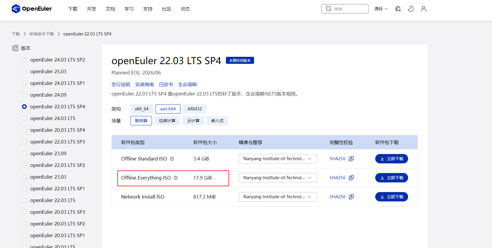

# D2000 开发环境搭建

## 硬件安装

## 安装操作系统

### 安装 openEuler

- 镜像下载

因为开发后续 DPU 驱动需要使用 5.10 linux kernel，因此选用工具链完善的 ARM64 架构的 openEuler 22.03 SP4 server edition.

操作系统镜像下载在[这里](https://www.openeuler.org/zh/download/archive/detail/?version=openEuler%2022.03%20LTS%20SP4)
选择下载服务器版的Everything ISO 文件

- 安装操作系统

官方的安装指导在[这里](https://docs.openeuler.org/zh/docs/24.03_LTS_SP2/server/installation_upgrade/installation/installation_preparations.html)
，可供参考

我们采用 U 盘制作 USB 启动盘进行安装，后续还可以使用这个 U 盘 作为无网络情况下的本地 yum 源安装软件。

1. 下载 USB 盘制作工具，这里使用了 Ubuntu 社区的开源烧录工具 [balenaEtcher](https://etcher.balena.io/)
2. 准备一个 32G 或更大的U盘，使用 balenaEtcher 和下载好的 ISO 文件制作一个启动 U 盘
3. 上电后按 F11 进入启动选项的选择，选择从 USB 启动
4. 根据菜单提示进行安装，这里需要注意的是在 software selection 的时候选择上 infiniband support 和 development tools
5. 系统安装好后重启进入 openEuler 系统

- 网络问题

北京集特智能制造的 D2000 主板上的以太网口的驱动目前只有 openKiny 麒麟操作系统支持，但是麒麟操作系统的开源版本是办公用途，不利于我们开发
DPU 驱动。

我们购买了 USB 无线网卡，使用 WIFI 连接到路由器，当我们的 Windows PC 与 D2000 环境连接到同一个路由器的时候，可以实现网络通信。

我们购买了 Tenda AX300 wifi6 USB 无线网卡，这个网卡在 Linux 上需要自己编译驱动程序。

网卡驱动程序从[这里](https://tenda.com.cn/material/show/690938082103365)下载，下载后的压缩包中有 PDF 文档，根据文档安装
网卡的 firmware 和 ko。

网卡驱动程序在编译过程中遇到了多个内核版本相关的兼容性错误，需要修改
`aic8800_linux_drvier/drivers/aic8800/aic8800_fdrv/aicwf_usb.c`，

```c++
AICWFDBG(LOGINFO, "%s the cpu is:%d\n", __func__, current->cpu);
```

改为

```c++
AICWFDBG(LOGINFO, "%s the cpu is:%d\n", __func__, get_cpu());
```

安装好驱动之后 `ifconfig` 命令执行后可以看到一个 `wlan0` 的网络设备
如果没看到，先执行一下

```shell
ifconfig wlan0 up
```

`nmcli` 执行后会看见 `wlan0` 报错 `pluging missing`

- 操作系统网络配置问题

安装好驱动之后，网卡可以被系统识别到，但是无法使用 DHCP 协议获取 IP 地址与路由器通信，我们还需要一些工具和设置。

现在还没有网络，因此我们还要使用启动盘作为本地 yum 源，这个方法可以询问大模型。

1. 安装网络工具

```shell
sudo dnf install wpa_supplicant -y
```

2. 编辑配置文件
   使用 wpa_supplicant + dhclient 方式手动连 WiFi：

创建配置文件 /etc/wpa_supplicant/wpa_supplicant.conf

```text
network={
    ssid="你的WiFi名称"
    psk="你的WiFi密码"
}
```

执行连接

```shell
sudo wpa_supplicant -B -i wlan0 -c /etc/wpa_supplicant.conf
sudo dhclient wlan0
```

3. 验证网络功能

输入`ip a`可以看到 wlan0 已经通过 DHCP 从路由器那里获取了 IPv4 地址，使用 `ping www.baidu.com` 可以验证网络通信正常。