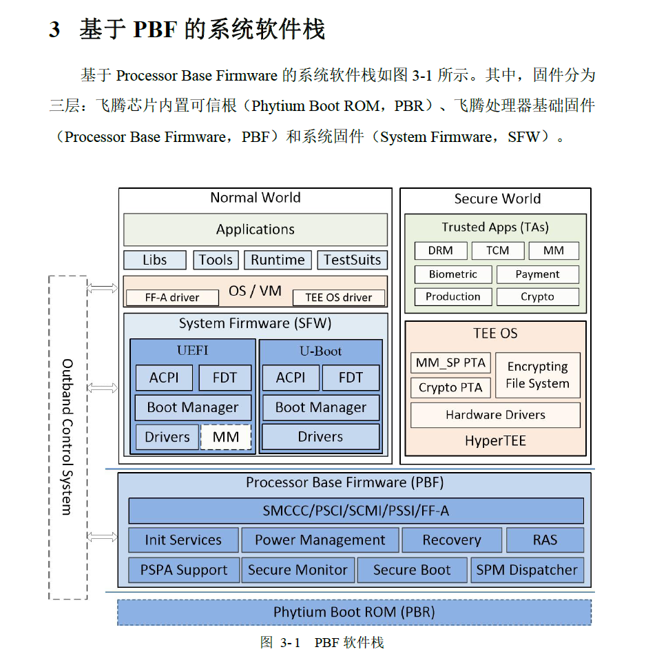

你提供的这张图（图 3-1）是**飞腾处理器平台基于 PBF（Processor Base Firmware）架构的系统软件栈图**
，展示了系统启动与运行过程中涉及的三层固件与两个世界（Normal World / Secure World）之间的关系。以下是逐层解释与架构逻辑梳理，帮助你
**从 U-Boot、内核开发者视角理解整个体系结构**。

---

## 🧱 固件的三层划分

图中系统软件架构自底向上划分为：

1. **PBR**（Phytium Boot ROM）：芯片内部不可修改的启动固件（Boot ROM）
2. **PBF**（Processor Base Firmware）：飞腾的处理器基础固件，承担 early boot 和安全功能
3. **SFW**（System Firmware）：系统固件，比如 U-Boot 或 UEFI，负责加载操作系统或 hypervisor

---

## 🌐 两个世界（ARM TrustZone 架构）

* **Normal World（非安全态）**：运行 Linux / U-Boot / 用户应用等普通操作系统
* **Secure World（安全态）**：运行安全 OS（如 HyperTEE），提供加密、身份认证、支付、DRM 等功能

---

## 🔻 底层：Phytium Boot ROM（PBR）

* 固化在芯片中，启动加载下一阶段 PBF 固件（BL1 / TF-A 早期镜像）
* 无法更换，是“芯片可信根”（Root of Trust）

---

## 🧠 中层：Processor Base Firmware（PBF）

该层由飞腾实现的固件，类似于 ARM 的 TF-A（Trusted Firmware-A），提供基础控制功能：

| 功能模块                        | 说明                                             |
|-----------------------------|------------------------------------------------|
| `SMCCC/PSCI/SCMI/PSSI/FF-A` | 对外暴露的标准固件接口，用于 Linux、U-Boot 调用服务（如关核、重启、时钟控制等） |
| `Init Services`             | 初始化服务，如 CPU、Timer、GIC、串口等                      |
| `Power Management`          | 电源管理，支持低功耗模式（PSCI 接口）                          |
| `Secure Monitor`            | SMC 调用入口，控制两个世界间的切换                            |
| `Secure Boot`               | 安全启动校验，防止非法加载                                  |
| `RAS`                       | 可靠性、可用性与可服务性                                   |
| `Recovery`                  | 异常时的恢复路径                                       |
| `SPM Dispatcher`            | 安全任务调度                                         |
| `PSPA Support`              | 飞腾平台支持增强功能模块                                   |

PBF 是**连接 Boot ROM 和 U-Boot/UEFI**的桥梁，并提供系统管理服务。

---

## 🧱 上层：System Firmware（SFW）

飞腾平台支持两种系统固件（Bootloader）：

| 固件         | 说明                                         |
|------------|--------------------------------------------|
| **UEFI**   | 通用平台固件，适用于传统服务器环境，支持 ACPI/FDT/Boot Manager |
| **U-Boot** | 嵌入式常用启动固件，加载内核镜像并传递设备树，适用于开发板或自定义平台        |

**主要功能模块：**

* `ACPI/FDT`: 传递硬件拓扑信息给 OS（ARM 平台常用 FDT）
* `Boot Manager`: 启动项管理（如 bootcmd / grub）
* `Drivers`: 各类外设驱动，如网卡、串口、存储
* `MM`: Memory Map、内存布局管理

---

## 🛡️ Secure World：TEE OS 与 TA（Trusted Apps）

| 模块                              | 说明                                 |
|---------------------------------|------------------------------------|
| **HyperTEE**                    | 安全世界运行的可信执行环境（类似 OP-TEE）           |
| **TEE OS**                      | 提供基础安全服务                           |
| **TA**（Trusted Apps）            | DRM、Biometric、Payment 等安全服务的应用     |
| **MM\_SP PTA** / **Crypto PTA** | 特定服务接口，供 Normal World 请求（通过 SMCCC） |
| **Encrypting File System**      | 安全加密文件系统                           |

---

## ⛓️ Normal World 软件层

| 层级                       | 说明                                                     |
|--------------------------|--------------------------------------------------------|
| `Applications`           | 普通 Linux 应用                                            |
| `Libs / Tools / Runtime` | 动态库、运行时组件                                              |
| `OS / VM`                | Linux Kernel 或虚拟机 Hypervisor                           |
| `FF-A driver`            | 支持 FF-A（Firmware Framework-A）协议的驱动，用于与 Secure World 通信 |
| `TEE OS driver`          | 向 TEE OS 发起服务请求的驱动                                     |

---

## 🔁 总结：理解飞腾平台的启动路径

```text
PBR（Boot ROM）
   ↓
PBF（TF-A 风格固件，提供 PSCI/SMCCC 等服务）
   ↓
SFW（U-Boot 或 UEFI，加载 Linux）
   ↓
Linux Kernel（通过 PSCI 等接口调度 CPU 电源，SCMI 管理时钟等）
   ↓
用户空间应用
```

* 若你是 **U-Boot 开发者**，你需要理解 SFW 层如何调用 PBF 层的接口加载内核
* 若你是 **内核开发者**，你需要理解如何通过 PSCI/SCMI 接口调用 PBF 提供的服务
* 若你是 **安全系统开发者**，你要关注 Secure World 和 TEE OS 的实现与对接

---

如你希望我生成一张高分辨率的「软件启动路径流程图」或「SMCCC 调用栈追踪图」，也可以继续告诉我，我可以画出更详细版本供你使用在文档或开发手册中。

