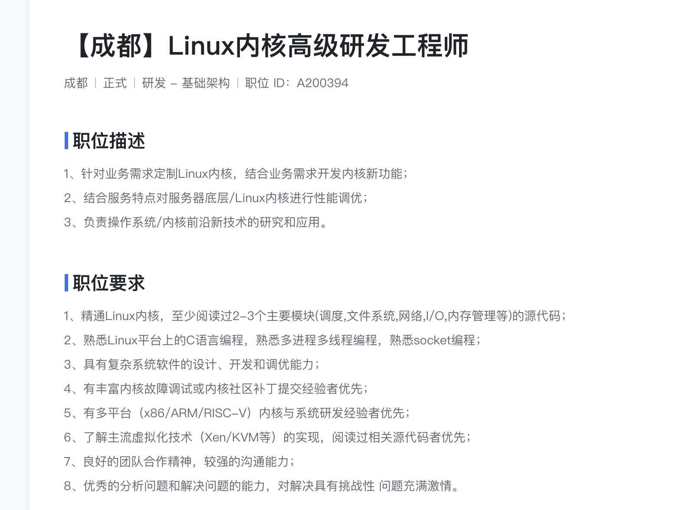

# 行动计划

---

> ## 心理建设

王立群教授：

无论一个国家，一个民族或者一个人，最重要的第一件事，就是使自身足够的强大起来，这是打破困境的唯一出路。秦国自身不强大，你何谈统一天下呢?

人生的悲剧是从自我的失衡开始的。命运的阴霾它是始于内心的乌云。就是你的内心里首先是被乌云遮住了，然后你才会有，各种这个不幸的事情产生，如果你内
心始终是很阳光的，那么你不可能做出一些出格的事情。

如果你对自己，有一个比较高的定位的话，你自然，你的精力就集中到这个事情上去了。精力的分散与集中，在很大程度上是你自己可以掌控的。

我们无论多高的学历，只是一个就业的准备阶段。

而人生，是一个漫长而艰辛的接力赛。有时领先，有时落后，但是你只要在路上，你就有机会。

一个人，他的一生能不能成就一番事业，很大程度上取决于，他处于什么样的平台之上。仓鼠跟厕鼠的区别就在于厕和仓两个平台不一样。这个平台非同。人生最
重要的是平台。没有一个平台，再有本事，你施展不开。

---

> ## 1. 内核模块源码: 入门篇、卷1

阅读代码

> ## 2. C语言多进程多线程编程，socket编程: 高性能 驱动程序

复现TinyWebServer

阅读驱动程序代码

> ## 3. 调优: 性能之巅

将章末的问题答案打印出来，做到非常熟悉

> ## 4. 故障: 卷2

> ## 5. 体系结构: ARM64

---

> ## 简历

[简历](./Resume.md)可以持续改进，随着学习进度逐渐的丰富和完整。

---

> ## 算法题

每日一题，投简历后再集中多刷题

掌握 40 个[LeetCode算法题](../LeetCode/leetcode_problems_with_chinese_links.md)

---

> ## 面试

心态上放轻松，保正常发挥。过了是实力，没过是学习，行不行都不亏。

张小方:
对于一些张口各种技术术语，问到具体细节说不清道不明的面试者，大多数面试官一般不会当面拆穿。面试者可能面完之后自我感觉良好，感觉什么问题都回答出来了，然而可能再也没有下文了。所以，社招的同学，建议找自己熟悉和擅长的领域来说，切忌东拉西扯。

核心是展示出我解决过什么问题，我会什么技能。我们一定要认真地准备我们的项目。

https://www.bilibili.com/video/BV1Jg4y1k7W9/?spm_id_from=333.337.search-card.all.click&vd_source=d69588c5ecf973a8818a2767cf7d663d

---

## 做人要有目标感

