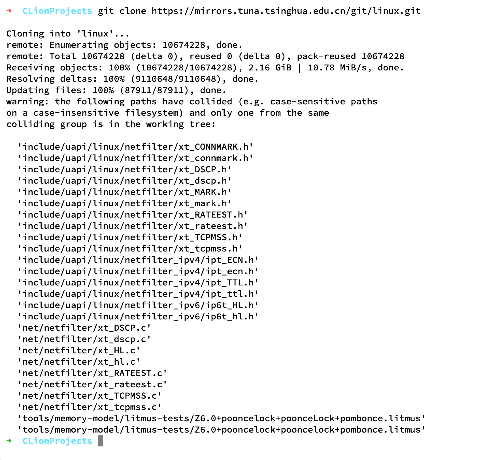

# macOS上使用CLion进行Linux内核开发

## clone代码



问题出现在 macOS 是 默认不区分大小写的文件系统（APFS 可能区分大小写，具体取决于你的磁盘格式），而 Linux
内核源码中包含了一些文件名仅大小写不同的文件，例如：

```shell
include/uapi/linux/netfilter/xt_CONNMARK.h
include/uapi/linux/netfilter/xt_connmark.h
```

在 macOS 的默认文件系统（不区分大小写）上，`xt_CONNMARK.h` 和 `xt_connmark.h` 会被视为同一个文件，因此 Git
在更新文件时可能会覆盖或忽略其中一个，导致
clone 之后出现“自动修改”的情况。

## 解决方法

使用大小写敏感的 APFS 磁盘
你可以创建一个 大小写敏感的 APFS 磁盘镜像，然后在其上 clone Linux 源码


---

## **第一步：创建大小写敏感的 APFS 磁盘镜像**

在 **终端** 执行：

```sh
hdiutil create -size 20g -type SPARSEBUNDLE -fs "Case-sensitive APFS" -volname LinuxKernel ~/LinuxKernel.sparsebundle
```

**参数解析：**

- `-size 20g`：创建 **20GB** 磁盘镜像（可以调整大小）。
- `-type SPARSEBUNDLE`：动态分配空间，**不会立即占用 20GB**。
- `-fs "Case-sensitive APFS"`：使用 **大小写敏感** 的 APFS，避免 Linux 内核文件冲突。
- `-volname LinuxKernel`：挂载后 **磁盘名称显示为 `LinuxKernel`**。
- `~/LinuxKernel.sparsebundle`：磁盘镜像文件存储在 `~` 目录下。

---

## **第二步：创建 `linux_kernel` 目录**

挂载前，我们先创建一个固定的挂载点：

```sh
mkdir -p ~/CLionProjects/linux_kernel
```

---

## **第三步：自动挂载和卸载**

**1. 编辑 `~/.zshrc`**

```sh
nano ~/.zshrc
```

然后在 **文件末尾** 添加：

```sh
# 挂载 LinuxKernel 磁盘镜像到 ~/CLionProjects/linux_kernel
alias mountlinux="hdiutil attach ~/LinuxKernel.sparsebundle -mountpoint ~/CLionProjects/linux_kernel"

# 卸载 LinuxKernel
alias unmountlinux="hdiutil detach /Volumes/LinuxKernel"
```

**2. 使新配置生效**

```sh
source ~/.zshrc
```

---

## **第四步：测试挂载**

执行：

```sh
mountlinux
```

然后检查是否成功挂载：

```sh
df -h | grep LinuxKernel
```

你应该看到类似：

```
/dev/disk3s1   20G  5G  15G  25%  /Users/wuyuhang/CLionProjects/linux_kernel
```

**如果你想卸载，执行：**

```sh
unmountlinux
```

---

## **第五步：克隆 Linux 内核代码**

**挂载后，下载 Linux 内核源码：**

```sh
cd ~/CLionProjects/linux_kernel
git clone https://mirrors.tuna.tsinghua.edu.cn/git/linux.git
```

---

## **第六步：在 CLion 中打开**

1. **启动 CLion**
2. **选择 File -> Open**
3. **打开 `/Users/wuyuhang/CLionProjects/linux_kernel/linux`**
4. **开始开发！🚀**

---

### **总结**

✅ **创建大小写敏感 APFS 磁盘镜像**  
✅ **挂载到 `~/CLionProjects/linux_kernel`，避免影响原有项目**  
✅ **使用 `mountlinux` 挂载，`unmountlinux` 卸载**  
✅ **在 CLion 里直接打开，流畅开发 Linux 内核**

# CLion解析内核源码

# 创建compile json

### **`make defconfig` 的作用**

`make defconfig` 是 **Linux 内核构建系统**中的一个 **默认配置生成命令**，用于创建一个基础的 `.config` 配置文件，作为编译内核的起点。

---

## **🔍 1. `make defconfig` 具体做了什么？**

当你在 Linux 内核源码目录中运行：

```bash
make defconfig
```

它会：

1. **读取架构默认配置**（通常是 `arch/$(ARCH)/configs/*_defconfig`）。
2. **生成 `.config` 文件**，并填充默认的内核编译选项：
   ```bash
   # 默认情况下，它会生成一个针对你当前 CPU 架构的 `.config`：
   *** Default configuration is based on 'x86_64_defconfig'
   ```
3. `.config` 是 `menuconfig` 或 `xconfig` 等配置工具使用的核心文件，它定义了：
    - 需要编译的 **驱动**
    - 需要启用的 **内核模块**
    - 是否支持 **网络功能**
    - 是否启用 **文件系统**（如 ext4、btrfs）
    - 是否启用 **调试功能**

`.config` 生成后，你可以使用 `cat` 命令查看：

```bash
cat .config | less
```

或者查询某个配置：

```bash
grep CONFIG_NETFILTER .config  # 查看 Netfilter 相关的选项
```

---

## **🛠 2. `make defconfig` 和其他配置命令的区别**

| 命令                   | 作用                            |
|----------------------|-------------------------------|
| `make defconfig`     | 生成基于默认值的 `.config`            |
| `make menuconfig`    | 提供 **交互式 TUI** 界面修改 `.config` |
| `make xconfig`       | 提供 **GUI** 图形界面修改 `.config`   |
| `make oldconfig`     | 适用于 **已有 `.config`**，只更新新选项   |
| `make savedefconfig` | 仅保存 **非默认配置**（简化 `.config`）   |
| `make randconfig`    | 生成随机 `.config`（用于测试）          |

---

## **📌 3. `make defconfig` 的用法**

### **1️⃣ 生成默认配置**

```bash
make defconfig
```

- 适用于 **首次编译** 内核时。

### **2️⃣ 生成某个架构的默认配置**

如果你需要为 **ARM64** 或 **其他架构** 生成配置：

```bash
make ARCH=arm64 defconfig
```

或者手动指定一个默认配置：

```bash
make x86_64_defconfig  # 适用于 x86_64
make i386_defconfig    # 适用于 32 位 x86
make arm64_defconfig   # 适用于 ARM64
```

### **3️⃣ 生成 `.config` 后进行手动调整**

如果你想微调内核配置：

```bash
make menuconfig  # 进入 TUI 界面手动调整
```

---

## **🚀 4. 总结**

✅ **`make defconfig` 作用**：

- **为当前架构生成默认 `.config` 文件**，用于编译 Linux 内核。
- **适用于第一次编译内核**，为 `make` 提供基础配置。

✅ **推荐使用**：

1. **首次编译**：`make defconfig`
2. **调整配置**：`make menuconfig`
3. **继续编译**：`make -j$(nproc)`

如果你是 **编译 Linux 内核新手**，可以先用 `make defconfig` 生成 `.config`，然后再用 `make menuconfig` 调整自己需要的选项！🚀

# 生成 json

```shell
make defconfig
bear -- make -j${nproc}
```

