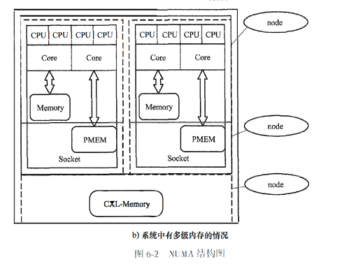

# 分级内存的实现

## 项目背景

## 目标计划

## 个人承担的任务

## 完成情况

## 问题和挑战

## 改进方向

性能数据对比：

| 指标     | 迁移前        | 迁移后        | 提升幅度   |
|--------|------------|------------|--------|
| 总访问时延  | 178,735 ns | 144,205 ns | 19.32% |
| 平均访问时延 | 17.45 ns   | 14.08 ns   | 19.32% |