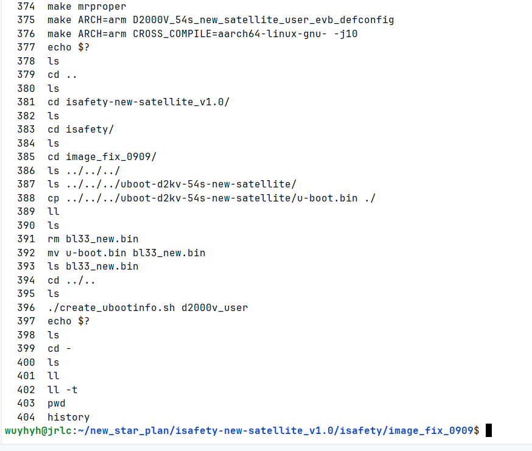
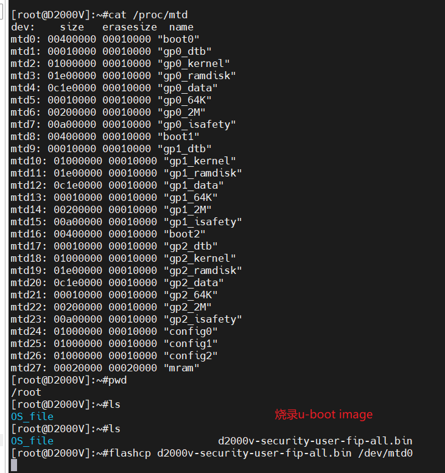

# 异常信号

为什么会发出02信号

```shell
mw.l 0x28014004 0x1388000e
mw.l 0x28014008 0x100
```



## 如何制作 U-Boot 镜像

### 编译

- 交叉编译

读取编译提示信息

```shell
./uboot-info.sh
```

- 编译配置

```shell
make ARCH=arm D2000V_54s_new_satellite_user_evb_defconfig
```

- 编译

```shell
make ARCH=arm CROSS_COMPILE=aarch64-linux-gnu- -j10
```

- 清理编译产物

```shell
make clean
```

- 彻底清理

```shell
make mrproper
```

### 打包

- 将编译产物复制到打包工具目录
- 制作烧录镜像
- 复制 U-Boot image 到 board

```shell
cp u-boot.bin ../isafety-new-satellite_v1.0/isafety/image_fix_0909/bl33_new.bin
cd ../isafety-new-satellite_v1.0
./create_ubootinfo.sh d2000v_user
cp ./isafety/image_fix_0909/d2000v-security-user-fip-all.bin /mnt/c/Users/wuyhy/Downloads/
```



```shell
flashcp d2000v-security-user-fip-all.bin /dev/mtd0
```
