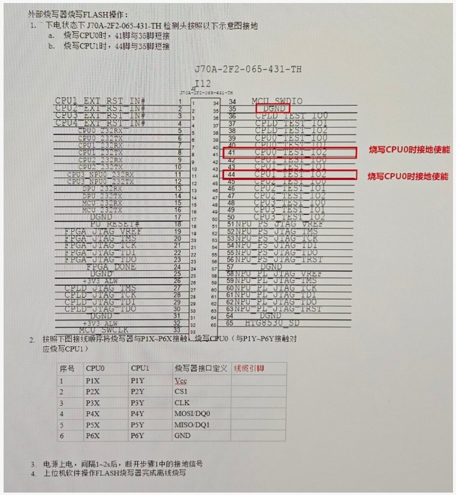

# EM100Pro-G3闪存Emulator使用方法

## 1. 操作 flash emulator


按照图示，操作 flash emulator 进入烧写准备状态

## 2. 连接开发板调试接口

> **注意：**
>
> **此时是下电状态！**



### 2.1 接地 flash 使能引脚

接地引脚为**35脚**

按照图示，烧写 CPU0 时，将**41脚**接地；

按照图示，烧写 CPU1 时，将**44脚**接地

### 2.2 使用探针接触 flash 芯片焊盘

按照图示注意**线序和颜色**，使用探针接触 flash 芯片引出的烧写引脚焊盘


## 3. 上位机软件操作方法

### 3.1 上电观察启动是否正常

> **注意：**
>
> **此时打开电源！**

打开电源可以观察到开发板从 flash emulator 读取 uboot 打包镜像 fip-all.bin文件并启动。

启动成功后在内存中存放了完整的 fip-all.bin 文件，地址是 `0x90000000`，文件长度自动保存在了环境变量 `filesize` 中

### 3.2 断开 flash 接地引脚

观察到进入了 U-Boot 命令行，现在断开 **flash 接地引脚**：比如CPU0断开 41脚 与 35脚 的连接

### 3.3 配置网络使用 tftp 下载要写入 flash 的 bootloader

#### 3.3.1 配置网络

##### a. 打印环境变量

```bash
pri
```

* **作用**：打印当前 U‑Boot 的环境变量。`pri` 是 `printenv` 的缩写（U‑Boot 支持命令前缀匹配）。

---

##### b. 配置基础网络参数

```bash
setenv ipaddr 192.168.11.102
setenv serverip 192.168.11.100
saveenv
```

* **`setenv ipaddr`**：设置本机（开发板）IP 地址。
* **`setenv serverip`**：设置 TFTP 服务器 IP（U‑Boot 的 `tftpboot` 会用到）。
* **`saveenv`**：把当前环境变量持久化到环境介质（掉电不丢）。

#### 3.3.2 tftp

> 使用 tftp 下载文件
>
> ```text
> tftpboot <loadaddr> <file_name>>
>```

```text
tftpboot 0x90000000 fip-all.bin
```

### 3.4 在串口中擦写 flash

#### 3.4.1 擦除 flash 芯片的部分区域

> write 之前先进行 erase
>
> ```text
> flashe <start_addr> <end_addr>
>```

这里的命令是：

```text
flashe 0x0 0x500000
```

#### 3.4.2 写入 flash

> 写入 flash
>
> ```text
> flashw <loadaddr> <start_addr> $filesize
>```

这里的命令是：

```text
flashw 0x90000000 0x0 $filesize
```

## 4. 重启

写入完毕后，下电，然后上电重启系统
