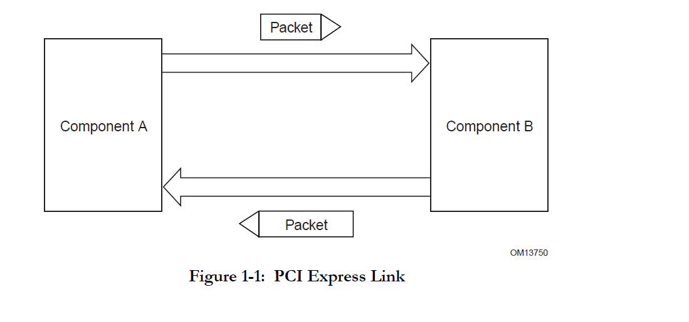
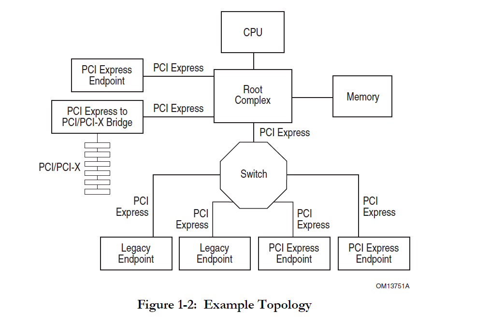

# PCI Express 3.0 Specification

## 1.2 PCI Express Link

The primary Link attributes are:

- The basic Link
- Signaling rate
- Lanes
- Initialization
- Symmetry

## 1.3 PCI Express Fabric Topology

### 1.3.1. Root Complex

我按条目给你拆开讲，每一段说的是什么、在体系结构里意味着什么，以及对你做 2 个 CPU + PEX8748 的设计有什么关系。

---

#### 第 1 条

> A Root Complex (RC) denotes the root of an I/O hierarchy that connects the CPU/memory subsystem to the I/O.

含义：

* **Root Complex = 整个 PCIe I/O 树的根**。
* 它一侧连着 CPU/内存子系统（核心、内存控制器），另一侧连着 PCIe 端口，把 CPU 的 load/store、配置访问转换成 PCIe TLP，往 I/O
  设备发。

对你来说：
每个 D2000 CPU 上的那块 “PCIe 主控制器 + Root Port” 就是一个 Root Complex 的实现。PEX8748 则挂在某个 Root Port 下面。

---

#### 第 2 条

> As illustrated in Figure 1-2, a Root Complex may support one or more PCI Express Ports. Each interface defines a
> separate hierarchy domain. Each hierarchy domain may be composed of a single Endpoint or a sub-hierarchy containing one
> or more Switch components and Endpoints.

含义：

* 一个 RC 可以有 **一个或多个 PCIe 端口（Root Port）**。
* **每个端口下面，是一棵独立的“层次域（hierarchy domain）”**：

    * 可以很简单，只挂一个 Endpoint；
    * 也可以复杂，是“Root Port → Switch → 更多 Switch/Endpoint”的子树。

简化理解：
Root Complex 就像多口的树根，每个 Root Port 是一棵独立子树的入口。
在 Linux 里你能看到多个 `0000:xx:00.0` 这种 Root Port，每一个就是一个 hierarchy domain 的 root。

对你：
CPU0、CPU1 可能各自有多个 Root Port，你把 PEX8748 接在哪个 Root Port 下，就决定了它属于哪个 hierarchy domain。

---

#### 第 3 条

> The capability to route peer-to-peer transactions between hierarchy domains through a Root Complex is optional and
> implementation dependent. For example, an implementation may incorporate a real or virtual Switch internally within the
> Root Complex to enable full peer-to-peer support in a software transparent way.

含义：

* **是否允许不同 Root Port 下面的设备互相直接访问（peer-to-peer）是可选的，由实现决定**；规范不强制。
* 有的实现会在 RC 里 **内建一个真实或“虚拟”的 Switch**，让它能在端口之间转发 TLP，从而支持 P2P；
* “software transparent” 的意思是：对 OS 来说，看起来就像普通的硬件拓扑，不需要专门写驱动做转发。

对你：

* 你现在想做“两个 CPU 互联”，如果是“CPU0 的 RC ↔ PEX8748 ↔ CPU1 的 RC”，那么两个 RC 是否支持、如何支持 P2P，完全看厂商 SoC
  的实现。
* 对单个 RC 来说，也不是一定能让 `Port A 下的 NVMe` 直接 DMA 到 `Port B 下的 NPU` ——得看 RC 是否做了这种内部“Switch”。

---

#### 第 4 条（RC 可以拆包）

> Unlike the rules for a Switch, a Root Complex is generally permitted to split a packet into smaller packets when
> routing transactions peer-to-peer between hierarchy domains (except as noted below), e.g., split a single packet with a
> 256-byte payload into two packets of 128 bytes payload each. The resulting packets are subject to the normal packet
> formation rules contained in this specification (e.g., Max_Payload_Size, Read Completion Boundary, etc.). Component
> designers should note that splitting a packet into smaller packets may have negative performance consequences,
> especially for a transaction addressing a device behind a PCI Express to PCI/PCI-X bridge.

含义分几层：

1. **和 Switch 的规则不同**：

    * 普通 PCIe Switch 在转发时不能随便把一个 TLP 拆成几个；
    * Root Complex 在做“端口之间的 peer-to-peer 转发”时，是**允许把一个大 TLP 拆成多个小 TLP**的。

2. 举例：

    * 一个 256-byte payload 的包，被 RC 拆成两个 128-byte payload 的包转发。

3. 拆出来的新包仍然要满足正常的包格式规则，比如：

    * 不超过 `Max_Payload_Size`；
    * 遵守 `Read Completion Boundary (RCB)` 等要求。

4. 最后一段是在提醒硬件设计者：

    * **拆包会增加 TLP 个数、开销更大**，影响性能；
    * 尤其当目标设备还在 PCIe-to-PCI/PCI-X Bridge 后面时（桥那边也有自己的限制），性能影响可能更明显。

对你：

* 如果未来你希望 CPU0 上某个设备直接 DMA 到 CPU0 另一端口下的设备（通过 RC 做 P2P 转发），要意识到：

    * 这过程中 RC 可能会拆包，造成带宽损失；
    * 如果系统里还有老的 PCI/PCI-X 设备，通过桥相连，影响更大。
* 但对于你现在主要的 Gen3 x8 ↔ Switch ↔ NVMe/NPU 这种现代设备，最关键的还是理解“RC 可以拆包，而 Switch 不能”。

---

#### 第 5 条（Vendor Defined Message 的例外）

> Exception: A Root Complex that supports peer-to-peer routing of Vendor_Defined Messages is not permitted to split a
> Vendor_Defined Message packet into smaller packets except at 128-byte boundaries (i.e., all resulting packets except the
> last must be an integral multiple of 128 bytes in length) in order to retain the ability to forward the Message across a
> PCI Express to PCI/PCI-X Bridge. Refer to the PCI Express to PCI/PCI-X Bridge Specification, Revision 1.0 for additional
> information.

含义：

* 上面说 RC 一般可以拆包，但**对 Vendor_Defined Message（厂商自定义消息 TLP）有特殊限制**：

    * 如果 RC 要对这类 Message 做 P2P 转发，它 **不能随便拆**；
    * 只允许在 **128-byte 边界**拆；
    * 也就是说，除最后一个包外，其他包的 payload 长度必须是 128 的整数倍。

* 这么规定的原因是：

    * 要保证这些 Vendor 定义的 Message 在经过 PCIe-to-PCI/PCI-X Bridge 时仍然可以被正确处理；
    * 详细行为在那本桥规范里定义。

对你：

* 一般你不会自己定义这类 Message，更多是某些高级设备/厂商协议才用到；
* 你只需要知道：**RC 的拆包能力是有类型限制的**，不是任何 TLP 都能随意拆。

---

#### 第 6 条（RC 必须能发配置请求）

> A Root Complex must support generation of configuration requests as a Requester.

含义：

* RC 必须能够作为 **Requester** 发起 Configuration Request（Config Read/Write）。
* 这是枚举 PCIe 拓扑、分配 BAR、分配 Bus 号的基础；没有这个能力整个 PCIe 树就没法被发现。

对你：

* 上电时 CPU 通过 RC 发 Config TLP 给 Root Port→Switch→Endpoint，一层层枚举。
* 你在 Linux 里看到的 `lspci`、`dmesg` 里的枚举日志，都是建立在 RC 具备这个能力之上的——这条是“强制要求”。

---

#### 第 7 条（RC 可选地发 I/O Request）

> A Root Complex is permitted to support the generation of I/O Requests as a Requester.

含义：

* 这是说：RC **可以支持** 发 I/O 空间访问（I/O Requests），但不是必须。
* I/O 空间是传统 PCI 的东西，现代 PCIe 系统大多用 Memory-mapped I/O（MMIO）替代，所以这条是兼容性选项。

对你：

* 嵌入式 SoC 如果完全不打算兼容传统 x86 设备，甚至可以完全不实现 I/O 空间；
* 若要挂一些 legacy 设备（或者有 x86 兼容需求），那 RC 可能需要实现 I/O Request。

---

#### 第 8 条子弹（80h / 84h 的特殊 I/O）

> A Root Complex is permitted to generate I/O Requests to either or both of locations 80h and 84h to a selected Root
> Port, without regard to that Root Port's PCI Bridge I/O decode configuration; it is recommended that this mechanism only
> be enabled when specifically needed.

含义：

* RC 被允许向**选定的某个 Root Port**发送 I/O 请求到端口地址 `0x80` 和/或 `0x84`；
* 这些请求**不受该 Root Port 的 PCI Bridge I/O decode 配置的限制**（也就是说，即使桥那边没声明解码这些地址，也可以强制发过去）；
* 规范建议：**只有确实需要时才启用这种机制**。

这其实是在为一些很古老的 x86 用例（比如 POST 代码输出到 0x80 端口）提供“后门路径”。

对你：

* 在 ARM64 嵌入式平台基本可以忽略这条；
* 你只需要知道：这里说的是一种“特殊的 I/O 端口直通机制”，不会影响你做 CPU 互联 / DMA 之类的主流程。

---

#### 第 9 条（Completer 端不允许 Lock 语义）

> A Root Complex must not support Lock semantics as a Completer.

含义：

* **Completer** 指收到请求并给出 Completion 的那一端。
* “Lock semantics” 是从旧 PCI 的 `LOCK#` 信号沿用来的“总线锁”概念：某个事务可以要求在完成前独占总线，防止其它主机并发访问某个共享资源。
* 这条要求：

    * **作为 Completer 的 RC 不能实现这种“锁定语义”**；
    * 即：不允许 RC 因为某个 Locked 请求而把整个链路“锁死”。

原因大致是：
总线锁在点对点、高并发拓扑下非常容易造成死锁或严重性能问题，PCIe 倾向于用原子操作等机制取代。

对你：

* 这说明：**不要指望 RC 能作为“被锁的一端”配合你做传统 PCI 风格的总线锁**。
* 在你的设计里，如果要做跨 CPU 的同步，应该依赖内存一致性协议 / 原子指令 / 门铃寄存器，而不是 PCI 风格的“Lock 事务”。

---

#### 第 10 条（Requester 端可以生成 Locked Requests）

> A Root Complex is permitted to support generation of Locked Requests as a Requester.

含义：

* 虽然 RC 不能作为 Completer 去实现 Lock 语义，但它 **可以作为 Requester 发送“带 Lock 属性的请求”**，用于兼容某些老设备或桥。
* 也就是说，它可以帮 CPU 模拟旧 PCI 设备那种“我发一个 Lock 事务，要求对端在处理这个事务期间保持资源独占”的行为，由对端设备自己决定怎么处理。

### 1.3.2 Endpoints

### 1.3.3 Switch

### 1.3.4 Root Complex Event Collector

### 1.3.5 PCI Express to PCI/PCI-X Bridge

## 1.5 PCI Express Layering Overview

