# chapter 3 地址空间和事务路由 address space and transaction routing

多端口 PCIe 设备要有路由能力

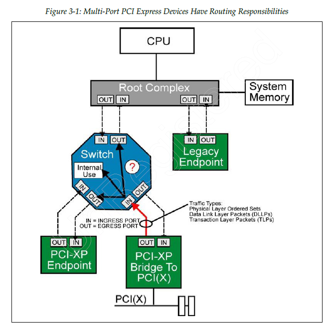

处理层数据包可以被接收、拒绝和路由，DLLP和物理层有序集流量不需要被转发。

路由方法有3种：地址路由、ID路由和隐式路由。

## 3.1 introduction

PCI 流量对所有设备可见，路由主要依赖 bridge。
PCIe 设备互相依赖，流量要么被接收，要么朝接收者路由。

当流量到达 ingress port 的时候，设备会检查是否出现问题，然后做出3种决定之一：

- 接收流量并在内部使用
- 转发流量到合适的出端口
- 拒绝流量

### 3.1.1 接收器检查3种类型的流量

链路中正常工作的设备的物理层接收器端口会监控逻辑空闲情况，并区分3种类型的链路流量：

- 有序集
- DLLP
- TLP

本地链路流量没有携带路由信息也不会被转发。

TLP 头部包含路由信息，可以在链路之间转发。

### 3.1.2 多端口设备承担路由负荷

multi-port device

### 3.1.3 EP 路由能力有限

EP 只能选择接收还是拒绝向他们提出的 transaction

### 3.1.4 系统路由策略是可编程的

PCIe 设备接入后，需要给他分配存储器和IO地址资源，并对交换器和桥进行编程，保证事务的正常运行。

所有设备都**必须配置**来执行系统事务路由方案。

## 3.2 两种类型的本地链路流量

local link traffic 目的是管理 link，这种流量不会被转发和进行流控，一旦发送**必须被接收**。

包含2类：物理层的 ordered sets 和 数据链路层的 DLLP

### 3.2.1 有续集

物理层控制信息

有序集的大小是固定的。

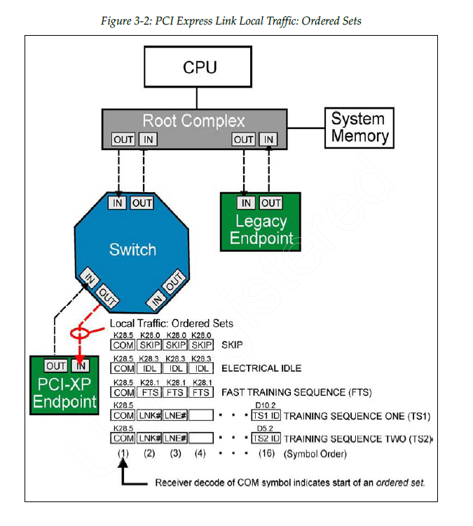

### 3.2.2 DLLP

DLLP 的主要功能是链路电源管理、TLP 流控、为 TLP 确认信息提供支持。

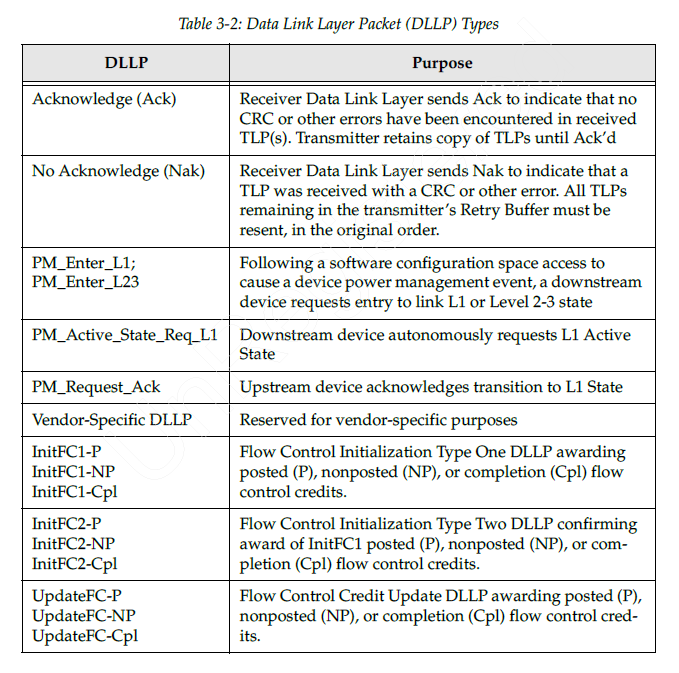

DLLP 携带16比特的 CRC

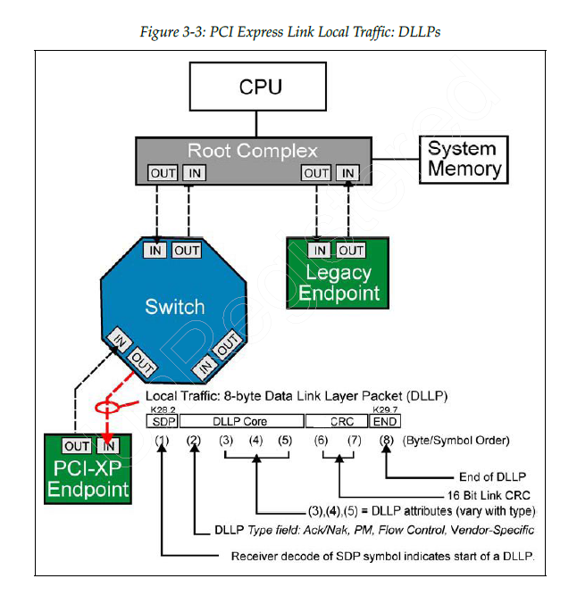

## 3.3 TLP 路由基础

TLP 从一条 link 转发到另一条 link 所依赖的机制和规则

### 3.3.1 用于访问4种地址空间的 TLP

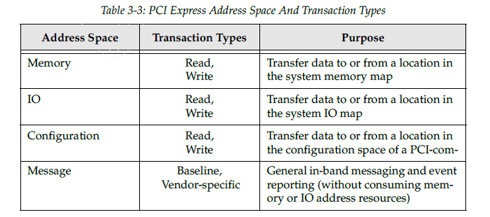

### 3.3.2 使用 split transaction protocol

#### 分离事务：性能更好，开销更大

分离事务协议是指：请求和完成在时间上解耦。
对于需要响应的 PCIe 事务，请求方先发送一个 Request TLP，完成方在稍后的时间再发送一个独立的 Completion TLP 返回结果。
这两个 TLP 在交换结构中独立传输和路由，但在事务语义上彼此对应。

- Split transaction = 请求和响应分开，不在同一时刻同步完成。
- 在 PCIe 里，通常表现为 Request TLP 和 Completion TLP 分离。
- 这两个 TLP 传输上独立，语义上关联。

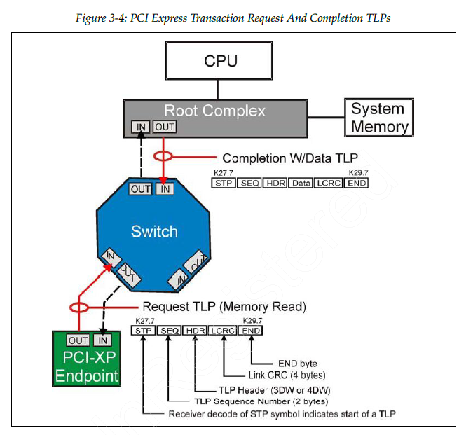

#### write posting：sometimes completion isn't needed

posted memory write 是**可以**被接受的：这是为了性能提升。

但是 IO write 和 config write **不能是** posted 的：这是因为配置和IO写入可能改变设备的行为。

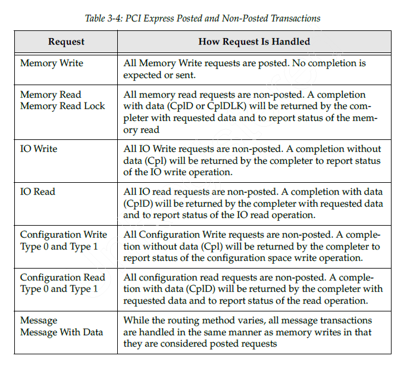

总的来说，memory write 和多数 message/message with data 是 **posted**.

### 3.3.3 TLP 路由的3种方法

TLP 无论目的地址是4种地址空间的哪一种，都是采用三种可能的路由方案：地址路由、ID 路由、隐式路由。

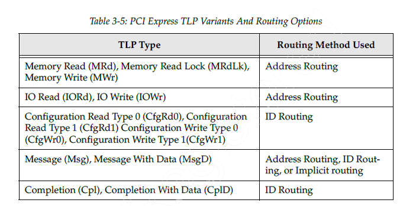

### 3.3.4 PCIe 路由方法与 PCI 的对比

PCIe 在软件可见模型上与 PCI 保持高度兼容，但由于它采用分组交换结构，又扩展了多种 TLP 路由方式。

#### PCIe adds implicit routing for messages

对于某些 Message TLP，可以使用 implicit routing，即目标接收者由消息类型和协议语义隐含确定，而不是像 Memory/IO 事务那样依赖显式地址映射。

这使得某些通知和事件类功能不必建模为普通寄存器访问，但并不意味着整个消息处理过程完全不需要设备支持或软件配置。

implicit routing 的重点是“路由目标由**消息语义**隐含决定，而不是由普通地址字段显式指定”。

### 3.3.5 数据包头中的 type 和 format 字段

TLP 的 header 中有 type 和 FMT 字段用来支持路由，长度为 3DW 或 4DW

### 3.3.6 using TLP header information

TLP 到达 ingress port 之后，接收器的物理层和链路层会进行错误检查，检查无误后执行 TLP 路由。

1. determine size and format
2. if it is for me, accept or forward
3. if it is not for me, reject

## 3.4 应用路由机制 applying routing mechanism

系统路由策略配置完成并启用事务之后，从 ingress 进入的 TLP 就会被处理。

这种处理包含多个层面：如果 TLP 的目的地是 internal location，就接收，如果不是，而且设备恰好是个 Switch，那么就会根据规则转发到
egress port. 如果数据包有错的话，也会进行相应的处理。

在处理的时候，会参照配置空间基址寄存器、基址界限寄存器、总线寄存器，然后进行地址路由、ID 路由、implicit 路由。

### 3.4.1 address routing

地址路由主要用于数据在存储器、IO设备之间传输数据。

#### 存储器和 IO 地址映射

system memory map 是 CPU address bus 所能访问的地址的 function。

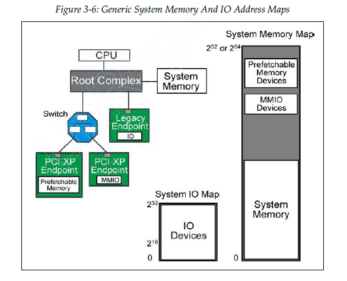

#### 地址路由中的主要 TLP 字段

如果收到的 TLP 中的类型字段规定要使用 address routing，那么就需要去检查 address 字段来执行路由。
有 3DW 长的32位地址和 4DW 长的64位地址

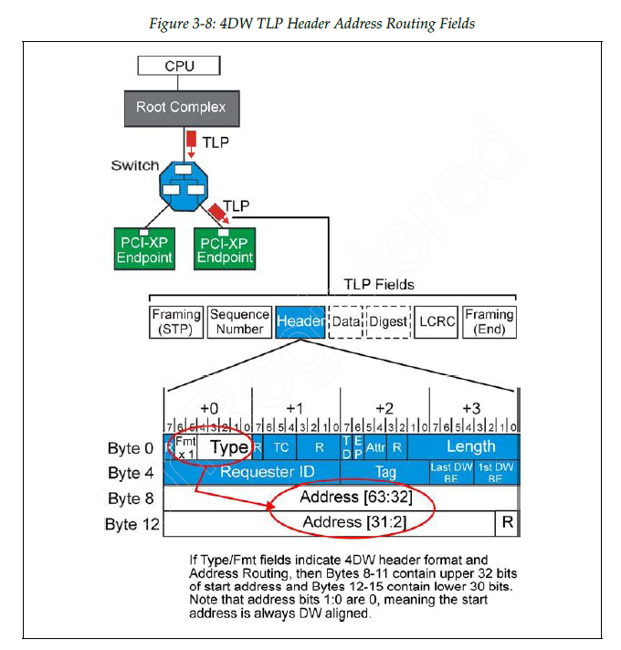

#### EP checks address routing TLP

EP 会比较 TLP header 中的 address 与 type0 configuration space 中的每一个 BAR 地址，决定 reject 还是 access 这个 TLP。

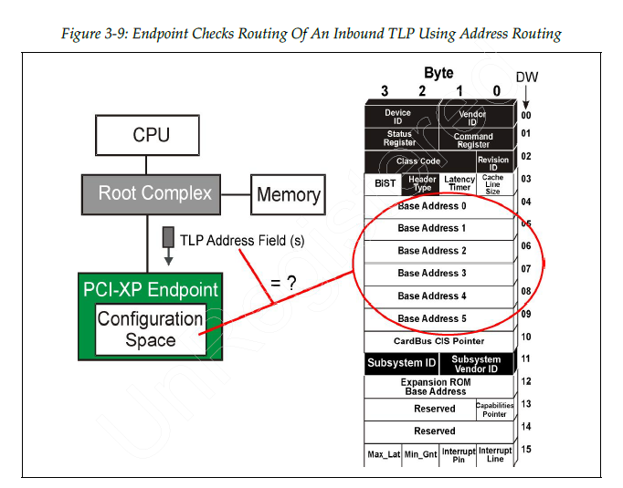

#### Switch checks address routing TLP in 2 ways

Switch 对 address-routed TLP 的处理分两步：

1. 首先检查该 TLP 的目标地址是否命中 Switch 自身可响应的空间，如果是，则由 Switch 自己作为 completer 接收。
2. 如果不是，则根据 Switch 各个下游端口对应的 Type 1 配置头中的 Base/Limit 窗口寄存器，判断该地址属于哪个 downstream
   port，并将 TLP 转发到对应端口。

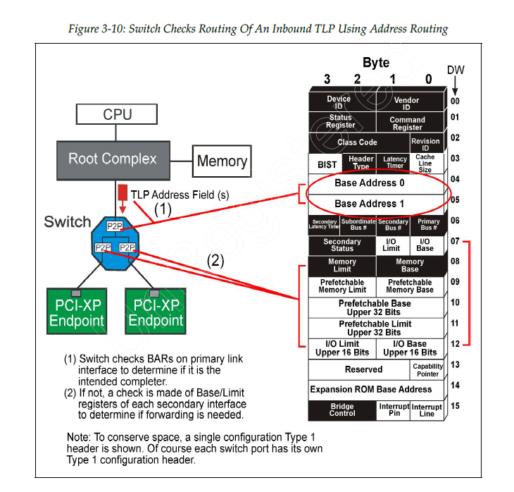

Switch address routing 有这3种情况：

1. 如果该地址命中了某个 downstream port 对应的 Base/Limit 窗口，就转发到那个 downstream port。
2. 如果该 TLP 是从 primary/upstream 端口进入但又不匹配任何 downstream window，则可视为无法路由，通常按 Unsupported Request
   处理。
3. 如果 TLP 是从 downstream 端口进入且不属于 Switch 本地空间，则通常向 upstream/primary 端口转发。

### 3.4.2 ID routing

ID 路由以设备功能的逻辑位置为基础，路由配置事务、消息事务和完成事务。

