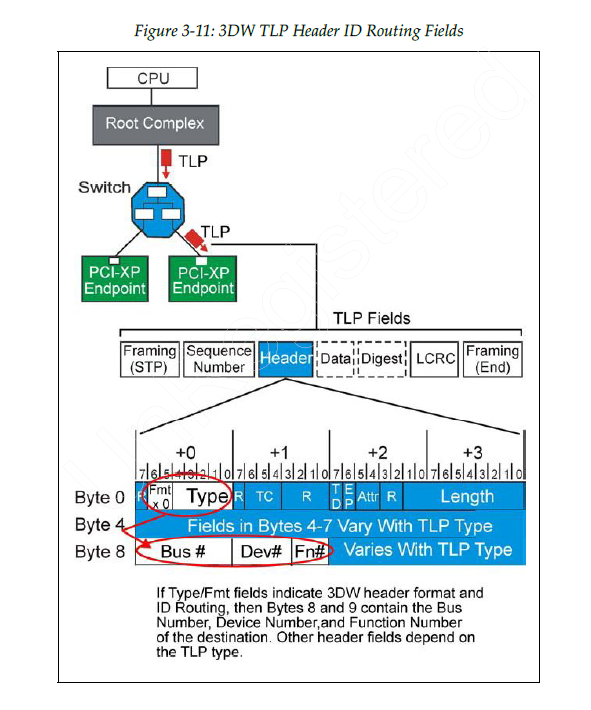
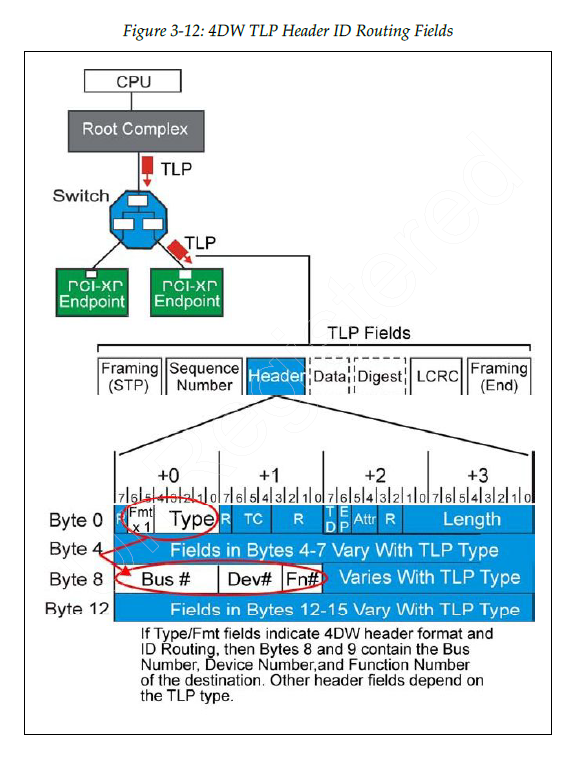
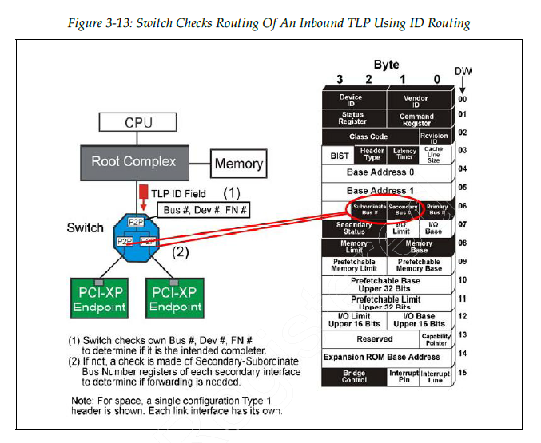
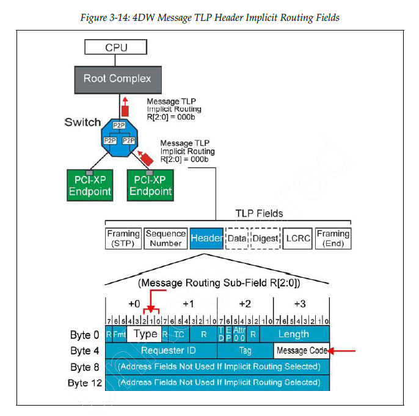
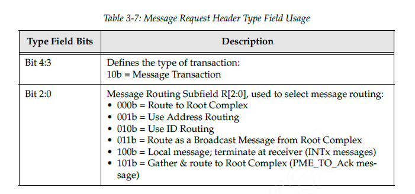
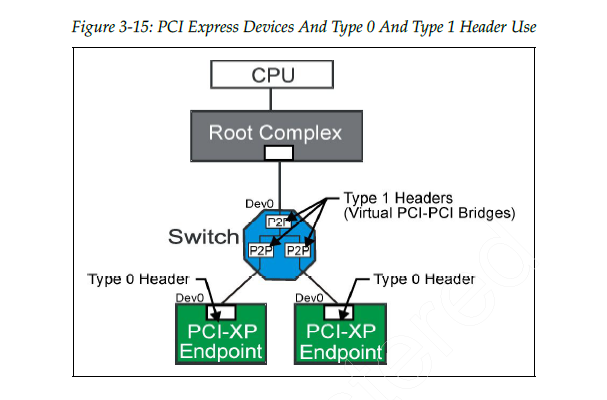
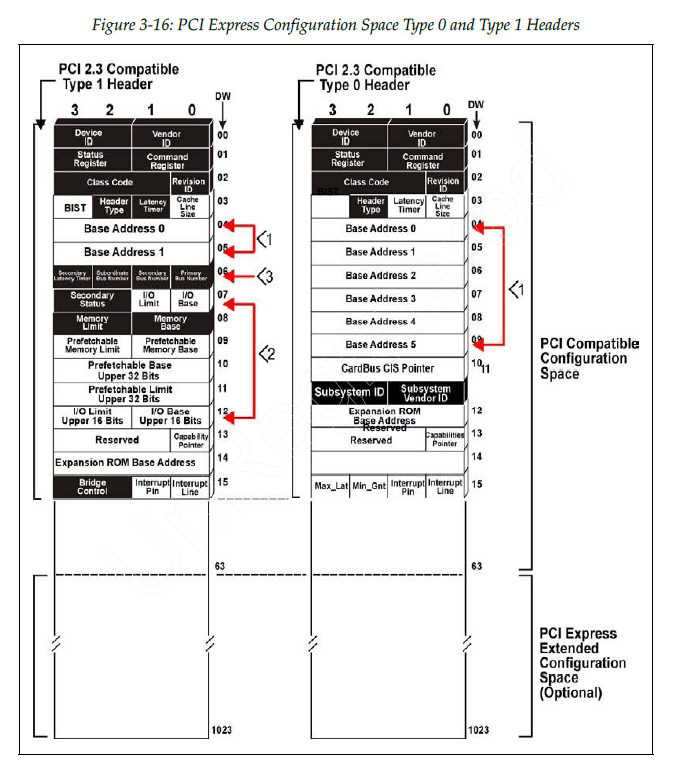
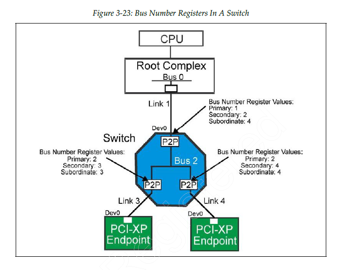

# chapter 3 地址空间和事务路由 address space and transaction routing

多端口 PCIe 设备要有路由能力


处理层数据包可以被接收、拒绝和路由，DLLP和物理层有序集流量不需要被转发。

路由方法有3种：地址路由、ID路由和隐式路由。

## 3.1 introduction

PCI 流量对所有设备可见，路由主要依赖 bridge。
PCIe 设备互相依赖，流量要么被接收，要么朝接收者路由。

当流量到达 ingress port 的时候，设备会检查是否出现问题，然后做出3种决定之一：

- 接收流量并在内部使用
- 转发流量到合适的出端口
- 拒绝流量

### 3.1.1 接收器检查3种类型的流量

链路中正常工作的设备的物理层接收器端口会监控逻辑空闲情况，并区分3种类型的链路流量：

- 有序集
- DLLP
- TLP

本地链路流量没有携带路由信息也不会被转发。

TLP 头部包含路由信息，可以在链路之间转发。

### 3.1.2 多端口设备承担路由负荷

multi-port device

### 3.1.3 EP 路由能力有限

EP 只能选择接收还是拒绝向他们提出的 transaction

### 3.1.4 系统路由策略是可编程的

PCIe 设备接入后，需要给他分配存储器和IO地址资源，并对交换器和桥进行编程，保证事务的正常运行。

所有设备都**必须配置**来执行系统事务路由方案。

## 3.2 两种类型的本地链路流量

local link traffic 目的是管理 link，这种流量不会被转发和进行流控，一旦发送**必须被接收**。

包含2类：物理层的 ordered sets 和 数据链路层的 DLLP

### 3.2.1 有续集

物理层控制信息

有序集的大小是固定的。


### 3.2.2 DLLP

DLLP 的主要功能是链路电源管理、TLP 流控、为 TLP 确认信息提供支持。


DLLP 携带16比特的 CRC


## 3.3 TLP 路由基础

TLP 从一条 link 转发到另一条 link 所依赖的机制和规则

### 3.3.1 用于访问4种地址空间的 TLP


### 3.3.2 使用 split transaction protocol

#### 分离事务：性能更好，开销更大

分离事务协议是指：请求和完成在时间上解耦。
对于需要响应的 PCIe 事务，请求方先发送一个 Request TLP，完成方在稍后的时间再发送一个独立的 Completion TLP 返回结果。
这两个 TLP 在交换结构中独立传输和路由，但在事务语义上彼此对应。

- Split transaction = 请求和响应分开，不在同一时刻同步完成。
- 在 PCIe 里，通常表现为 Request TLP 和 Completion TLP 分离。
- 这两个 TLP 传输上独立，语义上关联。


#### write posting：sometimes completion isn't needed

posted memory write 是**可以**被接受的：这是为了性能提升。

但是 IO write 和 config write **不能是** posted 的：这是因为配置和IO写入可能改变设备的行为。


总的来说，memory write 和多数 message/message with data 是 **posted**.

### 3.3.3 TLP 路由的3种方法

TLP 无论目的地址是4种地址空间的哪一种，都是采用三种可能的路由方案：地址路由、ID 路由、隐式路由。


### 3.3.4 PCIe 路由方法与 PCI 的对比

PCIe 在软件可见模型上与 PCI 保持高度兼容，但由于它采用分组交换结构，又扩展了多种 TLP 路由方式。

#### PCIe adds implicit routing for messages

对于某些 Message TLP，可以使用 implicit routing，即目标接收者由消息类型和协议语义隐含确定，而不是像 Memory/IO 事务那样依赖显式地址映射。

这使得某些通知和事件类功能不必建模为普通寄存器访问，但并不意味着整个消息处理过程完全不需要设备支持或软件配置。

implicit routing 的重点是“路由目标由**消息语义**隐含决定，而不是由普通地址字段显式指定”。

### 3.3.5 数据包头中的 type 和 format 字段

TLP 的 header 中有 type 和 FMT 字段用来支持路由，长度为 3DW 或 4DW

### 3.3.6 using TLP header information

TLP 到达 ingress port 之后，接收器的物理层和链路层会进行错误检查，检查无误后执行 TLP 路由。

1. determine size and format
2. if it is for me, accept or forward
3. if it is not for me, reject

## 3.4 应用路由机制 applying routing mechanism

系统路由策略配置完成并启用事务之后，从 ingress 进入的 TLP 就会被处理。

这种处理包含多个层面：如果 TLP 的目的地是 internal location，就接收，如果不是，而且设备恰好是个 Switch，那么就会根据规则转发到
egress port. 如果数据包有错的话，也会进行相应的处理。

在处理的时候，会参照配置空间基址寄存器、基址界限寄存器、总线寄存器，然后进行地址路由、ID 路由、implicit 路由。

### 3.4.1 address routing

地址路由主要用于数据在存储器、IO设备之间传输数据。

#### 存储器和 IO 地址映射

system memory map 是 CPU address bus 所能访问的地址的 function。


#### 地址路由中的主要 TLP 字段

如果收到的 TLP 中的类型字段规定要使用 address routing，那么就需要去检查 address 字段来执行路由。
有 3DW 长的32位地址和 4DW 长的64位地址


#### EP checks address routing TLP

EP 会比较 TLP header 中的 address 与 type0 configuration space 中的每一个 BAR 地址，决定 reject 还是 access 这个 TLP。


#### Switch checks address routing TLP in 2 ways

Switch 对 address-routed TLP 的处理分两步：

1. 首先检查该 TLP 的目标地址是否命中 Switch 自身可响应的空间，如果是，则由 Switch 自己作为 completer 接收。
2. 如果不是，则根据 Switch 各个下游端口对应的 Type 1 配置头中的 Base/Limit 窗口寄存器，判断该地址属于哪个 downstream
   port，并将 TLP 转发到对应端口。


Switch address routing 有这3种情况：

1. 如果该地址命中了某个 downstream port 对应的 Base/Limit 窗口，就转发到那个 downstream port。
2. 如果该 TLP 是从 primary/upstream 端口进入但又不匹配任何 downstream window，则可视为无法路由，通常按 Unsupported Request
   处理。
3. 如果 TLP 是从 downstream 端口进入且不属于 Switch 本地空间，则通常向 upstream/primary 端口转发。

### 3.4.2 ID routing

ID 路由以设备功能的逻辑位置为基础，路由配置事务、消息事务和完成事务。

logic position: bus number, device number, function number.

#### ID bus number, device number, function number 的限制

PCIe 大系统里，最先碰到的通常是 bus number 限制，而不是 function 数限制。

- Bus Number：8 位，最多 256 个 bus
- Device Number：5 位，每 bus 最多 32 个 device
- Function Number：3 位，每 device 最多 8 个 function

#### ID routing 中的关键 TLP header 字段

有 3DW 长度的 TLP header 和 4DW 长度的 TLP header。

> Type 表示事务语义，Fmt 表示包格式。
>
> 3DW 和 4DW 的区别主要来自地址字段是 32 位还是 64 位。
>
> 带数据还是不带数据，也由 Fmt 体现。





#### EP 检测 ID 路由的 TLP

configuration write type0 会对 EP 进行配置，之后 EP 会比较 TLP header 中的 BDF，然后选择接受还是拒绝。

reset 之后，bus number 和 device number 都会被置为0，这个时候 EP 将只响应 configuration write。

#### Switch 检测 ID 路由的 TLP

switch 接收 ID-routed TLP 也会进行 two checks.

1. if it is for me?
2. if it is for downstream links?



### 3.4.3 Implicit Routing

Implicit Routing 是 PCIe Message TLP 的一种典型路由方式。

message 也可以使用地址或 ID 路由方法。

它的特点是：TLP 不依赖显式的地址或 ID 来指定目标，而是由 Message 的类型和协议规定的路由规则决定转发方向，例如向上游、向下游或广播。

许多与系统管理相关的功能都会通过 Message TLP 传递，例如：

- power management
- INTx legacy interrupt signaling
- error signaling
- hot plug signaling
- vendor-specific message
- slot power limit message

这些消息经常会涉及 Root Complex，但并不能简单理解为大多数 Message 都只是由 RC 发出和接收；具体的发送方、接收方和转发方式取决于消息类型本身。

注意 message TLP 总是使用 4DW header。



header 中的关键字段主要是 type 和 code，这决定 TLP implicit routing 的处理方案



## 3.5 路由选项的即插即用配置（plug-and-play configuration）

这里概述与 routing 相关的 configuration space register 的编程方法。

> 注意：Configuration Space 在设备/function 里面，是寄存器空间。
> TLP Header 在传输包里面，是访问这些寄存器空间时携带的控制和寻址信息。

**1. Configuration Space 是什么**

它是每个 PCIe Function 自己实现的一块寄存器空间。

也就是说：

- RC 里的某些 function 有自己的 configuration space
- EP 的每个 function 有自己的 configuration space
- Switch 的每个 port function 也有自己的 configuration space

所以它本质上是：

设备内部的一组可被访问的配置寄存器

**2. TLP Header 是什么**

它是在线上传输的包头，属于传输中的数据格式。

它里面会带：

- 这是 Memory Read 还是 Config Write
- 目标 Bus/Device/Function
- 地址
- Tag
- 长度
- 属性位

所以它本质上是：

“怎么去访问某个东西”的请求描述

**3. 配置过程**

```text
CPU / RC software
    ↓
生成 Configuration Read/Write 请求
    ↓
TLP Header 中携带：
  - Type0/Type1
  - Bus/Device/Function
  - Register Number
    ↓
桥 / Switch 根据规则转发
    ↓
目标 Function
    ↓
访问该 Function 内部的 Configuration Space
    ↓
返回 Completion
```

### 3.5.1 Routing configuration 与 PCI 兼容（compatible）

PCIe configuration space 总大小为 4KB，其中前 256B 与传统 PCI configuration space 兼容。

#### 两种 configuration header format：Type 0 / Type 1

- Type 0 header：用于 Endpoint 等非桥设备
- Type 1 header：用于桥设备，如 Root Port、Switch Port 等



#### 与 routing 相关的关键寄存器主要位于 configuration header 中

主要包括：

- BARs（主要用于设备声明自己响应的地址窗口）
- Base/Limit register pairs（Type 1 header，用于桥定义下游地址窗口）
- 3 Bus Number registers（Type 1 header，用于配置请求的路由）



### 3.5.2 BARs in Type 0 and Type 1 headers

如果设备需要向主机暴露寄存器或本地资源，通常通过 BAR 由系统分配地址。

BAR 用于描述一个 function 需要响应的 Memory Space 或 I/O Space 地址窗口。
如果某个设备 function 需要作为 Memory Space 或 I/O Space 访问的目标，
则它会实现相应的 BAR（通常是 Memory BAR）。

现代 PCIe 设备通常主要使用 Memory BAR。
MMIO（memory-mapped I/O）本质上是将设备寄存器映射到 Memory Space 中进行访问，并不是独立于 Memory Space 和 I/O Space
之外的第三类地址空间。

### 3.5.3 Base/Limit Registers Type1 header only

Base/Limit registers 位于 Type 1 header 中，用于桥设备的 address routing。

它们定义桥下游可访问的地址窗口，包括：

- Prefetchable Memory Base and Limit Registers
- Non-Prefetchable Memory Base and Limit Registers
- I/O Base and Limit Registers

当桥收到 Memory / I/O Request TLP 时，会根据目标地址是否落入这些窗口来决定是否向下游转发。

因此，Base/Limit registers 描述的是桥的下游地址转发范围；
而 endpoint 的 BAR 描述的是设备自身响应的地址范围。

#### prefetchable 问题

因为上游系统、桥和 host 对这两类空间可以采取**不同处理策略**。

Non-Prefetchable

不能假设多读几字节无害。
常见于寄存器，访问可能有副作用。

Prefetchable

允许系统更激进优化。
更像普通内存窗口、frame buffer、大块 buffer aperture。

所以桥要把这两类空间分开管理，避免错误优化。

### 3.5.4 Bus Number Registers Type 1 header only

Type 1 header 中包含三个与配置请求路由密切相关的寄存器：

- Primary Bus Number
- Secondary Bus Number
- Subordinate Bus Number

它们用于描述桥设备连接的 bus 拓扑范围：

- Primary Bus Number：桥上游所在的 bus
- Secondary Bus Number：桥下游紧邻的 bus
- Subordinate Bus Number：桥下游整个子树中最大的 bus number

对于 Type 1 Configuration Request，桥通过比较目标 Bus Number 与 [Secondary, Subordinate] 区间来决定是否向下游转发：

- 若目标 Bus 不在该区间内，则不向下游转发
- 若目标 Bus = Secondary，则将 Type 1 request 转换为 Type 0 request 发到下游
- 若 Secondary < 目标 Bus <= Subordinate，则继续向下游转发 Type 1 request

因此，这组寄存器主要用于 Configuration TLP 的 routing 和即插即用枚举过程。

> Primary/Secondary/Subordinate 三个寄存器定义了一座桥所负责的下游 bus number 范围，
> 桥据此决定 Configuration TLP 是否转发，以及何时把 Type 1 转成 Type 0。



#### Switch = a two-level Bridge structure

PCIe switch 由一个 Upstream Port 和多个 Downstream Port 组成；这些 port 在配置/路由语义上表现为桥功能。

> 这里转发的主要是 Type 1 Configuration Request（包括 Config Read 和 Config Write）。
> 桥根据目标 Bus Number 是否落在 Secondary~Subordinate 范围内来决定是否向下游转发，
> 并在目标 Bus 等于 Secondary 时把 Type 1 转换为 Type 0

> 注意区分 ID routing 和 configuration space register
>
>Configuration Request 不是靠普通 Memory Address Routing 来找设备，而是按目标 BDF 进行访问。
> 桥设备并不是简单按某个 ID 直接转发，而是利用 Type 1 header 中的 Secondary/Subordinate Bus Number 寄存器，判断目标 Bus
> Number 是否属于自己的下游范围。
> 因此，这三个 Bus Number 寄存器不是 TLP 中的 ID，而是桥实现 Configuration TLP 转发的本地路由配置。
