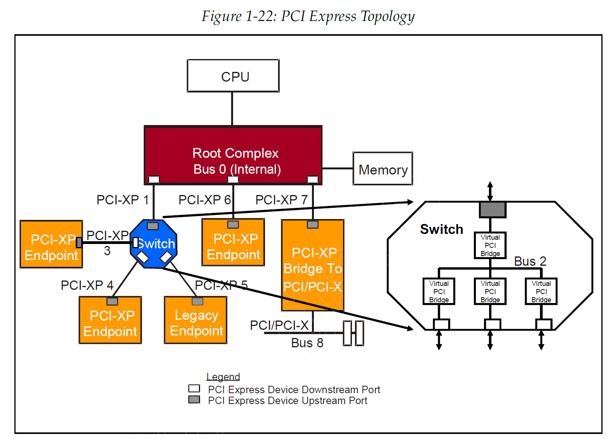
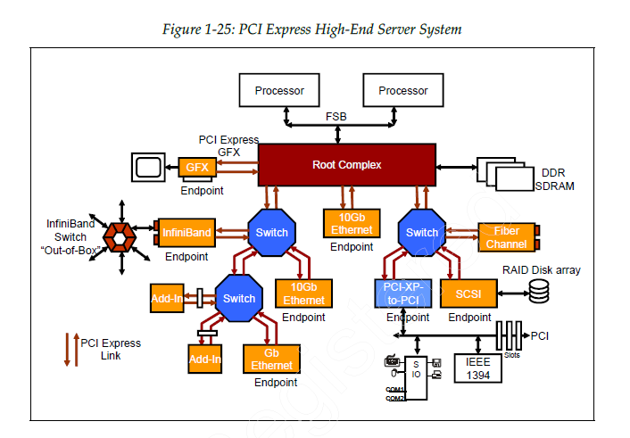

# chapter 1 体系结构视角 architectural perspective

## 1.1 PCI Express 简介

PCIe 采用了与 PCI 相同的使用模型和读写通信模型

PCIe 支持 chip-to-chip 和 board-to-board 的互连。

PCI 是一种多点并行互连总线，多台设备共享一条总线。PCIe 是点对点串行总线，多台设备使用 Switch 实现互连。

根据互连设备的性能需求，每个互连实现了不同的引脚数和通道数。

在串行互连上通信使用的是基于数据包的通信协议。
QoS 为不同应用提供不同的传输性能
热插拔功能使 always-online 系统成为可能。
电源管理功能可以支持低功耗设备的应用。
热插拔、电源管理、错误处理、中断信息使用数据包进行带内传递，降低了设备硬件设计的复杂性。

## 1.2 与原有总线的比较

提高总线频率可以显著增加总线带宽，但是会降低此频率上电气负载的数目。

链路 Link
信号对 Signal Pair
通道 Lane

为了提高信号的健壮性，引入了额外编码：8b/10b 编码器

PCIe 是全双工链路，总带宽是两个方向同时发生的流量。

## 1.4 PCI Express 的线路

PCIe 为互连设备提供高速、点对点、全双工、差分信号链路。

### Link: 点对点互连

一条 X1 链路 Link 有一条通道 Lane, 有1对差分信号，一共4个信号线。

链路初始化的过程中没有 OS 和固件的参与。在硬件初始化期间，链路两端的设备自动初始化链路的带宽和工作频率。

### 差分信号

PCIe 设备各个端口之间使用差分信号驱动器和接收器。

### 用来互连多个设备的交换器 Switch

交换器可以是一个2到 n 端口的设备。

### 基于数据包的协议

PCIe 使用基于数据包的协议来编码事务。

数据包串行地发送和接收，并按字节拆分以通过链路的可用通道，链路上的通道越多，数据包的发送速度就越快，带宽越高。

### 带宽和定时

链路上不存在时钟信号，接收器使用 PLL 从输入比特流恢复时钟。

### 地址空间

PCIe支持的地址空间：存储器地址空间、IO 地址空间、配置地址空间

### PCIe 事务

存储器读/写
I/O 读/写
配置读/写
消息事务

- Memory Read
- Memory Write
- IO Read
- IO Write
- Config Read Type 0 / Type 1
- Config Write Type 0 / Type 1
- Message
- Message with Data

基于数据包的 PCIe 协议会对这些事务进行编码

### PCIe Transaction Model

这个 Request 发出去后，接收方要不要专门回一个 Completion TLP?

PCIe TPL 分为3类：

- Posted Request
- Non-Posted Request
- Completion

Posted = 发出去就算“投递完成”，发送方不用等 Completion。

Non-posted = 发出去后，必须收到 Completion。

| 事务类型              | 功能分类  | 请求属性分类     | 是否需要 Completion |
|-------------------|-------|------------|-----------------|
| Memory Read       | 存储器读  | Non-Posted | 需要，且带数据         |
| Memory Write      | 存储器写  | Posted     | 不需要             |
| IO Read           | IO读   | Non-Posted | 需要，且带数据         |
| IO Write          | IO写   | Non-Posted | 需要，通常不带数据，仅状态   |
| Config Read       | 配置读   | Non-Posted | 需要，且带数据         |
| Config Write      | 配置写   | Non-Posted | 需要，通常不带数据，仅状态   |
| Message           | 消息    | 多数是 Posted | 多数不需要           |
| Message with Data | 带数据消息 | 多数是 Posted | 多数不需要           |
| Completion        | 完成包   | 不是 Request | 它自己就是响应         |

> PCIe 事务可以先按功能分为 Memory、IO、Configuration、Message 等类型；
> 其中这些 Request 又可按是否需要 Completion 分为 Posted 和 Non-Posted。
> Memory Write 和大多数 Message 属于 Posted Request；
> Memory Read、IO Read/Write、Config Read/Write 属于 Non-Posted Request；
> 对 Non-Posted Request，目标设备必须返回 Completion TLP。

### 错误处理和数据传送的健壮性

CRC 字段嵌在每个发送的数据包中。

大量的错误记录寄存器和错误报告机制可以提供 RAS 应用所需要的改进的错误隔离和恢复方案。

RAS：可靠性、可用性、可维护性

### 服务质量 QoS 流量类别 TC 和虚拟信道 VC

QoS 特性是这样的能力：以不同的优先级和确定的时延和带宽传送不同应用程序的数据包通过结构(fabric)

QoS 是目的，TC/VC/仲裁是手段。

流量类别编号：traffic classes number
这些编号是应用程序或设备驱动程序分配的。

每一个 TC 可以单独映射到一个虚拟通道 VC，可以将多个 TC 存放到一个 VC 的 buffer 中

TC 解决“你是谁”，VC 解决“你去哪排队”。

VC 仲裁和端口仲裁

最终不同 TC 号的数据包在通过 PCIe 结构进行传送的时候，可以获得不同的性能。

> 你可以把一条 PCIe 链路想成一个收费站前的发送口。

不同事务不断到来，比如：

- 普通内存读写
- 配置访问
- 消息
- 中断消息
- 实时性更高的流量

如果所有流量都混在一个队列里：

- 大流量 Memory Write 可能堵死小而关键的控制包
- 延迟敏感事务可能一直排队
- 不同业务没法区分服务质量

所以 PCIe 引入了一层层机制：

- TC（Traffic Class）：先给包打标签，说明它属于哪类服务
- VC（Virtual Channel）：把这些标签映射到不同的虚拟发送/接收队列
- VC Arbitration：多个 VC 都有包时，决定这次轮到哪个 VC 发
- Port Arbitration：某个 VC 被选中后，该 VC 内部还有多种 TLP 在等，决定具体发哪一个

所以它不是四个孤立概念，而是一条处理链：

事务 → 标记 TC → 映射到 VC → VC 仲裁 → 端口仲裁 → 发上链路

### 流控制

接收器定期地将自己的 VC 缓冲区的信息传递给发送器，这样保证发送的数据包能够被接收。

### MSI 风格的中断处理

PCIe 设备使用存储器写 TLP 来发送中断 vector 给 RC, RC 再去中断 CPU，PCIe 设备需要实现 MSI 寄存器。

### 电源管理

各个 PCIe 设备的电源状态可以独立管理。

两方面的电源管理：

- D-state 设备电源状态
- L-state 链路状态

### 热插拔支持

从带内传送给 RC 的中断消息会触发热插拔软件来检测热插拔事件。

### 与 PCI 兼容的软件模型

配置空间前 256 字节相同。

### 1.4.1 PCI Express 的拓扑结构

#### RC

Root Complex 连接 CPU 和存储器子系统和 PCIe 设备支持多个端口；
每个端口连接一个 EP 或者 Switch.

RC 代表 CPU 发出事务请求，锁定事务请求。但是当 RC 作为完成者时，是不响应锁定请求的。

RC 实现了中心资源：热插拔控制器、电源管理控制器、中断控制器、错误检测和报告逻辑。

请求者 ID 和完成者 ID 也是由 RC 初始化的。包含了总线号、设备号和功能号。

#### Hierarchy

从 RC 一个端口出来的所有 Link 和 Switch、EP 组成的树。

每个交换器形成一个子层。

#### EP

EP 是不同于 RC 和 Switch 的其他设备，这些是 PCIe 事务的请求者或完成者。

EP 可以作为请求者发起事务，或者作为完成者对事务做出响应。

EP 用设备号 ID 来初始化，设备 ID 包含了总线号、设备号和功能号。

device ID = bus number + device number + function number

一条总线上，EP 总是设备0.

每个 EP 支持最多 8 个 function。

Requester 是发起事务的设备，RC 和 EP 是 requester

Completer 是 requester 寻址或者作为目标的设备，RC 和 EP 也是 completer

#### Port

Port 是 Link 之间的接口，由差分发送器和接收器组成。

#### Switch

Switch 以类似 PCI 桥的方式，路由地转发数据包。

Switch 支持端口仲裁和 VC 仲裁，Switch 还支持锁定请求。

#### Enumerating the System

Links 按照 DFS 的方式进行计数和编号。

每条 PCIe Link 等同与一条 PCI bus，所以有一个 bus number.

所以每条 PCIe Link 只支持一个 device。

