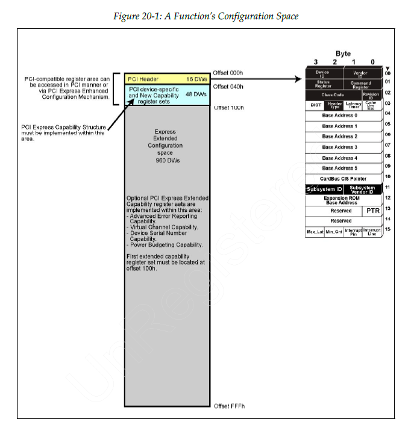

# chapter 20 配置机制 configuration mechanisms

> PCI-compatible configuration space 现在仍然是现代 PCIe 系统中正在真实使用的基础部分，不只是为了兼容旧软件。
>
> Extended configuration space 则承载 PCIe 的大量增强能力，是在前者基础上的扩展。

- PCI-compatible configuration
- PCIe extended configuration

## 20.1 Introduction

每个 function 都有独立的 configuration space，大小为 4KB。

- 前 256 Bytes：PCI-compatible configuration space
- 后 3840 Bytes：PCIe extended configuration space

## 20.2 PCI compatible configuration mechanism

### 20.2.1 Background

X86 架构下打算使用 IO 地址空间作为 PCI 兼容配置空间，但是这个地址空间被 EISA 占据，系统设计者于是只能用存储器空间去实现配置寄存器的映射。

### 20.2.2 PCI 兼容配置机制说明

PCI 兼容配置机制采用了 RC 内的两个 32 bit 端口，一个作为 configuration address port，一个作为 configuration data port。

访问一个 function 的 PCI compatible register：

1. 将 target 的 BDF 和 dword number 写入 configuration address port，并设置 enable bit
2. 1/2/4 bytes 读取或写入 configuration data port

如果 RC 指定的 target bus number 不在直接相连的 bridge 另一端的总线范围内，将启动配置读或配置写事务。

