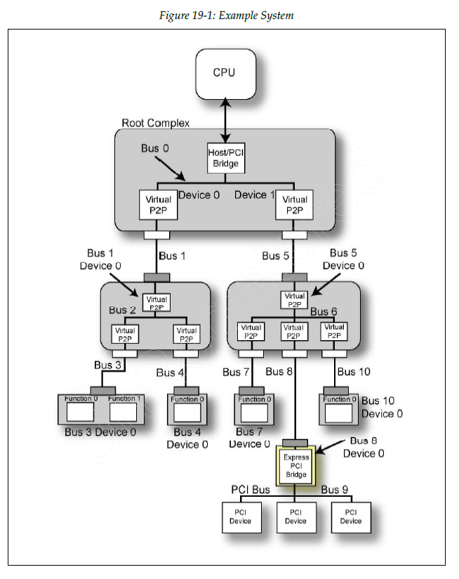
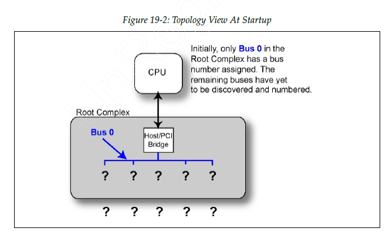
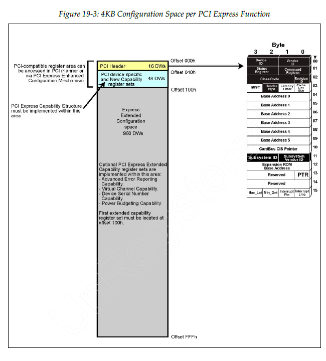
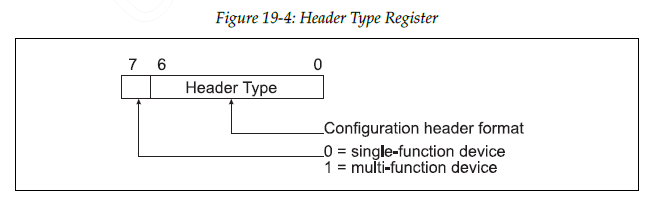

# chapter 19 配置简介：configuration overview

> PCIe 继承了 PCI-compatible configuration space，并扩展了 enhanced/extended configuration space。

- PCI-compatible configuration
- PCIe enhanced configuration

## 19.1 设备与功能的定义

> 一个 device 最多有 8 个 function（0~7）。
> 如果是 multi-function device，则 function 0 必须存在，function number 可以不连续。
> 同一个 Bus:Device 下如果有多个不同的 Function，则该设备是 multi-function device。

这里的 Bus 3 Device 0 就是一个 multi-function 设备。

- Bus 3, Device 0, Function 0
- Bus 3, Device 0, Function 1

## 19.2 Primary Bus / Secondary Bus / Subordinate Bus

对于 PCIe bridge（Type 1 header）：

- Primary Bus：bridge 上游侧所在的 bus
- Secondary Bus：bridge 下游紧邻的 bus
- Subordinate Bus：该 bridge 下游可到达的最大 bus number

这些字段用于 bridge 的配置和枚举。

## 19.3 Topology 在启动时未知

系统启动时并不知道完整的 PCIe topology，只知道从 root bus（通常是 Bus 0）开始扫描。

扫描 PCIe fabric、发现设备与 bridge、建立 topology 并分配资源的过程称为 **enumeration**。

## 19.4 每种功能实现为一组配置寄存器

每个 function 都有独立的 configuration space，大小为 4KB。

- 前 256 Bytes：PCI-compatible configuration space
- 后 3840 Bytes：PCIe extended configuration space

## 19.5 Host/PCI Bridge 与配置空间访问

RC / Host Bridge 向处理器提供访问 PCIe configuration space 的机制。
在很多平台上，这种访问表现为映射到处理器地址空间中的一段内存映射配置窗口（如 ECAM/MMCONFIG）。

## 19.6 由处理器发起配置事务

1. 配置请求由 RC 代表系统软件发起
2. Configuration Request 只沿层级向下游发送
3. Completion 再从目标 function 返回上游
4. 不存在 peer-to-peer configuration transaction

## 19.7 配置事务使用 ID 路由

Configuration transaction 按 Bus / Device / Function 目标进行路由，而不是按内存地址路由。

## 19.8 Function discovery

枚举软件通过读取目标 BDF 的 Vendor ID 判断 function 是否存在。
若 function 不存在，通常会返回 all-1（例如 0xFFFF）。

## 19.9 Non-Bridge function 的区分

通过 Header Type 寄存器判断配置头类型：

- bit 7：是否为 multi-function
- lower 7 bits：header type
    - Type 0：non-bridge function
    - Type 1：PCI-to-PCI Bridge

