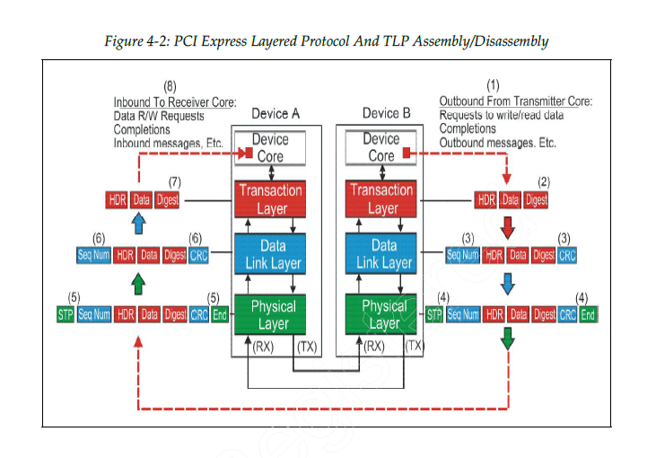
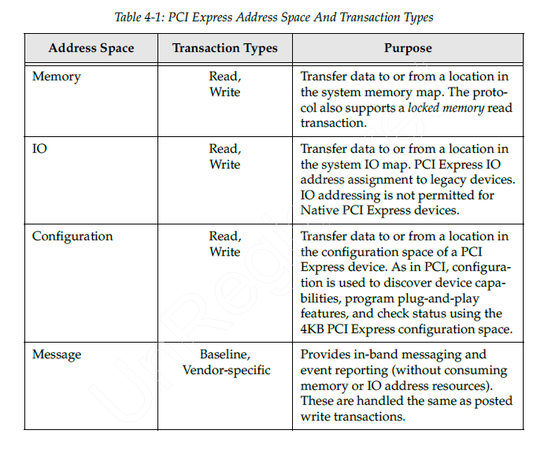
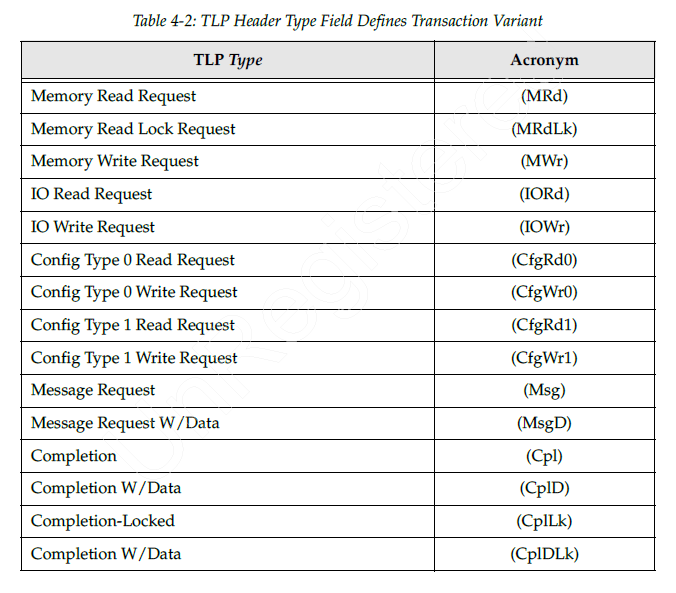
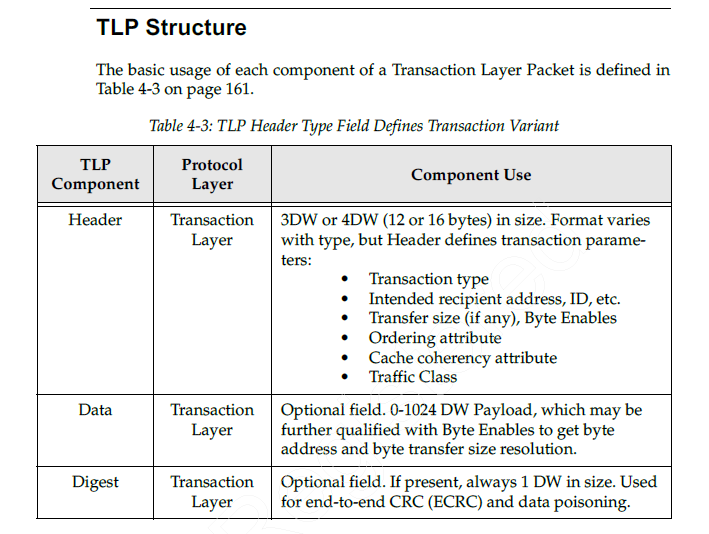
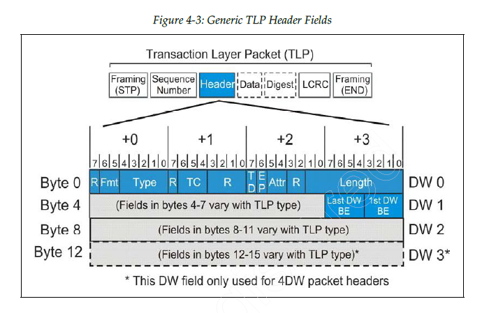
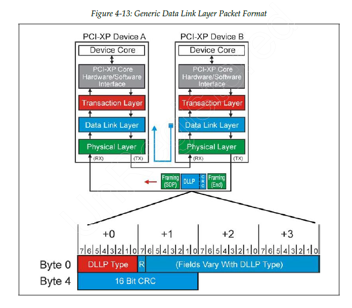

# chapter 4 基于数据包的事务 packet-based transaction

sideband
inband

## 4.1 基于数据包的协议简介

两台 PCIe 设备之间交换的数据包主要是 TLP 和 DLLP。

### 4.1.1 为什么要使用 packet-based transaction protocol

基于数据包的协议的一个显著优点是：数据完整性（data integrity）。

PCIe 在3个方面的设计有助于改进链路发送过程中的数据完整性。

1. 数据包是 well-defined
2. 成帧符号标识数据包的边界
3. CRC 保护整个数据包

#### 数据包 well-defined

每个 PCIe 数据包都有已知的大小和格式。
一旦传送开始，接收者就不能提早终止事务。

这种结构化的数据包格式能够支持在指定的位置插入另外的消息，其中包括成帧符号、CRC、和数据包序列号（TLP才有）。

#### 成帧符号标识数据包的边界

TLP 和 DLLP 数据包都用开始和结束控制符形成了帧，数据包的边界使用的是10 bytes 的开始和结束控制符。

接收器必须完整解码这 10 bytes 的符号之后，才能判断出链路状态的 beginning 和 ending。
非预期的符号被当做错误处理。

#### CRC 保护整个数据包

CRC 不包含成帧符号。

TLP 还包含数据包序列号，这为错误重传提供了机制。

## 4.2 TLP

### 4.2.1 TLP 数据包的组装和拆解

### 4.2.2 device core requests 访问4种地址空间

### 4.2.3 transaction variant

TLP header 中有一个 Type 字段，用于指示 transaction 的类型。

### 4.2.4 TLP structure

digest 是可选的摘要信息

一个通用的 TLP header fields，存储器、IO、配置、消息事务的 TLP header 有一定的差距。

## 4.3 DLLP

数据链路层的主要功能是保证两台设备之间传送 TLP 的完整性，
还负责链路的初始化和电源管理，包括跟踪链路状态并在 transaction layer 和 physical layer之间传递消息和状态。

### 4.3.1 DLLP types

在管理链路时，有3组重要的 DLLP：

1. TLP acknowledgement Ack/Nak DLLPs
2. Power management DLLPs
3. Flow control packet DLLPs

此外，还有一些 vendor-specific DLLP

### 4.3.2 DLLP 是 local traffic

DLLP 是本地流量

### 4.3.3 接收器对 DLLP 的处理

DLLP 接受器的处理：

1. 立即被处理，没有流量控制
2. 所有接收的 DLLP 都要进行错误处理
3. 丢弃 CRC 校验失败的 DLLP
4. 没有确认协议，但是有超时触发 recovery
5. 不同类型的 DLLP 会发送到不同的内部逻辑进行处理。

### 4.3.4 发送一个 DLLP

DLLP 的大小固定为8 bytes。
