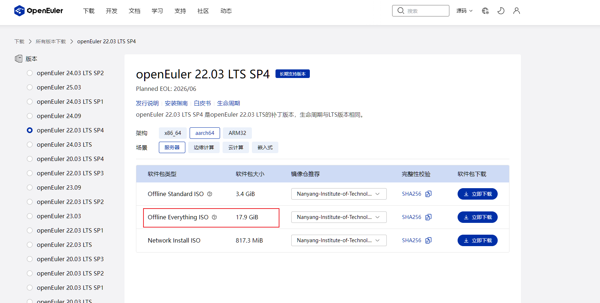

# D2000 开发环境搭建

## 1. 硬件清单（单台）

| 名称         | 数量 | 型号            | 备注                                |
|------------|----|---------------|-----------------------------------|
| 飞腾D2000主板  | 1  | GM9-2002      | 目前该主板网卡驱动只支持麒麟操作系统，其他操作系统需使用USB网卡 |
| 内存         | 2  | 七彩虹DDR4       | 单条容量16G，频率3200MHz                 |
| SSD        | 1  | 七彩虹CN600      | 256G，M.2接口                        |
| 机箱         | 1  | AOCCG 391B    | 支持M-ATX                           |
| 电源         | 1  | SEASONIC ATX3 | 750W                              |
| USB网卡      | 1  | Tenda AX300   | 需自行在飞腾平台上编译驱动                     |
| 显卡         | 1  | AMD R5 230    | 主要用于前期调试，后面PCIE接扩展卡               |
| HDMI-HDMI线 | 1  | 山泽            | 飞腾主板仅支持HDMI和VGA                   |
| U盘         | 1  | Kingston 64GB | 安装操作系统（目前使用openEuler）镜像           |

## 2. 安装 openEuler 操作系统

### 2.1 镜像下载

因为开发后续 DPU 驱动需要使用 5.10 linux kernel，因此选用工具链完善的 ARM64 架构的 openEuler 22.03 SP4 server edition.

操作系统镜像在[这里](https://www.openeuler.org/zh/download/archive/detail/?version=openEuler%2022.03%20LTS%20SP4)
，选择下载服务器版的Everything ISO 文件

### 2.2 安装操作系统

官方的安装指导在[这里](https://docs.openeuler.org/zh/docs/24.03_LTS_SP2/server/installation_upgrade/installation/installation_preparations.html)
，可供参考

我们采用 U 盘制作 USB 启动盘进行安装，后续还可以使用这个 U 盘作为无网络情况下的本地 yum 源安装软件。

1. 下载 USB 盘制作工具，这里使用了 Ubuntu 社区的开源烧录工具 [balenaEtcher](https://etcher.balena.io/)
2. 准备一个 32G 或更大的U盘，使用 balenaEtcher 和下载好的 ISO 文件制作一个启动 U 盘
3. 上电后按 F11 进入启动选项的选择，选择从 USB 启动
4. 根据菜单提示进行安装，这里需要注意的是在 `software selection` 的时候选择上 `infiniband support` 和 `development tools`
5. 系统安装好后重启进入 openEuler 系统

## 3. 网络问题

### 3.1 下载网络驱动程序

北京集特智能制造的 D2000 主板上的以太网口的驱动目前只有 openKiny 麒麟操作系统支持，但是麒麟操作系统的开源版本是办公用途，不利于我们开发
DPU 驱动。

我们购买了 USB 无线网卡，使用 WIFI 连接到路由器，当我们的 Windows PC 与 D2000 环境连接到同一个路由器的时候，可以实现网络通信。

我们购买了 Tenda AX300 wifi6 USB 无线网卡，这个网卡在 Linux 上需要自己编译驱动程序。

网卡驱动程序从[这里](https://tenda.com.cn/material/show/690938082103365)下载，下载后的压缩包中有 PDF 文档，根据文档安装网卡的
firmware 和 ko。

### 3.2 解决兼容性错误

网卡驱动程序在编译过程中遇到了多个内核版本相关的兼容性错误，需要修改
`aic8800_linux_drvier/drivers/aic8800/aic8800_fdrv/aicwf_usb.c`，

```c++
AICWFDBG(LOGINFO, "%s the cpu is:%d\n", __func__, current->cpu);
```

改为

```c++
AICWFDBG(LOGINFO, "%s the cpu is:%d\n", __func__, get_cpu());
```

安装好驱动之后 `ifconfig` 命令执行后可以看到一个 `wlan0` 的网络设备
如果没看到，先执行一下

```shell
ifconfig wlan0 up
```

`nmcli` 执行后会看见 `wlan0` 报错 `pluging missing`

### 3.3 操作系统网络配置问题

安装好驱动之后，网卡可以被系统识别到，但是无法使用 DHCP 协议获取 IP 地址与路由器通信，我们还需要一些工具和设置。

## 4. 使用本地镜像源安装网络相关工具

现在还没有网络，因此我们还要使用启动盘作为本地 yum 源。

### 4.1 查看当前块设备

插入 U 盘后，执行：

```sh
lsblk
```

可以看到U 盘分区，假设 U 盘分区是 /dev/sda1，你可以挂载它到 /mnt/iso：

```sh
mkdir -p /mnt/iso
mount /dev/sda1 /mnt/iso
```

### 4.2 创建本地仓库文件

首先需备份/etc/yum.repos.d/目录下的.repo源文件，再将其删除

```shell
cp /etc/yum.repos.d/xxx.repo /etc/yum.repos.d/xxx.repo.backup
rm -rf /etc/yum.repos.d/xxx.repo
vi /etc/yum.repos.d/local.repo
```

添加如下内容：

```text
[local]
name=OpenEuler Local Repo
baseurl=file:///mnt/iso
enabled=1
gpgcheck=0
```

保存并退出（:wq）

### 4.3 刷新本地缓存

```sh
dnf clean all
dnf makecache
```

查看是否识别成功：

```sh
dnf repolist
```

应该能看到：

```text
repo id     repo name
local       OpenEuler Local Repo
```

### 4.4 使用本地源安装软件

```sh
dnf install wpa_supplicant -y
dnf install make gcc kernel-headers kernel-devel -y
```

## 5. 手动连接WiFi

使用 wpa_supplicant + dhclient 方式手动连 WiFi：

### 5.1 创建配置文件

```sh
vi /etc/wpa_supplicant/wpa_supplicant.conf
```

```text
network={
    ssid="你的WiFi名称"
    psk="你的WiFi密码"
}
```

### 5.2 执行连接

```shell
sudo wpa_supplicant -B -i wlan0 -c /etc/wpa_supplicant/wpa_supplicant.conf
sudo dhclient wlan0
```

### 5.3 验证网络功能

输入`ip a`可以看到 wlan0 已经通过 DHCP 从路由器那里获取了 IPv4 地址，使用 `ping www.baidu.com` 可以验证网络通信正常。

## 6. 配置启动自动配置网络

### 6.1 首先，假设你的脚本路径是

```shell
vim /usr/local/bin/config_wlan0.sh
```

```text
#!/usr/bin/sh

ifconfig wlan0 up

sleep 3

wpa_supplicant -B -i wlan0 -c /etc/wpa_supplicant/wpa_supplicant.conf

dhclient wlan0
```

可执行权限

```shell
chmod +x /usr/local/bin/config_wlan0.sh
```

### 6.2 创建一个 systemd 服务文件：

```shell
vim /etc/systemd/system/wlan0-config.service
```

### 6.3 在文件中添加以下内容：

```text
[Unit]
Description=Configure wlan0 IPv4 address on boot
After=network.target

[Service]
Type=oneshot
ExecStart=/usr/local/bin/config_wlan0.sh
RemainAfterExit=yes

[Install]
WantedBy=multi-user.target
```

### 6.4 启用并启动服务：

```shell
sudo systemctl daemon-reload
sudo systemctl enable wlan0-config.service
```
