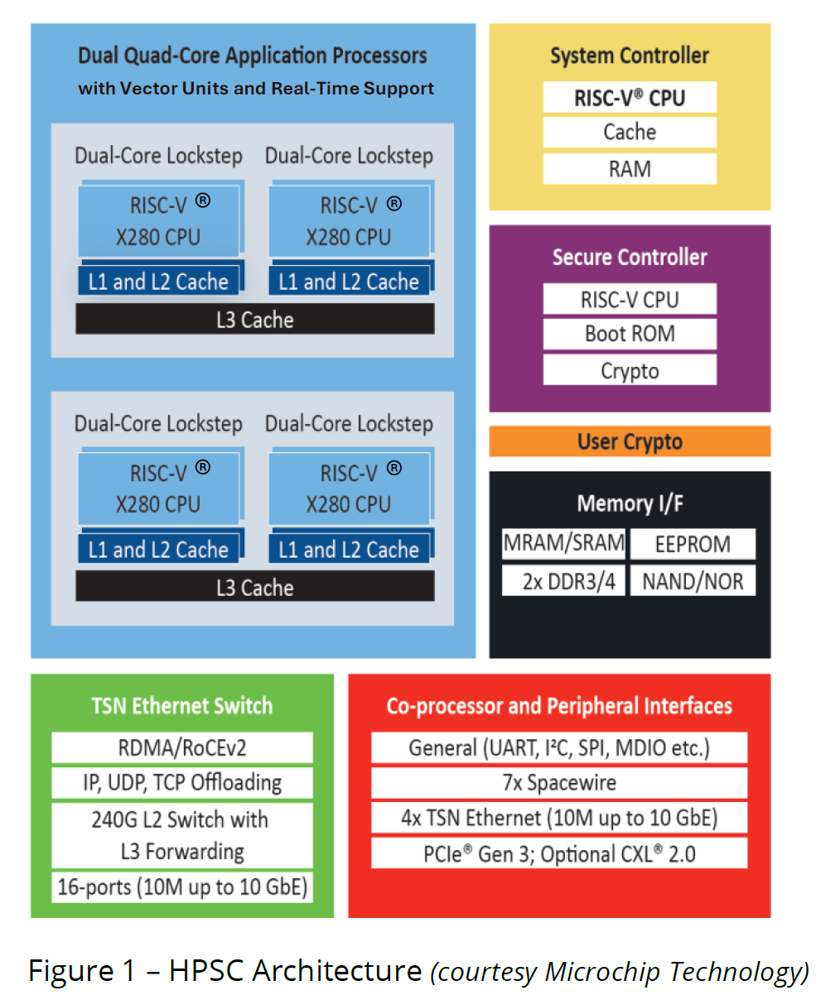
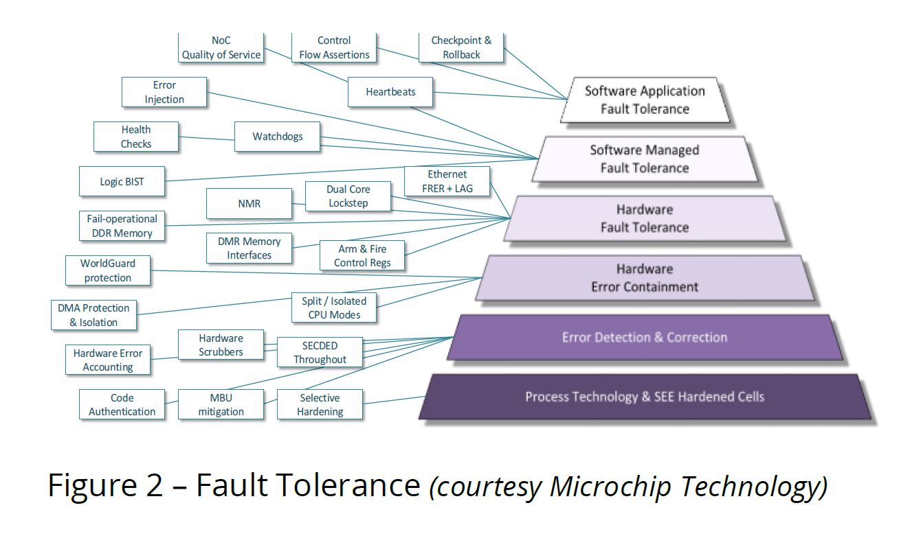
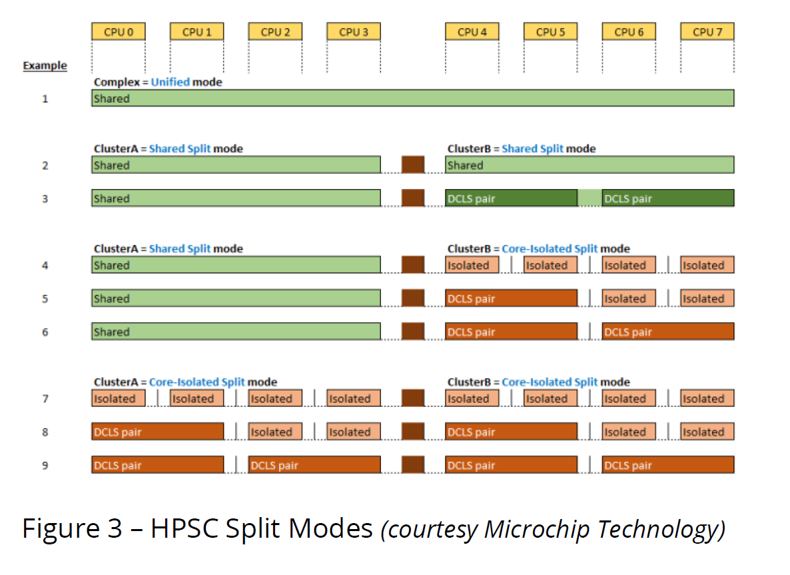

# NASA’s High Performance Spaceflight Computer

NASA 高性能航天飞行计算机

---

## 1. Introduction（引言） （Page 1，第一页）

> 机构：National Aeronautics and Space Administration（美国国家航空航天局，NASA）  
> 文档类型：White paper（白皮书）  
> 年份：2024

| 原文（English）                                                                                                                                                                                                                                                                                                                                                                                                                                                                                                                                                                                                            | 译文（中文）                                                                                                                                                                                                                                                |
|------------------------------------------------------------------------------------------------------------------------------------------------------------------------------------------------------------------------------------------------------------------------------------------------------------------------------------------------------------------------------------------------------------------------------------------------------------------------------------------------------------------------------------------------------------------------------------------------------------------------|-------------------------------------------------------------------------------------------------------------------------------------------------------------------------------------------------------------------------------------------------------|
| **NASA’s High Performance Spaceflight Computer**                                                                                                                                                                                                                                                                                                                                                                                                                                                                                                                                                                       | **NASA 高性能航天飞行计算机**                                                                                                                                                                                                                                   |
| **I. Introduction**                                                                                                                                                                                                                                                                                                                                                                                                                                                                                                                                                                                                    | **一、引言**                                                                                                                                                                                                                                              |
| As humans and robotic space missions continue to explore the universe, scientific observation and analysis of remote locations require advanced levels of autonomy to successfully achieve NASA’s science goals. Spacecraft computational power, connected systems, power efficiency and resilience in dynamic, harsh environments are critical to improving the quantity and quality of science return.                                                                                                                                                                                                               | 随着载人任务与机器人航天任务持续探索宇宙，对遥远地点的科学观测与分析需要更高水平的自主能力，才能成功实现 NASA 的科学目标。航天器的计算能力、互联系统、能效，以及在动态且严苛环境中的韧性，对于提升科学回报的数量与质量至关重要。                                                                                                                                   |
| NASA’s Science & Technology Mission Directorate (STMD) has embarked on a Game Changing Development (GCD) effort to significantly improve the capabilities of space-qualified computing technology and funded the *High Performance Spaceflight Computing* (HPSC) program to deliver this technology.                                                                                                                                                                                                                                                                                                                   | NASA 的科学与技术任务理事会（STMD）启动了一项“变革性开发（GCD）”工作，旨在显著提升航天级（space-qualified）计算技术能力，并资助 *高性能航天飞行计算（HPSC）* 项目来交付这项技术。                                                                                                                                           |
| HPSC is a fault tolerant, rad-hard-by-design (RHBD), modern cache-coherent multicore System-On-Chip (SoC) 64-bit microprocessor with unparalleled end-to-end sensor data ingestion and edge processing capabilities facilitated by a built-in 240Gbps enterprise grade TSN Ethernet switch and High Performance Computing (HPC) features. HPSC effectively combines modern computing architectures, advanced SoC design techniques, fault tolerance and recovery mechanisms with a power-aware RHBD approach to achieve over a 100x improvement in performance per watt over NASA’s current space-qualified computers. | HPSC 是一款具备容错能力、设计级抗辐射（RHBD）、现代化缓存一致性多核片上系统（SoC）的 64 位微处理器。它通过内置的 240Gbps 企业级 TSN 以太网交换机与高性能计算（HPC）特性，实现了无与伦比的端到端传感器数据接入与边缘处理能力。HPSC 将现代计算架构、先进的 SoC 设计技术、容错与故障恢复机制，与面向功耗的 RHBD 方法相结合，从而在单瓦性能（performance per watt）方面，相对 NASA 当前的航天级计算机实现了超过 100 倍的提升。 |
| HPSC is a groundbreaking partnership with Microchip Technology and its industry partners. It’s the culmination of Microchip’s over 60 years of spaceflight heritage stretching back to the Apollo program and NASA’s experience and expertise in autonomous systems and fault tolerant computing technologies, ushering in a new era of possibilities for space exploration.                                                                                                                                                                                                                                           | HPSC 是 NASA 与 Microchip Technology 及其行业合作伙伴的一项突破性合作成果。它凝聚了 Microchip 超过 60 年、可追溯至阿波罗计划的航天飞行技术积累，以及 NASA 在自主系统与容错计算技术方面的经验与专长，为空间探索开启了一个充满新可能性的时代。                                                                                                     |
| HPSC was designed for autonomy and AI at the edge of space and the demanding fault-tolerance needs of Human Exploration and Operations (HEO) missions. This whitepaper contains a high level overview of the features and benefits of HPSC.                                                                                                                                                                                                                                                                                                                                                                            | HPSC 的设计目标是满足太空边缘场景下的自主与 AI 需求，以及人类探索与运行（HEO）任务对容错能力的严苛要求。本白皮书对 HPSC 的特性与优势进行了高层概述。                                                                                                                                                                   |

---

> 术语对照与补充对照：见附录 A.1

---

## 2. HPSC is the future of AI science return（HPSC 是 AI 时代科学回报的未来） （Page 2，第二页）

| 原文（English）                                                                                                                                                                                                                                                                                                                                                                                                                                                                                                                                                                                                                                                                                                                                                    | 译文（中文）                                                                                                                                                                                                                         |
|----------------------------------------------------------------------------------------------------------------------------------------------------------------------------------------------------------------------------------------------------------------------------------------------------------------------------------------------------------------------------------------------------------------------------------------------------------------------------------------------------------------------------------------------------------------------------------------------------------------------------------------------------------------------------------------------------------------------------------------------------------------|--------------------------------------------------------------------------------------------------------------------------------------------------------------------------------------------------------------------------------|
| **II. HPSC is the future of AI science return**                                                                                                                                                                                                                                                                                                                                                                                                                                                                                                                                                                                                                                                                                                                | **二、HPSC 是 AI 时代科学回报的未来**                                                                                                                                                                                                      |
| Spacecraft autonomy is the key to exploring dynamic environments in remote locations [1,2,3]. As opportunities to study significant locations and events are farther from Earth, ground-in-the-loop (GITL) based data processing and decision making become inefficient and time consuming, wasting precious spacecraft resources. Furthermore, longer communication light times reduce the ability of mission control, and therefore the spacecraft, to respond to rapidly changing conditions in harsh environments, opportunities for science discovery may be tragically lost or simply overlooked.                                                                                                                                                        | 航天器自主能力是探索遥远地点动态环境的关键 [1,2,3]。当研究重要地点与事件的机会发生在离地球更远的位置时，基于“地面在环（GITL）”的数据处理与决策会变得低效且耗时，从而浪费宝贵的航天器资源。此外，更长的通信光时延会削弱任务控制（以及航天器本身）对严苛环境中快速变化条件的响应能力，导致科学发现的机会可能以悲剧性的方式丢失，或干脆被忽略。                                                  |
| The Deep Space Network (DSN), an infrastructure used to communicate with spacecraft, has limited bandwidth to send massive amounts of data that will be generated by future advanced sensors and on-board science instruments and the cost-per-byte to send, receive and process this data has risen. Moreover, any future space-qualified processor must possess features that allow it to recognize and recover from faults, maintain operational readiness and adapt to changing mission timelines and science objectives. Recent space missions have proven to be particularly long lived and it’s not uncommon to realize unexpected and profitable science return and results during extended mission phases and in the pursuit of ad-hoc science goals. | 深空网络（DSN）作为与航天器通信的基础设施，其带宽有限，难以承载未来先进传感器与星载科学仪器将产生的海量数据；同时，发送、接收并处理这些数据的“每字节成本”正在上升。此外，任何未来的航天级处理器都必须具备相应特性，使其能够识别并从故障中恢复、保持运行就绪状态，并适应不断变化的任务时间线与科学目标。近期航天任务已经证明其生命周期往往非常长，在任务延寿阶段以及追求临时（ad-hoc）科学目标的过程中，获得意外且高价值的科学回报与结果并不少见。 |
| “The objective of NASA space exploration missions is quantified in terms of science return, and achievement of those objectives is represented as a set of mission operational functions” [4].                                                                                                                                                                                                                                                                                                                                                                                                                                                                                                                                                                 | “NASA 空间探索任务的目标可用科学回报来量化，而这些目标的达成可表示为一组任务运行功能（mission operational functions）”[4]。                                                                                                                                              |
| Based on a comprehensive study of past and future spaceflight missions and use-cases, modern computer architectures and science software applications, HPSC was designed with an innovative set of operational features and functions that give scientists and mission designers the ability to achieve unprecedented levels of autonomy and science data processing far from the historied confines of mission control. Figure 1 depicts a high-level block diagram of HPSC and its major sub-systems, where all the sub-systems are attached to a Network-on-Chip (NoC) fabric as the primary organizing principle.                                                                                                                                          | 基于对既往与未来航天任务及用例、现代计算机架构与科学软件应用的综合研究，HPSC 在设计时引入了一组创新的运行特性与功能，使科学家与任务设计人员能够在远离传统“任务控制中心”边界的情况下，实现前所未有的自主水平与科学数据处理能力。图 1 给出了 HPSC 及其主要子系统的高层框图，其中所有子系统都连接到片上网络（NoC）互联结构上，并以此作为主要的组织原则。                                           |
| These key capabilities are: • High Performance Computing (HPC) • Artificial Intelligence At the Edge (AIAE) • Radiation Hardening and Fault Tolerance • Ethernet Connected Spacecraft • Mixed Criticality and Power Efficiency • Security and Mission Assurance                                                                                                                                                                                                                                                                                                                                                                                                                                                                                                | 这些关键能力包括：• 高性能计算（HPC）• 边缘人工智能（AIAE）• 抗辐射加固与容错 • 以太网互联航天器 • 混合关键性与功耗效率 • 安全与任务保障                                                                                                                                                |

---

> 术语补充对照：见附录 A.2

---

### 2.1 High Performance Computing（高性能计算） （Page 2，第二页）

| 原文（English）                                                                                                                                                                                                                                                                                                                                                                                                                                                                                                                                                                                          | 译文（中文）                                                                                                                                                                                                                                                        |
|------------------------------------------------------------------------------------------------------------------------------------------------------------------------------------------------------------------------------------------------------------------------------------------------------------------------------------------------------------------------------------------------------------------------------------------------------------------------------------------------------------------------------------------------------------------------------------------------------|---------------------------------------------------------------------------------------------------------------------------------------------------------------------------------------------------------------------------------------------------------------|
| **1. High Performance Computing**                                                                                                                                                                                                                                                                                                                                                                                                                                                                                                                                                                    | **1. 高性能计算**                                                                                                                                                                                                                                                  |
| HPC is used by scientists to study astronomical phenomenon, analyze large sets of data, perform science simulations and understand the fundamental nature of the universe and our place in it. Typically, space-borne sensors such as telescopes and radars, remote sensing orbiters and rovers conducting orbital and surface science send raw data back to Earth, which can be analyzed using high performance computers. One such HPC system is the Pleiades supercomputer at NASA Ames’ High End Computing Capability (HECC) center.                                                             | 科学家使用高性能计算（HPC）来研究天文现象、分析海量数据、进行科学仿真，并理解宇宙的基本规律以及人类在其中的位置。通常，诸如望远镜与雷达等星载传感器、执行遥感任务的轨道器，以及开展轨道与表面科学探测的巡视器，会将原始数据回传至地球，再使用高性能计算机进行分析。NASA Ames 的高端计算能力（HECC）中心的 Pleiades 超级计算机就是此类 HPC 系统之一。                                                                    |
| HPSC brings a similar capability to spacecraft that enables in situ science data processing and analysis. Furthermore, by enabling HPSC to use the same software, tools and HPC processing techniques as terrestrial supercomputers, we have coined the notion of Desktop to Spaceflight Software Development. Essentially, this means modern science software, built upon existing HPC software libraries and methodologies, is available to NASA scientists supporting the migration of datacenter based HPC tasks to spaceborne HPC tasks.                                                        | HPSC 将类似的能力带到航天器上，使其能够开展原位（in situ）的科学数据处理与分析。此外，通过让 HPSC 能使用与地面超级计算机相同的软件、工具与 HPC 处理技术，我们提出了“从桌面到航天飞行的软件开发（Desktop to Spaceflight Software Development）”这一概念。本质上，这意味着：基于现有 HPC 软件库与方法构建的现代科学软件，将可供 NASA 科学家使用，从而支持把数据中心的 HPC 任务迁移为星载（spaceborne）HPC 任务。      |
| HPSC is a modern cache-coherent shared memory multicore microprocessor with eight application processing cores implemented using the open standard 64-bit RISC-V Instruction Set Architecture (ISA) [5]. HPSC integrates two SiFive X288 core complexes, with each complex consisting of 4x X280 RISC-V cores. The X280 cores were designed with an advanced feature called a vector unit, which are compliant to the RISC-V Vector Extension (RVV) standard. The vector unit features a 512-bit vector register length and variable vector length computations are supported, up to 4096-bits wide. | HPSC 是一款现代化、支持缓存一致性的共享内存多核微处理器，包含 8 个应用处理核心，采用开放标准的 64 位 RISC-V 指令集架构（ISA）实现 [5]。HPSC 集成了两套 SiFive X288 核心复合体，每套复合体由 4 个 X280 RISC-V 核心组成。X280 核心设计中包含一种称为“向量单元（vector unit）”的高级特性，符合 RISC-V 向量扩展（RVV）标准。该向量单元具备 512-bit 向量寄存器长度，并支持可变向量长度计算，最高可达 4096-bit 宽。 |
| RISC-V vectors are a powerful and super-efficient extension that features compact code size, high performance capability and the on-die SoC structures consume a limited area as compared to Single Instruction Multiple Data (SIMD) architecture approaches favored by other ISAs. Furthermore, RVV can utilize different vector lengths within the same software, enabling scalability, flexibility and future compatibility.                                                                                                                                                                      | RISC-V 向量扩展是一种强大且极高能效的扩展：它具备紧凑的代码规模、高性能能力，并且相较于其他 ISA 偏好的单指令多数据（SIMD）架构路线，其片上 SoC 结构占用面积更小。此外，RVV 能在同一套软件中使用不同的向量长度，从而带来可扩展性、灵活性与面向未来的兼容性。                                                                                                                    |
| Due to the unique properties of the X280 RISC-V vector unit design and implementation, it boasts a high ratio of FLOPS/watt. Furthermore, the X288 scalar and vector pipelines are decoupled, allowing the vector unit to run behind the scalar pipeline, which enables memory loads to commit early. This improves machine-level parallelism and tolerates latency.                                                                                                                                                                                                                                 | 由于 X280 RISC-V 向量单元在设计与实现上的独特特性，它能够实现较高的 FLOPS/瓦（每瓦浮点运算性能）比值。此外，X288 的标量（scalar）与向量（vector）流水线是解耦的，使向量单元可以在标量流水线之后运行，从而让内存加载（memory load）可以更早提交（commit）。这提升了机器级并行性，并增强了对延迟的容忍能力。                                                                              |

---

> **笔记**
>
> 重点抓住三条逻辑：
>
> 1. 为什么 GITL 不够用（光时延 + 资源浪费）
> 2. 为什么 DSN 带宽与成本逼迫端侧处理
> 3. HPSC 解决方案的核心抓手：把“地面 HPC 软件生态”迁移到“星载端侧”

#### 图 1 HPSC Architecture （Page 3，第三页）

（图 1：HPSC 架构，Microchip Technology 提供）—

> 注：图中是架构框图，包含应用处理器集群、系统控制器/安全控制器、存储接口、TSN 交换与外设/协处理器接口等模块。

#### 2.1.1 图 1（框图文字标签）对照翻译

| 图中文字（English）                                                                 | 中文（对照翻译）                                 |
|-------------------------------------------------------------------------------|------------------------------------------|
| Dual Quad-Core Application Processors with Vector Units and Real-Time Support | 双四核应用处理器（含向量单元与实时支持）                     |
| Dual-Core Lockstep                                                            | 双核锁步（Lockstep）                           |
| RISC-V® X280 CPU                                                              | RISC-V® X280 处理器核心                       |
| L1 and L2 Cache / L3 Cache                                                    | L1/L2 缓存 / L3 缓存                         |
| System Controller                                                             | 系统控制器                                    |
| RISC-V® CPU / Cache / RAM                                                     | RISC-V® CPU / 缓存 / RAM                   |
| Secure Controller                                                             | 安全控制器                                    |
| RISC-V® CPU / Boot ROM / Crypto                                               | RISC-V® CPU / 启动 ROM / 密码（学）模块           |
| User Crypto                                                                   | 用户侧密码（学）模块                               |
| Memory I/F                                                                    | 存储接口（Memory Interface）                   |
| MRAM/SRAM / EEPROM / 2x DDR3/4 / NAND/NOR                                     | MRAM/SRAM / EEPROM / 双 DDR3/4 / NAND/NOR |
| TSN Ethernet Switch                                                           | TSN 以太网交换机                               |
| RDMA/RoCEv2                                                                   | RDMA / RoCEv2                            |
| IP, UDP, TCP Offloading                                                       | IP/UDP/TCP 卸载                            |
| 240G L2 Switch with L3 Forwarding                                             | 240G 二层交换（带三层转发）                         |
| 16-ports (10M up to 10GbE)                                                    | 16 端口（10M 至 10GbE）                       |
| Co-processor and Peripheral Interfaces                                        | 协处理器与外设接口                                |
| General (UART, I²C, SPI, MDIO etc.)                                           | 通用接口（UART、I²C、SPI、MDIO 等）                |
| 7x Spacewire                                                                  | 7 路 SpaceWire                            |
| 4x TSN Ethernet (10M up to 10GbE)                                             | 4 路 TSN 以太网端点（10M 至 10GbE）               |
| PCIe® Gen 3; Optional CXL® 2.0                                                | PCIe® Gen3；可选 CXL® 2.0                   |

---

正文（对照翻译）— Page 3（第三页）

| 原文（English）                                                                                                                                                                                                                                                                                                                                                                                                                                                                                                                                                                                                           | 译文（中文）                                                                                                                                                                                                  |
|-----------------------------------------------------------------------------------------------------------------------------------------------------------------------------------------------------------------------------------------------------------------------------------------------------------------------------------------------------------------------------------------------------------------------------------------------------------------------------------------------------------------------------------------------------------------------------------------------------------------------|---------------------------------------------------------------------------------------------------------------------------------------------------------------------------------------------------------|
| Figure 1 – HPSC Architecture (courtesy Microchip Technology)                                                                                                                                                                                                                                                                                                                                                                                                                                                                                                                                                          | 图 1——HPSC 架构（由 Microchip Technology 提供）                                                                                                                                                                 |
| Additionally, as RVV possesses similar qualities as Digital Signal Processors (DSPs), Graphics Processing Units (GPUs) and Tensor Processing Units (TPUs), it eliminates the need for multiple on-die processing units, their associated power consumption and additional software tool chains resulting in decreased power consumption and reduced software complexity compared to devices with multiple heterogeneous computing elements utilizing different ISAs.                                                                                                                                                  | 此外，由于 RVV 具备与数字信号处理器（DSP）、图形处理器（GPU）以及张量处理单元（TPU）相似的一些特性，它在一定程度上消除了对多种片上专用处理单元的需求，连带减少了这些单元的功耗以及额外的软件工具链；与采用多种不同 ISA 的异构计算元素并存的设备相比，这将带来更低的功耗与更低的软件复杂度。                                                 |
| Furthermore, HPSC can simultaneously process scalar, vector and AI/ML instruction streams generated from a single optimizing compiler toolchain. Our compiler suite (LLVM) is the same one used on a significant number of terrestrial supercomputers in the Top500 list, which is a ranked measure of a given computers ability to solve a series of linear equations, A x = b, using a dense random matrix A.                                                                                                                                                                                                       | 另外，HPSC 能够同时处理由同一套优化编译器工具链生成的标量、向量以及 AI/ML 指令流。我们使用的编译器套件（LLVM）也被 Top500 榜单中的大量地面超级计算机采用；Top500 是对计算机求解线性方程组能力的一种排名度量，其基准问题可表述为使用稠密随机矩阵 A 来求解 A·x = b。                                                  |
| To enable this extreme leap in space-borne data processing capability, HPSC features two high-performance DDR4 ports that have a combined bandwidth of 51.2 GBytes/second. This helps to satisfy the high rates of memory communication required to sustain computations by the 8 vector units in the application cores. Additionally, HPSC has two DMA engines that can be used to offload the movement and transposition of data inside the SoC with minimal involvement of the cores. These DMA engines can overlap data transfer while computation is occurring, increasing performance and minimizing latencies. | 为了实现这种星载数据处理能力的“跨越式提升”，HPSC 配备了两路高性能 DDR4 端口，合计带宽为 51.2 GB/s。这有助于满足应用核心中 8 个向量单元持续计算所需的高带宽内存通信速率。此外，HPSC 还提供两套 DMA 引擎，可在尽量少占用核心参与的情况下，将 SoC 内部的数据搬运与转置操作卸载给 DMA。DMA 引擎能够在计算进行的同时并行执行数据传输，从而提高性能并尽量降低延迟。 |
| HPSC has software support for OpenCL, a programming language and open standard for exploiting the differing strengths of multiple connected parallel processors. This standard allows the composition of parallel computing tasks independent of the underlying ISA or architecture.                                                                                                                                                                                                                                                                                                                                  | HPSC 在软件上支持 OpenCL——一种编程语言与开放标准，用于发挥多个互联并行处理器的不同优势。该标准允许并行计算任务的组合与构建不依赖于底层 ISA 或具体架构。                                                                                                                   |
| OpenCL in HPSC can target both the on-chip RISC-V application cores and off-chip attached GPUs, accelerators and FPGAs. With the ability to connect disparate, specialized processing elements via dual x8 or bifurcated quad x4 PCIe Gen 3 interfaces and target them with a unified programming language, HPSC can scale out to handle the most demanding and specialized workloads.                                                                                                                                                                                                                                | HPSC 中的 OpenCL 既可以面向片上 RISC-V 应用核心，也可以面向片外连接的 GPU、各类加速器与 FPGA。通过双 x8 或可分叉为四 x4 的 PCIe Gen3 接口连接不同的专用处理单元，并用统一的编程语言对它们进行开发与调度，HPSC 能够横向扩展以应对最苛刻、最专用的负载。                                                  |
| Furthermore, HPSC features Compute eXpress Link (CXL) [6], a protocol that rides on top of its PCIe interfaces and allows CXL enabled devices to participate in HPSC’s memory coherency mechanism. This eliminates the need for specialized data handling due to the “host to device” memory transfer paradigm.                                                                                                                                                                                                                                                                                                       | 此外，HPSC 还支持 Compute eXpress Link（CXL）[6]。CXL 是一种构建在 PCIe 接口之上的协议，使支持 CXL 的设备能够参与到 HPSC 的内存一致性机制中。这将减少因“host-to-device（主机到设备）”内存传输范式而产生的专门数据处理需求。                                                        |
| HPSC’s HPC capability via RVV, its high-performance memory subsystems, standards-based software compatibility and custom data movement features allow very efficient processing of large datasets and is well suited to scientific computing workloads utilized by planetary scientists, astronomers and instrument designers.                                                                                                                                                                                                                                                                                        | HPSC 通过 RVV 提供的 HPC 能力、高性能内存子系统、基于标准的软件兼容性，以及定制化的数据搬运特性，使其能够高效处理大规模数据集，并非常适合行星科学家、天文学家与仪器设计人员所使用的科学计算工作负载。                                                                                              |
| Finally, utilizing HPSC’s massive external I/O capability (discussed below), multiple HPSCs can be combined to realize HPC clusters of rad-hard computing services for use on larger spacecraft, orbiting satellites, gateways, space stations and HABs.                                                                                                                                                                                                                                                                                                                                                              | 最后，借助 HPSC 强大的外部 I/O 能力（下文将讨论），可以将多个 HPSC 组合起来，构建由抗辐射加固计算服务组成的 HPC 集群，用于更大型的航天器、在轨卫星、网关节点、空间站以及 HABs（文中缩写，原文保留）。                                                                                        |

---

### 2.2 AIAE（边缘人工智能） （Page 3，第三页，续到下一页）

| 原文（English）                                                                                                                                                                                                                                                                                                    | 译文（中文）                                                                                                                                   |
|----------------------------------------------------------------------------------------------------------------------------------------------------------------------------------------------------------------------------------------------------------------------------------------------------------------|------------------------------------------------------------------------------------------------------------------------------------------|
| 2. AIAE                                                                                                                                                                                                                                                                                                        | 2. AIAE（边缘人工智能）                                                                                                                          |
| Artificial Intelligence At the Edge (AIAE) features allow HPSC to use neural network computational techniques to make sense of its environment, plan and execute missions based on changing real-time priorities and objectives and resolve critical science questions.                                        | 边缘人工智能（AIAE）特性使 HPSC 能够使用神经网络计算技术来理解其所处环境，并根据不断变化的实时优先级与目标来规划和执行任务，从而解决关键科学问题。                                                           |
| Combined with HPSC’s unprecedented end-to-end system throughput and carefully realized system balance (the ratio of computations to communications), the RVV execution pipeline in each application processing core also enables HPSC to perform high-performance AI/ML tasks.                                 | 结合 HPSC 前所未有的端到端系统吞吐能力以及精心实现的系统平衡（即“计算与通信的比例”），每个应用处理核心中的 RVV 执行流水线也使 HPSC 能够执行高性能的 AI/ML 任务。                                            |
| This is further enhanced by specialized extensions to the RVV specification called SiFive Intelligence Extensions. These custom vector instructions speed up critical computations necessary for efficient execution of Convolutional Neural Networks (CNNs) with mixed datatypes and complex data reductions. | 这一能力还可通过对 RVV 规范的专用扩展进一步增强，该扩展称为 SiFive Intelligence Extensions。这些定制的向量指令能够加速关键计算，使得在混合数据类型与复杂归约（data reduction）场景下，高效执行卷积神经网络（CNN）成为可能。 |
| HPSC can process AI workloads, data flow management, object detection and recognition, recommendation  processing, mission planning and assist flight and mission software with decision making. These AI tasks can execute while simultaneously ingesting sensor data at speed.                               | HPSC 可以处理 AI 工作负载、数据流管理、目标检测与识别、推荐处理、任务规划，并辅助飞行与任务软件进行决策。这些 AI 任务可以在高速持续接入传感器数据的同时执行。                                                    |
| Finally, the HPSC software suite uses the same libraries and AI/ML API interfaces (Tensorflow, XNNPACK and OpenXLA) as terrestrial applications. Models can easily be developed and validated on the desktop and in the datacenter and then directly used inside HPSC.                                         | 最后，HPSC 的软件套件使用与地面应用相同的库与 AI/ML API 接口（Tensorflow、XNNPACK、OpenXLA）。模型可以在桌面与数据中心环境中轻松开发与验证，然后直接在 HPSC 内部使用。                               |

---

> 术语补充对照：见附录 A.3

---

#### 图 2 Fault Tolerance（图 2：容错，Microchip Technology 提供） （Page 4，第四页）

> 注：图 2 是“多层容错栈”的概念图：从工艺与抗辐射单元、错误检测与纠正、硬件错误收敛（containment）、硬件/软件容错到应用级容错。旁边列了许多支撑模块（watchdog、健康检查、EDAC/ECC、内存
> scrubbing、NMR、锁步等），用于形成端到端的韧性体系。

（图注）

- 原文：Figure 2 – Fault Tolerance (courtesy Microchip Technology)
- 译文：图 2——容错（由 Microchip Technology 提供）

---

### 2.3 Radiation Hardening and Fault Tolerance（抗辐射加固与容错） （Page 4，第四页）

| 原文（English）                                                                                                                                                                                                                                                                                                                                                                                                                                                                                                                                                                                                                                                               | 译文（中文）                                                                                                                                                                                                                                     |
|---------------------------------------------------------------------------------------------------------------------------------------------------------------------------------------------------------------------------------------------------------------------------------------------------------------------------------------------------------------------------------------------------------------------------------------------------------------------------------------------------------------------------------------------------------------------------------------------------------------------------------------------------------------------------|--------------------------------------------------------------------------------------------------------------------------------------------------------------------------------------------------------------------------------------------|
| **3. Radiation Hardening and Fault Tolerance**                                                                                                                                                                                                                                                                                                                                                                                                                                                                                                                                                                                                                            | **3. 抗辐射加固与容错**                                                                                                                                                                                                                            |
| HPSC is developed using an RHBD approach that blends multiple radiation hardened design techniques. This approach allows for high processor clocks rates, while simultaneously protecting HPSC from harsh radiation environments. Logic structures on the device are protected from radiation damage and radiation-induced operational failures using a variety of radiation-hardened flip flops and gates. These logic elements are distributed within HPSC according to functional criticality, power, timing, and die area tradeoffs. This ensures high-performance processing, lower power consumption and a balance of radiation protection for deep space missions. | HPSC 采用一种“设计级抗辐射（RHBD）”方法进行开发，该方法融合了多种抗辐射加固设计技术。该方法既允许处理器实现较高的时钟频率，同时又能保护 HPSC 免受严苛辐射环境的影响。器件上的逻辑结构通过多种抗辐射加固触发器（flip-flop）与逻辑门（gate）来抵御辐射损伤以及辐射诱发的运行故障。这些逻辑单元会依据功能关键性、功耗、时序以及芯片面积等权衡，分布在 HPSC 的不同位置。由此在深空任务场景下实现高性能处理、更低功耗，并在抗辐射保护能力上取得平衡。 |

---

#### 2.3.1 Radiation Hardening Design Approach（抗辐射加固设计方法） （Page 4，第四页）

| 原文（English）                                                                                                                                                                                                                                                                                                                                                                                                                                                                                                                                                                                                                                      | 译文（中文）                                                                                                                                                                                                                                                                          |
|--------------------------------------------------------------------------------------------------------------------------------------------------------------------------------------------------------------------------------------------------------------------------------------------------------------------------------------------------------------------------------------------------------------------------------------------------------------------------------------------------------------------------------------------------------------------------------------------------------------------------------------------------|---------------------------------------------------------------------------------------------------------------------------------------------------------------------------------------------------------------------------------------------------------------------------------|
| **A. Radiation Hardening Design Approach**                                                                                                                                                                                                                                                                                                                                                                                                                                                                                                                                                                                                       | **A. 抗辐射加固设计方法**                                                                                                                                                                                                                                                                |
| HPSC is fabricated on GlobalFoundries 12LP+ (12nm Leading-Performance Plus) process node to fabricate HPSC chips. GlobalFoundries is an onshore high-volume, trusted supply chain provider to the Department of Defense (DoD) with low defect rates and excellent quality control. HPSC is available in several packages including a space-qualified organic QML Class-Y package. 12LP+ was chosen to enhance radiation tolerance in the following ways:                                                                                                                                                                                         | HPSC 芯片采用 GlobalFoundries 12LP+（12nm Leading-Performance Plus）工艺节点制造。GlobalFoundries 是美国本土的大规模制造厂商，也是国防部（DoD）可信供应链提供方，缺陷率较低且质量控制优秀。HPSC 提供多种封装形式，包括航天级的有机 QML Class-Y 封装。选择 12LP+ 的原因在于它能在以下方面增强抗辐射能力：                                                                          |
| **Radiation-Hardened Design**                                                                                                                                                                                                                                                                                                                                                                                                                                                                                                                                                                                                                    | **抗辐射加固设计**                                                                                                                                                                                                                                                                     |
| Total Ionizing Dose (TID) performance is enhanced by using advanced FINFET materials and structures specifically designed and tested to resist TID radiation damage.                                                                                                                                                                                                                                                                                                                                                                                                                                                                             | 通过采用先进的 FinFET 材料与结构，并对其进行专门设计与测试以抵御 TID（总电离剂量）辐射损伤，从而提升 TID 相关性能。                                                                                                                                                                                                              |
| HPSC’s radiation-induced Single Event Effects (SEE), Single Event Transient (SET), Single Event Latchup (SEL), Single Event Upset (SEU) and Single Event Functional Interrupt (SEFI) performance is enhanced throughout the SoC by utilizing radiation-aware design techniques in hardware and software. This includes deploying extensive EDAC/ECC functions, memory scrubbing, n-modular redundant logic, multi-level architectural error detection, reporting and recovery functions in hardware and software and deploying radiation hardened (SEE resistant) logic and radiation hardened design rules and practices throughout the design. | HPSC 针对辐射诱发的单粒子效应（SEE）以及单粒子瞬态（SET）、单粒子锁存（SEL）、单粒子翻转（SEU）、单粒子功能中断（SEFI）等问题，在整个 SoC 范围内通过软硬件“辐射感知（radiation-aware）”设计技术来增强其表现。这包括：部署大量 EDAC/ECC（错误检测与纠正/纠错码）功能、内存 scrubbing（周期擦洗/巡检纠错）、N 模块冗余逻辑（n-modular redundancy）、多层架构级错误检测、软硬件中的错误上报与恢复机制，以及在设计全流程贯彻抗辐射（抗 SEE）逻辑与抗辐射设计规则与实践。 |
| Furthermore, all HPSC memories are protected using methods to help detect and correct data corruption, external non-volatile random access memories (NVRAM) have redundant access ports and significant attention was paid to memory error reporting and fault handing capabilities.                                                                                                                                                                                                                                                                                                                                                             | 此外，HPSC 的所有存储器都采用了保护机制，以帮助检测并纠正数据损坏；外部非易失随机存储器（NVRAM）具有冗余访问端口，并且在内存错误上报与故障处理能力方面投入了大量设计关注。                                                                                                                                                                                      |

---

#### 2.3.2 Fault Tolerance（容错） （Page 4，第四页）

| 原文（English）                                                                                                                                                                                                                                                                                                                                                                                                                                                                                                                                     | 译文（中文）                                                                                                                                                                 |
|-------------------------------------------------------------------------------------------------------------------------------------------------------------------------------------------------------------------------------------------------------------------------------------------------------------------------------------------------------------------------------------------------------------------------------------------------------------------------------------------------------------------------------------------------|------------------------------------------------------------------------------------------------------------------------------------------------------------------------|
| **B. Fault Tolerance**                                                                                                                                                                                                                                                                                                                                                                                                                                                                                                                          | **B. 容错**                                                                                                                                                              |
| HPSC has multilayered and comprehensive support for fault tolerance based on several major categories. Broadly outlined in Figure 2, they consist of process technology and SEE hardened cells, error detection and correction, hardware error containment, hardware fault tolerance, software managed fault tolerance and software application level fault tolerance. This paper does not cover every one of these categories, instead we choose several major functional blocks, which provide insight into the comprehensive design of HPSC. | HPSC 的容错支持是多层次且全面的，可归纳为若干主要类别。图 2 对其进行了概括，这些类别包括：工艺与抗 SEE 加固单元、错误检测与纠正、硬件错误收敛（containment）、硬件容错、软件管理的容错，以及软件应用级容错。本文不会覆盖上述每一类的全部内容，而是选择若干关键功能模块进行介绍，以揭示 HPSC 的整体性设计思路。 |

---

#### 2.3.3 System Controller（系统控制器） （Page 4-5，第四-五页）

| 原文（English）                                                                                                                                                                                                                                                                                                                                                                                                                                                                                                                                                                                                                                                                                                    | 译文（中文）                                                                                                                                                                                                                                                                                                        |
|----------------------------------------------------------------------------------------------------------------------------------------------------------------------------------------------------------------------------------------------------------------------------------------------------------------------------------------------------------------------------------------------------------------------------------------------------------------------------------------------------------------------------------------------------------------------------------------------------------------------------------------------------------------------------------------------------------------|---------------------------------------------------------------------------------------------------------------------------------------------------------------------------------------------------------------------------------------------------------------------------------------------------------------|
| HPSC features an always-on processing complex known as the System Controller (SysC). In terms of radiation tolerance, SysC is the hardest part of the device. This RISC-V complex, which has its own separate memory, I/O and network-on-chip (NoC) fabric for managing HPSC, is primarily responsible for the health, safety, error reporting and handling, power and clock mode configuration, fault tolerance features and overall management of the SoC. The SysC is also responsible for configuring the SoC, boot operations and externalizing the state of HPSC for consumption by outside facilities. Also, HPSC has emergency modes that allow its recovery by various means in worst-case scenarios. | HPSC 内置一个始终上电运行（always-on）的处理复合体，称为系统控制器（System Controller，SysC）。从抗辐照角度看，SysC 是器件中最“难做”的部分：它是一个 RISC-V 处理复合体，拥有独立的存储、I/O，以及用于管理整颗 HPSC 的片上网络（NoC）互联结构。SysC 主要负责 SoC 的健康与安全、错误上报与处理、电源与时钟模式配置、容错特性以及 SoC 的总体管理。同时，SysC 还负责 SoC 的配置、引导启动（boot）流程，并将 HPSC 的状态对外呈现，以供外部设施使用。此外，HPSC 还具备应急模式，使其在最坏情况下可以通过多种手段实现恢复。 |
| The SysC is constantly monitoring the state of the SoC and tracks the status of all systems and sub-systems. A historical record of events and their significance can be queried and analyzed via various means. Furthermore, SysC can be configured using built-in fault response heuristics to handle hundreds of possible failure and near-failure event scenarios and recover from them utilizing various means.                                                                                                                                                                                                                                                                                           | SysC 会持续监控 SoC 的运行状态，并跟踪所有系统与子系统的状态；同时会保留事件及其重要性的历史记录，支持通过多种方式进行查询与分析。此外，SysC 还可以配置内置的故障响应启发式策略（fault response heuristics），用于覆盖数以百计的可能故障与“接近故障”（near-failure）事件场景，并通过多种手段执行恢复。                                                                                                                                |
| SysC software has multiple Built-In Self-Test (BIST) procedures that are executed during device boot up and can be called periodically or on demand depending on their capability and scope. If errors or anomalies are detected in sub-systems, SysC can disable them, or section them off, as mandated by its configuration and the event’s risk profile to maintain the health and safety of device.                                                                                                                                                                                                                                                                                                        | SysC 软件包含多套内置自检（BIST）流程：既会在设备启动阶段执行，也可以根据自检能力与覆盖范围按周期或按需触发。当在某些子系统中检测到错误或异常时，SysC 可以依据其配置以及事件的风险画像（risk profile）的要求，将相关功能禁用或进行隔离（section them off），以维持设备的健康与安全。                                                                                                                                               |
| HPSC supports the ability to switch between software loads for different mission phases such as Cruise, Entry, Descent and Landing (EDL), Roving, Planning, Science Data Acquisition and Science Data Processing.                                                                                                                                                                                                                                                                                                                                                                                                                                                                                              | HPSC 支持针对不同任务阶段切换不同的软件载荷（software loads），例如：巡航（Cruise）、进入/下降/着陆（Entry, Descent and Landing，EDL）、漫游（Roving）、规划（Planning）、科学数据采集（Science Data Acquisition）与科学数据处理（Science Data Processing）。                                                                                                                     |
| Transitions to different software loads (mission phase) or configurations can be requested via external pins or a call to the SysC via Flight Software (FSW) after certain fail safe conditions are met.                                                                                                                                                                                                                                                                                                                                                                                                                                                                                                       | 在满足特定的失效保护（fail safe）条件后，可通过外部引脚（pins）或由飞行软件（FSW）调用 SysC 的方式，请求切换到不同的软件载荷（任务阶段）或系统配置。                                                                                                                                                                                                                         |
| Finally, the SysC also runs the software for the built in TSN ethernet switch. Because SysC runs the critical functions of the Ethernet switch, HPSC can be put into a configuration that completely disables the application cores and HPSC can be used solely as a TSN Ethernet switch, thereby solving the need for the funding and production of a separate TSN-capable Ethernet switch Application Specific Integrated Circuit (ASIC).                                                                                                                                                                                                                                                                    | 最后，SysC 还负责运行片内 TSN 以太网交换机的软件。由于交换机的关键功能由 SysC 承担，HPSC 可以被配置为完全关闭应用核（application cores），此时整颗 HPSC 仅作为一颗 TSN 以太网交换机使用，从而避免为单独的“具备 TSN 能力的以太网交换机 ASIC”投入经费与生产制造。                                                                                                                                                |

#### 2.3.4 术语补充对照（汇总见附录 A.4）

（本节术语条目已汇总到附录 A.4。）

---

#### 2.3.5 Dual Core Lockstep (DCLS)（双核锁步 DCLS） （Page 5，第五页）

| 原文（English）                                                                                                                                                                                                                                                                                                                                                                                                                                                                                                             | 译文（中文）                                                                                                                                                                                     |
|-------------------------------------------------------------------------------------------------------------------------------------------------------------------------------------------------------------------------------------------------------------------------------------------------------------------------------------------------------------------------------------------------------------------------------------------------------------------------------------------------------------------------|--------------------------------------------------------------------------------------------------------------------------------------------------------------------------------------------|
| The application cores on HPSC can be paired off into a configuration known as DCLS. This configuration increases the fault-tolerance capability of the HPSC by providing built-in redundancy of software execution at the processor core’s microarchitectural level.                                                                                                                                                                                                                                                    | HPSC 的应用核可以两两配对，组成一种称为 DCLS 的配置。该配置通过在处理器核心的微体系结构（microarchitectural）层面提供内建的执行冗余，从而提升 HPSC 的容错能力。                                                                                          |
| DCLS or split lock replicates portions of an application processor core’s execution pipeline and two cores are combined into a lockstep domain. When two cores are configured in DCLS, they are referred to as the main core and shadow core.                                                                                                                                                                                                                                                                           | DCLS（或称 split lock）会复制应用处理器核心执行流水线中的部分结构，并将两个核心组合成一个“锁步域”（lockstep domain）。在 DCLS 配置下，两颗核心分别称为主核（main core）与影子核（shadow core）。                                                              |
| All outputs of the two cores are compared at each clock cycle of processor operation. The main core outputs are the ones selected as the lockstep domain outputs, while the shadow core values are discarded after comparison, provided the two outputs match.                                                                                                                                                                                                                                                          | 在处理器运行的每一个时钟周期，两个核心的所有输出都会进行比较。若两者输出一致，则主核输出被选为锁步域的输出；影子核的输出在比较后被丢弃。                                                                                                                       |
| This comparison logic provides a direct, externally (to the lockstep domain) visible notification of differences in the outputs. Any difference is flagged immediately and is handled according to the lockstep register settings, which typically involves preventing writes to memory and halting the operation of both the main and shadow cores. At this point, SysC can decide, in conjunction with FSW, how to best handle the fault while ensuring the integrity of SoC operation in the context of the mission. | 该比较逻辑会对锁步域外部直接可见地给出“输出差异”的通知。一旦出现任何差异，会立刻被标记，并按照锁步寄存器（lockstep register）的配置进行处置；通常的处置动作包括：禁止对内存的写入，并停止主核与影子核的运行。此时，SysC 可以与飞行软件（FSW）协同决策，在确保 SoC 在任务背景下仍保持完整性（integrity）的前提下，选择最合适的故障处理方式。 |
| 1 Microarchitecture is a term of art that refers to the connected structures in a microprocessor that implement the ISA.                                                                                                                                                                                                                                                                                                                                                                                                | 注 1：Microarchitecture（微体系结构）是行业术语，指微处理器内部为实现 ISA（指令集架构）而组织起来的一组互连结构。                                                                                                                       |

---

### 2.4 Ethernet Connected Spacecraft（以太网互联航天器） （Page 5，第五页）

| 原文（English）                                                                                                                                                                                                                                                                                                                                                         | 译文（中文）                                                                                                                                                                 |
|---------------------------------------------------------------------------------------------------------------------------------------------------------------------------------------------------------------------------------------------------------------------------------------------------------------------------------------------------------------------|------------------------------------------------------------------------------------------------------------------------------------------------------------------------|
| **4. Ethernet Connected Spacecraft**                                                                                                                                                                                                                                                                                                                                | **4. 以太网互联航天器**                                                                                                                                                        |
| HPSC has a built in 240Gbps 16-Port TSN Ethernet switch with an attached Remote Direct Memory Access (RDMA) feature implemented using the RDMA over Converged Ethernet (RoCE) version 2 standard. This sea change advancement in capability over existing space-qualified microprocessors uniquely positions HPSC as the heart of an Ethernet connected spacecraft. | HPSC 内置一颗 240Gbps、16 端口的 TSN 以太网交换机，并集成远程直接内存访问（RDMA）能力，该能力采用融合以太网 RDMA（RoCE）v2 标准实现。相较于现有航天级微处理器，这种能力带来了“翻天覆地（sea change）”式的提升，使 HPSC 能够在以太网互联航天器中独特地处于“核心（heart）”位置。 |
| HPSC’s collection of TSN protocols are designed to ensure reliable, deterministic delivery of time-sensitive traffic across Ethernet networks. TSN protocols handle time propagation and synchronization, traffic scheduling, and network redundancy.                                                                                                               | HPSC 所采用的一组 TSN 协议旨在确保时间敏感业务能够在以太网网络中可靠且确定性地交付。TSN 协议覆盖时间传播与同步、流量调度以及网络冗余等机制。                                                                                          |
| HPSC is conformant with and implements a superset of the IEEE P802.1DP TSN for Aerospace profile standard and NASA is participating in the IEEE TSN standards body to influence the IEEE TSN standard for NASA’s needs.                                                                                                                                             | HPSC 符合并实现了 IEEE P802.1DP “航天 TSN Profile”标准的一个超集；NASA 也在参与 IEEE TSN 标准组织的工作，以便推动 TSN 标准更好地满足 NASA 的需求。                                                                |
| HPSC’s Ethernet Switch has significant hardware and software capabilities and is built from existing deployed Microchip switch IP, which helps to ensure network interoperability, reliability, compatibility and flexibility. Some of the main features of the switch are:                                                                                         | HPSC 的以太网交换机具备重要的软硬件能力，并基于 Microchip 已经部署应用的交换机 IP 构建，这有助于保证网络互操作性、可靠性、兼容性与灵活性。该交换机的一些主要特性包括：                                                                          |

#### 2.4.1 交换机特性列表（对照翻译）

| 原文（English, bullets）                                                                        | 译文（中文）                                         |
|---------------------------------------------------------------------------------------------|------------------------------------------------|
| 240G non-blocking switch with 16 external ports (up to 10G each) and 2 internal ports       | 240G 非阻塞交换：16 个外部端口（每个最高 10G）+ 2 个内部端口         |
| 80G of Remote Direct Memory Access (RDMA, using RoCEv2 protocol) and general packet offload | 80G 远程直接内存访问（RDMA，采用 RoCEv2 协议）以及通用报文卸载        |
| Virtual Local Area Network (VLAN) and Quality of Service (QoS) support                      | VLAN（虚拟局域网）与 QoS（服务质量）支持                       |
| TCAM-based packet inspection and classification                                             | 基于 TCAM 的报文检测与分类                               |
| Layer 2 and layer 3 forwarding                                                              | 二层与三层转发                                        |
| Operations, administration, maintenance (OAM) and performance monitoring                    | OAM（运行/管理/维护）与性能监控                             |
| Link Aggregation (LAG)                                                                      | 链路聚合（LAG）                                      |
| Time Distribution with IEEE 1588v2 Precision Time Protocol (PTP) and IEEE 802.1AS           | 基于 IEEE 1588v2 精密时间协议（PTP）与 IEEE 802.1AS 的时间分发 |
| Highly integrated Time Sensitive Networking (TSN) support                                   | 高度集成的 TSN（时间敏感网络）支持                            |

---

#### 2.4.2 术语补充对照（汇总见附录 A.5）

（本节术语条目已汇总到附录 A.5。）

---

#### 2.4.3 以太网端点、RDMA 灌入内存、SpaceWire 与集群扩展能力（对照翻译）

| 原文（English）                                                                                                                                                                                                        | 译文（中文）                                                                                                           |
|--------------------------------------------------------------------------------------------------------------------------------------------------------------------------------------------------------------------|------------------------------------------------------------------------------------------------------------------|
| HPSC also features four stand-alone TSN-enabled Ethernet endpoints with similar features to the switch.                                                                                                            | HPSC 还提供 4 个独立的、支持 TSN 的以太网端点，其特性与片上交换机类似。                                                                       |
| Using HPSC’s RDMA capability, it’s possible to sink 80Gbps of the switch bandwidth into DDR4 memory with zero-touch by the application cores.                                                                      | 利用 HPSC 的 RDMA 能力，可以将交换机带宽中的 80Gbps 直接“灌入”DDR4 内存，并实现应用核零介入（zero-touch）。                                         |
| The application cores can consume these memory blocks at the appropriate time using the standard libibverbs software library.                                                                                      | 应用核可在合适的时间点通过标准软件库 **libibverbs** 来消费这些内存块。                                                                      |
| libibverbs is part of the OpenFabrics Enterprise Distribution (OFED) is open-source software for RDMA and kernel bypass applications.                                                                              | **libibverbs** 是 **OpenFabrics Enterprise Distribution（OFED）** 的组成部分；OFED 是面向 RDMA 与内核旁路（kernel bypass）应用的开源软件栈。 |
| This feature puts HPSC network and RDMA connectivity on-par with terrestrial HPC systems.                                                                                                                          | 该特性使 HPSC 的网络与 RDMA 互联能力可与地面 HPC 系统处于同一量级。                                                                       |
| HPSC also has Spacewire router with seven endpoints for connection to Spacewire enabled devices and systems.                                                                                                       | HPSC 还集成 **SpaceWire 路由器**，提供 7 个端点，用于连接支持 SpaceWire 的设备与系统。                                                     |
| Furthermore, HPSC has support for deep introspection, trace and debug capabilities, both on the ground and in space.                                                                                               | 此外，HPSC 支持深度内省（introspection）、跟踪（trace）与调试能力，可用于地面调试，也可用于在轨（in space）分析。                                         |
| By utilizing the combination of RDMA and TSN features, HPSC can ingest high-bandwidth sensor data and support the creation of HPSC purpose built or ad hoc processing clusters to work on larger science problems. | 通过结合 RDMA 与 TSN 特性，HPSC 能够接入高带宽传感器数据，并支持构建专用的或临时组建的（ad hoc）处理集群，以处理更大规模的科学问题。                                    |
| HPSC has hardware and software support to scale its capabilities up to very large space HPC systems.                                                                                                               | HPSC 在硬件与软件层面都支持能力扩展，可将系统规模提升到非常大的航天 HPC 系统。                                                                     |

---

### 2.5 Mixed Criticality and Power Efficiency（混合关键性与功耗效率） （Page 6，第六页）

| 原文（English）                                                                                                                                                                                                                        | 译文（中文）                                                                             |
|------------------------------------------------------------------------------------------------------------------------------------------------------------------------------------------------------------------------------------|------------------------------------------------------------------------------------|
| **5. Mixed Criticality and Power Efficiency**                                                                                                                                                                                      | **5. 混合关键性与功耗效率**                                                                  |
| HPSC has several operating modes and capabilities that enable mixed criticality processing, hardware separation to reduce interference, an advanced notion of time and hardware support for ARINC-653 time and space partitioning. | HPSC 具有多种运行模式与能力，能够支持混合关键性处理；通过硬件隔离减少相互干扰；并提供更先进的“时间”概念以及对 ARINC-653 时间与空间分区的硬件支持。 |

---

#### 2.5.1 Mixed Criticality（混合关键性） （Page 6，第六页）

| 原文（English）                                                                                                                                                                                                                                                                                                                                                                                                                                                                                                                                                                                                            | 译文（中文）                                                                                                                                                                                                                                                                                          |
|------------------------------------------------------------------------------------------------------------------------------------------------------------------------------------------------------------------------------------------------------------------------------------------------------------------------------------------------------------------------------------------------------------------------------------------------------------------------------------------------------------------------------------------------------------------------------------------------------------------------|-------------------------------------------------------------------------------------------------------------------------------------------------------------------------------------------------------------------------------------------------------------------------------------------------|
| **A. Mixed Criticality**                                                                                                                                                                                                                                                                                                                                                                                                                                                                                                                                                                                               | **A. 混合关键性**                                                                                                                                                                                                                                                                                    |
| HPSC has multiple major modes that split up the architecture in various ways using its dual application core cluster topology and RISC-V WorldGuard. WorldGuard is a fine-grain security model for isolated code execution and data protection. WorldGuard offers SoC-level information control with advanced isolation control, based on multiple levels of privilege per world, and 32 worlds. WorldGuard offers multi-domain security and data protection for core, cache, interconnect, peripheral, and memory. WorldGuard works in conjunction with RISC-V Physical Memory Protection (PMP) integrated into HPSC. | HPSC 通过其“双应用核心集群”的拓扑结构以及 RISC-V 的 WorldGuard，提供多种将架构按不同方式拆分（split up）的主要模式。WorldGuard 是一种细粒度安全模型，用于隔离代码执行与数据保护。WorldGuard 在 SoC 级提供信息控制与高级隔离控制：每个 world（隔离域）具有多级特权控制，并支持 32 个 worlds。WorldGuard 为核心、缓存、互联结构、外设与内存提供跨多个域（multi-domain）的安全与数据保护。WorldGuard 与集成在 HPSC 中的 RISC-V 物理内存保护机制（PMP）协同工作。 |
| In the HPC implementation, WorldGuard has low level support for limiting the access to/from and improving the QoS for sub-systems attached to the NoC.                                                                                                                                                                                                                                                                                                                                                                                                                                                                 | 在 HPC 的实现中，WorldGuard 在底层支持对连接到 NoC 的各子系统进行访问限制（to/from），并提升其 QoS（服务质量）表现。                                                                                                                                                                                                                      |
| These different modes, many of which utilize DCLS (explained above), allow HPSC to attach NoC endpoints (e.g. DDR4, PCIe, DMA, etc.) to each split for exclusive use. By partitioning HPSC into different portions with hardware level separation, the various splits have reduced or no practical interference channels with one another.                                                                                                                                                                                                                                                                             | 这些不同模式（其中许多会使用前文解释过的 DCLS）使 HPSC 能够将 NoC 端点（例如 DDR4、PCIe、DMA 等）分配给不同的 split（分区/切分）以供独占使用。通过将 HPSC 在硬件层面进行分区隔离，不同 split 之间的相互干扰通道会显著减少，甚至在实践中基本不存在。                                                                                                                                              |
| Each type of split mode has different capabilities. In core-isolated split mode for example, application cores can turn on or off features to enable options that help with deterministic latency of real-time processing. Figure 3 represents the split modes possible for configuring HPSC.                                                                                                                                                                                                                                                                                                                          | 每一种 split 模式都有不同能力。比如在“核心隔离（core-isolated）”的 split 模式下，应用核心可以开启或关闭某些特性，从而为实时处理提供更确定性的延迟表现。图 3 展示了可用于配置 HPSC 的多种 split 模式。                                                                                                                                                                       |

---

#### 图 3 HPSC Split Modes（图 3：HPSC 分区/切分模式，Microchip Technology 提供） （Page 6，第六页）

- 原文：Figure 3 – HPSC Split Modes (courtesy Microchip Technology)
- 译文：图 3——HPSC 分区/切分模式（由 Microchip Technology 提供）

> 注：图 3 通过“ClusterA/ClusterB、Shared/Core-Isolated、DCLS pair”等标签展示把 8 个应用核在不同 split 模式下如何分配与隔离。

---

#### 2.5.2 Split modes 与多 OS 运行示例（对照翻译） （Page 6，第六页）

| 原文（English）                                                                                                                                                                                                                                                                                                                                                                                                                                                                        | 译文（中文）                                                                                                                                                                                                                                    |
|------------------------------------------------------------------------------------------------------------------------------------------------------------------------------------------------------------------------------------------------------------------------------------------------------------------------------------------------------------------------------------------------------------------------------------------------------------------------------------|-------------------------------------------------------------------------------------------------------------------------------------------------------------------------------------------------------------------------------------------|
| HPSC split modes allow the execution of multiple, logically isolated operating systems, including multiple copies of the same operating system on different sides of a split.                                                                                                                                                                                                                                                                                                      | HPSC 的 split 模式允许执行多个在逻辑上相互隔离的操作系统，包括在同一 split 的不同侧运行同一操作系统的多个副本。                                                                                                                                                                         |
| For example, reference mode 6 in Figure 3, Cluster A can run SMP, Linux RT, which is ingesting and organizing data via RDMA and performing AI tasks, while the Cluster B has two identical copies of Windriver VxWorks 7 running time critical FSW tasks, each on its own DCLS pair.                                                                                                                                                                                               | 例如，在图 3 的参考模式 6 中：Cluster A 可以运行 SMP 的 Linux RT，用于通过 RDMA 接入并组织数据，同时执行 AI 任务；而 Cluster B 则运行两套完全相同的 Windriver VxWorks 7，用来执行时间关键的飞行软件（FSW）任务，并且每套 VxWorks 各自运行在一对 DCLS 锁步核心上。                                                             |
| These redundant copies of VxWorks can be used as high availability instances with FSW managing failover during a mission phase such as EDL. Or alternately, can be running different vehicle control software for less critical but more complex operations such as simultaneous sensing and roving.                                                                                                                                                                               | 这些冗余的 VxWorks 副本可以作为高可用实例使用，由 FSW 在如 EDL 这样的任务阶段管理故障切换（failover）。或者，也可以让它们分别运行不同的飞行器控制软件，用于关键性较低但更复杂的操作，例如同时进行感知与巡视。                                                                                                                      |
| In either case, using a WorldGuard reserved memory window between Clusters A and B, FSW on Cluster B can ask for data and results from software daemons handling data ingestion and AI tasks on Cluster A.                                                                                                                                                                                                                                                                         | 无论哪种情况，通过在 Cluster A 与 Cluster B 之间使用 WorldGuard 预留的内存窗口，Cluster B 上的 FSW 都可以向 Cluster A 上负责数据接入与 AI 任务的软件守护进程请求数据与结果。                                                                                                                    |
| HPSC will support several operating systems at launch including Linux with PREEMPT_RT, VxWorks 7, RTEMS, bare metal execution using a low level SDK and the Xen Hypervisor. The depth and breadth of this software offering (including CSPs and BSP support for evaluation board design of all operating systems) is one of the hallmark features of HPSC and underscores NASA and Microchip’s commitment to widespread support of many scenarios, use-cases and mission profiles. | HPSC 在发布时将支持多种操作系统，包括带 PREEMPT_RT 的 Linux、VxWorks 7、RTEMS、使用底层 SDK 的裸机执行（bare metal），以及 Xen 虚拟机管理器（Hypervisor）。这种软件供给的深度与广度（包括 CSP，以及为所有操作系统的评估板设计提供 BSP 支持）是 HPSC 的标志性特征之一，也体现了 NASA 与 Microchip 对广泛支持多种场景、用例与任务画像（mission profiles）的承诺。 |

---

#### 2.5.3 术语补充对照（汇总见附录 A.6）

（本节术语条目已汇总到附录 A.6。）

---

#### 2.5.4 Time and ARINC-653（时间与 ARINC-653） （Page 7，第七页）

| 原文（English）                                                                                                                                                                                                                                                                                                                                                                                                                                                                                                                                      | 译文（中文）                                                                                                                                                                                                                                                   |
|--------------------------------------------------------------------------------------------------------------------------------------------------------------------------------------------------------------------------------------------------------------------------------------------------------------------------------------------------------------------------------------------------------------------------------------------------------------------------------------------------------------------------------------------------|----------------------------------------------------------------------------------------------------------------------------------------------------------------------------------------------------------------------------------------------------------|
| HPSC has an advanced notion of time with several onboard time keeping systems for various purposes, including redundant gPTP timers inside the Ethernet switch. Every HPSC timer has sub-nanosecond resolution with a range of bit widths and capabilities, some of which can be automatically synchronized amongst themselves, network time and external time sources. Furthermore, the timer subsystem is connected throughout the device and provides the basis for other important timing systems such as the ARINC-653 [7] scheduler block. | HPSC 在时间概念上做了增强，提供多套板载计时系统用于不同目的，其中包括位于以太网交换机内部的冗余 gPTP 计时器。HPSC 的每一种计时器都具备亚纳秒（sub-nanosecond）分辨率，并提供不同位宽与能力；其中一些计时器还能在内部相互同步，并与网络时间以及外部时间源自动对时。此外，计时子系统在芯片内部贯通连接，为其它重要的时序系统提供基础，例如 ARINC-653 [7] 调度器模块。                                                 |
| One example is the high precision timer (HP_TIMER). It’s a monotonic timer that is available with uncontended access locally to each core using a native RISC-V instruction and is guaranteed to be the same value on every core at the same instant, even across split modes. The value of HP_TIMER in the core is warm reset invariant, so even after a core is warm reset and restarted, the current HP_TIMER value will be reloaded from the main HP_TIMER housed in the SysC.                                                               | 其中一个例子是高精度计时器（HP_TIMER）。它是单调递增（monotonic）的计时器：每个核心都可以通过原生 RISC-V 指令在本地无争用（uncontended）地访问它，并且保证在同一时刻所有核心读到的值完全一致，即使在 split 模式下亦然。核心内部的 HP_TIMER 值对“热复位”（warm reset）不敏感（warm reset invariant），因此即便某个核心被热复位并重新启动，其当前 HP_TIMER 值也会从 SysC 中的主 HP_TIMER 重新加载。 |
| The ARINC-653 scheduler block allows hardware timing of major, minor and sub-minor frames based on HP_TIMER ticks and can be used as the basis of ARINC software support for time partitioning. Furthermore, the ARINC scheduler block is directly connected to the DMA engine. This connection and associated logic can track many transfer and byte limit schedules while halting errant DMA transactions that occur outside or run over their assigned major, minor and sub-minor timeframes.                                                 | ARINC-653 调度器模块可以基于 HP_TIMER 的 tick 在硬件层面划分 major / minor / sub-minor 帧，并作为 ARINC 软件进行时间分区（time partitioning）支持的基础。此外，ARINC 调度器模块还直接连接到 DMA 引擎；借助这一路径及相关逻辑，它可以跟踪多条传输与字节数上限的调度计划，并在 DMA 事务越界或超出其分配的 major/minor/sub-minor 时间窗时，及时将异常 DMA 事务停止（halting）。   |
| These advanced features, usable across disparate operating systems and application software allow independent execution of mixed criticality workloads, minimize time and space interference, coordinate precise timing and execution of FSW tasks and support complex mission and science processing requirements during critical mission phases.                                                                                                                                                                                               | 这些可在不同操作系统与应用软件上复用的高级能力，使得混合关键性（mixed criticality）工作负载能够相互独立地执行，尽可能减少时间与空间上的相互干扰，协调 FSW 任务的精确时序与执行，并在关键任务阶段支撑复杂的任务与科学处理需求。                                                                                                                               |

---

#### 2.5.5 Power Efficiency（功耗效率/能效） （Page 7，第七页）

| 原文（English）                                                                                                                                                                                                                                                                                                                                                                                                                                                                                                                                    | 译文（中文）                                                                                                                                                                                                          |
|------------------------------------------------------------------------------------------------------------------------------------------------------------------------------------------------------------------------------------------------------------------------------------------------------------------------------------------------------------------------------------------------------------------------------------------------------------------------------------------------------------------------------------------------|-----------------------------------------------------------------------------------------------------------------------------------------------------------------------------------------------------------------|
| **C. Power Efficiency**                                                                                                                                                                                                                                                                                                                                                                                                                                                                                                                        | **C. 功耗效率（能效）**                                                                                                                                                                                                 |
| HPSC can adjust its power usage based on the unique requirements of the mission at any given point in the timeline. This is accomplished through several key technologies: Power Islands, Clock Control, Clock Gating and Power Dial.                                                                                                                                                                                                                                                                                                          | HPSC 能够根据任务时间线中任意时刻的特定需求来调整功耗。这通过若干关键技术实现：电源岛（Power Islands）、时钟控制（Clock Control）、时钟门控（Clock Gating）以及 Power Dial。                                                                                               |
| HPSC has hardware support and software control over 70+ power islands that can be turned on or off depending on how the SoC will be used and for what purpose. Additionally, a particular mission profile can adjust the clock speed of the processor before boot time to reduce power consumption. Entire portions of HPSC can be put into low power modes that use very little quiescent current.                                                                                                                                            | HPSC 在硬件上支持并在软件上可控 70+ 个电源岛，可根据 SoC 的用途与使用方式选择性开启或关闭。此外，特定的任务画像（mission profile）还可以在启动前调整处理器时钟频率以降低功耗。HPSC 的整块区域还可进入低功耗模式，使静态电流（quiescent current）极低。                                                           |
| The application core power modes include normal run mode with the Power Dial option and multiple idle modes with increasing depths of sleep, including a full power down mode. Power Dial is a method of scaling down power consumption in a processor core by restricting cycles allowed to advance instructions in the processor execution pipeline. Wait-for-interrupt (WFI) wake up mode puts the processor into a state that waits for an interrupt to resume processing. When the processor is in the WFI state, it consumes less power. | 应用核心的电源模式包括：带 Power Dial 选项的正常运行模式，以及多种深度逐步加深的空闲（idle）睡眠模式，其中包括完全断电（full power down）模式。Power Dial 是一种通过限制处理器执行流水线中推进指令所允许的周期数，来降低单个核心功耗的方法。WFI（Wait-for-interrupt）唤醒模式会使处理器进入等待中断以恢复处理的状态；当处理器处于 WFI 状态时，其功耗更低。 |
| WFI Tile Clock Gate mode detects when operations have finished on a core and initiates a coarse clock gating mode to save even more power. This feature can also be applied to any of the eight cores in the device and alternately power gated idle mode puts the entire core complex into the deepest sleep possible, while the rest of the SoC remains alive.                                                                                                                                                                               | WFI Tile Clock Gate 模式能够检测某个核心上的操作是否已完成，并启动一种较粗粒度的时钟门控模式，以进一步节能。该特性可应用于器件中的任意一个核心；另外，power gated idle（电源门控的空闲）模式可使整个核心复合体进入尽可能深的睡眠状态，同时保持 SoC 的其余部分仍然存活运行。                                                      |
| This multiplicity of power control features allows HPSC to scale up and down the mission power curve and be used in the smallest of helicopters, small sats and robots to the largest of HEO missions.                                                                                                                                                                                                                                                                                                                                         | 这些多样的功耗控制能力使 HPSC 可以沿任务功耗曲线灵活上调或下调，从而既能用于最小型的直升机、小卫星与机器人平台，也能用于规模最大的 HEO（人类探索与运行）任务。                                                                                                                            |

---

### 2.6 Security（安全） （Page 7，第七页）

| 原文（English）                                                                                                                                                                           | 译文（中文）                                                                                                  |
|---------------------------------------------------------------------------------------------------------------------------------------------------------------------------------------|---------------------------------------------------------------------------------------------------------|
| **6. Security**                                                                                                                                                                       | **6. 安全**                                                                                               |
| HPSC has a comprehensive security solution with comprehensive defense-in-depth, tamper-resistant, future-proof security features. This solution revolves around several key elements: | HPSC 提供一套全面的安全方案，具备纵深防御（defense-in-depth）、防篡改（tamper-resistant）以及面向未来（future-proof）的安全特性。该方案围绕若干关键要素展开： |

#### 2.6.1 Security Coprocessor（安全协处理器）

| 原文（English）                                                                                                                                                                                                                                                                                                                                                                                          | 译文（中文）                                                                                                                                                                                                           |
|------------------------------------------------------------------------------------------------------------------------------------------------------------------------------------------------------------------------------------------------------------------------------------------------------------------------------------------------------------------------------------------------------|------------------------------------------------------------------------------------------------------------------------------------------------------------------------------------------------------------------|
| **Security Coprocessor**                                                                                                                                                                                                                                                                                                                                                                             | **安全协处理器**                                                                                                                                                                                                       |
| Also known as the User Crypto Accelerator, this is a separate peripheral block attached to the NoC that is responsible for encryption and decryption tasks. It’s a side-channel resistant post-quantum enabled cryptography accelerator for use by the application cores. It appears as a native device in the operating systems. All currently used cryptography algorithms by the DoD are present. | 又称“用户侧密码加速器（User Crypto Accelerator）”。这是一个连接到 NoC 的独立外设模块，负责加/解密任务。它是一种具备抗侧信道（side-channel resistant）能力、支持后量子（post-quantum enabled）密码学的加速器，供应用核心使用。在操作系统中，它表现为原生设备（native device）。文中称：国防部（DoD）当前使用的所有密码算法均已包含其中。 |

#### 2.6.2 Secure Controller（安全控制器）

| 原文（English）                                                                                                                                                                                     | 译文（中文）                                                                                                                                    |
|-------------------------------------------------------------------------------------------------------------------------------------------------------------------------------------------------|-------------------------------------------------------------------------------------------------------------------------------------------|
| **Secure Controller**                                                                                                                                                                           | **安全控制器**                                                                                                                                 |
| Integrated secure enclave for secure boot, encryption, key and secret handling and tamper detection. This controller is a RISC-V processor with special purview of the security implementation. | 集成式安全隔离区（secure enclave），用于安全启动（secure boot）、加密、密钥与机密信息处理，以及篡改检测（tamper detection）。该控制器是一个 RISC-V 处理器，对安全实现具有专门的控制与管辖权限（special purview）。 |

---

#### 2.6.3 Supply Chain Assurance（供应链保障）

| 原文（English）                                                                                                                                                                                                                                                                                                                      | 译文（中文）                                                                                                                                           |
|----------------------------------------------------------------------------------------------------------------------------------------------------------------------------------------------------------------------------------------------------------------------------------------------------------------------------------|--------------------------------------------------------------------------------------------------------------------------------------------------|
| HPSC is manufactured using secure manufacturing techniques, which include the use of Hardware Security Modules (HSMs) during fabrication process to ensure authenticity of wafer, die and packaged parts. Every HPSC device has a factory inserted, unique X.509 certificates traceable to a trusted certificate authority (CA). | HPSC 采用安全制造工艺生产，其中包括在制造流程中使用硬件安全模块（HSM），以保证晶圆（wafer）、裸片（die）以及封装器件（packaged parts）的真实性与可追溯性。每一颗 HPSC 器件在出厂时都会写入唯一的 X.509 证书，并可追溯到受信任的证书颁发机构（CA）。 |

---

#### 2.6.4 术语补充对照（汇总见附录 A.7）

（本节术语条目已汇总到附录 A.7。）

---

## 3. Reducing the cost per byte of science return（降低单位字节科学回报成本） （Page 8，第八页）

| 原文（English）                                                                                                                                                                                                                                                                                                                                                                                                                                                                                                                         | 译文（中文）                                                                                                                                                                                                  |
|-------------------------------------------------------------------------------------------------------------------------------------------------------------------------------------------------------------------------------------------------------------------------------------------------------------------------------------------------------------------------------------------------------------------------------------------------------------------------------------------------------------------------------------|---------------------------------------------------------------------------------------------------------------------------------------------------------------------------------------------------------|
| **II. Reducing the cost per byte of science return**                                                                                                                                                                                                                                                                                                                                                                                                                                                                                | **二、降低单位字节科学回报成本**                                                                                                                                                                                      |
| NASA’s HPSC project is working with industry partners to develop and support the HPSC ecosystem including participation in the new Sensor Open Systems Architecture (SOSA) for Space working group, which aims to standardize the interfaces and specifications for avionics board and chassis level electronics. Based on previous safety/mission critical efforts by the Telecom industry and DoD, standards crafted by this group will be a focal point for industry innovation and commoditization of space flight electronics. | NASA 的 HPSC 项目正在与产业合作伙伴共同开发并支持 HPSC 生态体系，其中包括参与新的“面向航天的传感器开放系统架构（SOSA for Space）”工作组。该工作组旨在标准化航空电子板卡与机箱级电子设备的接口与规范。基于电信行业与国防部（DoD）以往在安全/任务关键系统方面的实践，该工作组制定的标准将成为推动产业创新与航天电子“商品化（commoditization）”的关键焦点。 |
| HPSC gives scientists the ability to process data and conduct autonomous missions in deep space. HPSC can make decisions at the point of observation to best serve the mission and its goals.                                                                                                                                                                                                                                                                                                                                       | HPSC 赋予科学家在深空环境中进行数据处理并开展自主任务的能力。HPSC 能够在观测点（point of observation）做出决策，以更好地服务于任务及其目标。                                                                                                                   |
| HPSC is energy efficient, conserving precious resources and extending mission life. HPSC has significant fault tolerant handling and radiation mitigation capabilities ensuring it will operate in the harsh, dynamic environments of deep space.                                                                                                                                                                                                                                                                                   | HPSC 具备高能效，能够节约宝贵资源并延长任务寿命。HPSC 具有显著的容错处理与辐射缓解（radiation mitigation）能力，从而确保其能够在深空严苛且动态变化的环境中运行。                                                                                                         |
| HPSC’s advanced architecture supports multiple configurations and mission phases for radically different science and spaceflight computing priorities.                                                                                                                                                                                                                                                                                                                                                                              | HPSC 的先进架构支持多种配置与任务阶段，以适应差异巨大的科学与航天计算优先级需求。                                                                                                                                                             |
| HPSC’s robust implementation and long life-cycle survival characteristics allows the extension of expensive spaceflight missions to support exigent and directed follow-on science goals.                                                                                                                                                                                                                                                                                                                                           | HPSC 的鲁棒实现与长生命周期生存特性，使高成本航天任务能够延寿，从而支持紧迫且明确指向的后续科学目标。                                                                                                                                                   |
| Finally, HPSC reduces the cost-per-byte of science return by delivering a comprehensive software, hardware and reference design solution.                                                                                                                                                                                                                                                                                                                                                                                           | 最终，HPSC 通过交付一套完整的软件、硬件与参考设计解决方案，降低单位字节科学回报的成本。                                                                                                                                                          |

---

## 4. Conclusion（结论） （Page 8，第八页）

| 原文（English）                                                                                                                                                                                                                                                                                                                                                     | 译文（中文）                                                                                                              |
|-----------------------------------------------------------------------------------------------------------------------------------------------------------------------------------------------------------------------------------------------------------------------------------------------------------------------------------------------------------------|---------------------------------------------------------------------------------------------------------------------|
| **III. Conclusion**                                                                                                                                                                                                                                                                                                                                             | **三、结论**                                                                                                            |
| HPSC was built with AI, future spacecraft connectivity, HPC, resilience, efficiency and security as the cornerstones of its design and development.                                                                                                                                                                                                             | HPSC 的设计与开发以 AI、面向未来的航天器互联能力、高性能计算（HPC）、韧性（resilience）、能效（efficiency）与安全（security）作为基石。                             |
| HPSC represents a massive leap forward in space-qualified computing technology and will markedly improve the quality and quantity of science data return.                                                                                                                                                                                                       | HPSC 代表航天级计算技术的一次巨大飞跃，将显著提升科学数据回传的质量与数量。                                                                            |
| HPSC’s unique high reliability and industry-standard architecture, takes a forward looking approach to the needs of future science missions. HPSC makes more advanced missions possible with lower cost, shorter time-to-value, higher reliability and with a greater regard to answering important and far ranging questions about the nature of the universe. | HPSC 独特的高可靠性与符合工业标准的架构，以前瞻性方式面向未来科学任务需求。HPSC 使更先进的任务以更低成本、更短价值实现周期（time-to-value）、更高可靠性成为可能，并更有助于回答关于宇宙本质的重要而广泛的问题。 |

---

## 5. 免责声明（原文保留） （Page 8，第八页底部）

Reference herein to any specific commercial product, process, or service by trade name, trademark, manufacturer, or
otherwise, does not constitute or imply its endorsement by the United States Government or NASA.

下面是第 9 页 References，按你的要求不翻译，原样附上：

## 6. References（原文） （Page 9，第九页）

[1] N. A. of Sciences, D. on Engineering, P. Sciences, S. S. Board, and C. on A. S. S. for the S. for L. in the
Universe, An astrobiology strategy for the search for life in the universe. National Academies Press, 2019.

[2] E. National Academies of Sciences, “Origins, worlds, and life: a decadal strategy for planetary science and
astrobiology 2023-2032,” 2022.

[3] N.R. Council, D. on Engineering, P. Sciences, S. S. Board, and C. on the P. S. D. Survey, Vision and voyages for
planetary science in the decade 2013-2022. National Academies press, 2012.

[4] A. Howard and G. Rodriguez, “Validating mission relevance of autonomy technologies through increased science
return,” in 20th International Conference on Machine Learning, Washington DC USA, Aug. 2003.

[5] A. Waterman, K. Asanovic, and C. Division, “The RISC-V Instruction Set Manual Volume I: unprivileged ISA.” 2019.

[6] CXL – Compute Express Link, https://computeexpresslink.org/resources/

[7] SAE Industry Technologies Consortia, Avionics Application Software Standard Interface
ARINC-653, https://www.sae.org/standards/content/arinc653p0-1/

---

## 附录 A. 术语对照与术语补充对照（汇总）

### A.1 Page 1（对应：1. Introduction（引言））

- space-qualified：航天级 / 航天认证级
- autonomy：自主能力 / 自主化
- resilience：韧性（强调在严苛环境下持续运行与恢复）
- Game Changing Development (GCD)：变革性开发（GCD）
- fault tolerant：容错
- rad-hard-by-design (RHBD)：设计级抗辐射（RHBD）
- cache-coherent multicore SoC：缓存一致性多核 SoC（片上系统）
- sensor data ingestion：传感器数据接入/摄取
- edge processing：边缘处理
- TSN Ethernet switch：TSN（时间敏感网络）以太网交换机
- performance per watt：单瓦性能 / 性能功耗比
- Human Exploration and Operations (HEO)：人类探索与运行（HEO）

### A.2 Page 2（对应：2. HPSC is the future of AI science return（HPSC 是 AI 时代科学回报的未来））

- ground-in-the-loop (GITL)：地面在环
- Deep Space Network (DSN)：深空网络
- in situ：原位（就地）
- Network-on-Chip (NoC)：片上网络互联结构
- Instruction Set Architecture (ISA)：指令集架构
- RISC-V Vector Extension (RVV)：RISC-V 向量扩展
- SIMD (Single Instruction Multiple Data)：单指令多数据
- FLOPS/watt：每瓦浮点运算性能

### A.3 Page 3（对应：2.2 AIAE（边缘人工智能））

- tool chain / toolchain：工具链
- Top500：超算 Top500 排名体系
- DDR4 ports combined bandwidth：DDR4 端口合计带宽
- DMA engines：DMA 引擎
- OpenCL：OpenCL（统一并行编程标准/语言）
- dual x8 / bifurcated quad x4 PCIe Gen3：双 x8 / 分叉四 x4 的 PCIe Gen3
- Compute eXpress Link (CXL)：CXL（构建在 PCIe 之上的一致性互联协议）
- memory coherency mechanism：内存一致性机制
- host-to-device paradigm：主机到设备传输范式
- data reduction：数据归约
- SiFive Intelligence Extensions：SiFive 智能扩展（RVV 专用扩展）
- CNN：卷积神经网络

### A.4 Page 4（对应：2.3 Radiation Hardening and Fault Tolerance（抗辐射加固与容错））

- RHBD (rad-hard-by-design)：设计级抗辐射
- TID (Total Ionizing Dose)：总电离剂量
- SEE (Single Event Effects)：单粒子效应
- SET/SEL/SEU/SEFI：单粒子瞬态/锁存/翻转/功能中断
- EDAC/ECC：错误检测与纠正 / 纠错码
- memory scrubbing：内存擦洗/巡检纠错
- n-modular redundancy：N 模块冗余（如 TMR/NMR）
- error containment：错误收敛/隔离（把故障影响范围收住）
- always-on processing complex：始终在线的处理复合体
- SysC (System Controller)：系统控制器
- externalize state：对外呈现/导出状态（便于外部设施消费）

### A.5 Page 5（对应：2.4 Ethernet Connected Spacecraft（以太网互联航天器））

- BIST (Built-In Self-Test)：内建自测试
- section them off：隔离分区/隔离处理
- mission phase：任务阶段
- FSW (Flight Software)：飞行软件
- DCLS (Dual Core Lockstep)：双核锁步
- main core / shadow core：主核 / 影子核
- lockstep domain：锁步域
- microarchitecture：微架构
- RoCEv2：融合以太网 RDMA v2
- non-blocking switch：非阻塞交换
- packet offload：报文卸载
- TCAM：三态内容寻址存储器（常用于高速匹配/分类）
- OAM：运行/管理/维护
- LAG：链路聚合
- PTP (IEEE 1588v2)：精密时间协议
- IEEE 802.1AS：面向时间同步的 TSN 相关标准

### A.6 Page 6（对应：2.5 Mixed Criticality and Power Efficiency（混合关键性与功耗效率））

- sink bandwidth into DDR4：将带宽“灌入”DDR4（通过 RDMA 直接写内存）
- zero-touch：核心零触碰（不需要核心参与拷贝/搬运）
- libibverbs：RDMA verbs 用户态库接口
- OFED：OpenFabrics 企业发行版（RDMA/内核旁路生态）
- kernel bypass：内核旁路
- deep introspection：深度内省（更强的可观测/调试能力）
- mixed criticality：混合关键性
- ARINC-653 time and space partitioning：ARINC-653 时间/空间分区
- WorldGuard：RISC-V 细粒度隔离与信息流控制模型（本页定义）
- PMP (Physical Memory Protection)：物理内存保护
- split mode / split：分区/切分模式 / 分区
- core-isolated：核心隔离
- deterministic latency：确定性延迟
- high availability / failover：高可用 / 故障切换
- reserved memory window：预留内存窗口
- SMP Linux RT：SMP 的实时 Linux（通常指 PREEMPT_RT 路线）
- Hypervisor：虚拟机管理器

### A.7 Page 7（对应：2.6 Security（安全））

- gPTP：通用精密时间协议（常与 TSN 体系关联，用于时间同步）
- sub-nanosecond resolution：亚纳秒级分辨率
- monotonic timer：单调递增计时器
- uncontented access：无争用访问
- warm reset：热复位
- major/minor/sub-minor frames：大/中/小帧（分层时间窗）
- time partitioning：时间分区（ARINC-653 核心概念）
- errant DMA transactions：异常 DMA 事务
- Power Islands：电源岛
- Clock Gating：时钟门控
- Power Dial：通过限制流水线推进周期来缩放功耗的机制（文中定义）
- WFI：等待中断
- quiescent current：静态电流
- defense-in-depth：纵深防御
- tamper-resistant / tamper detection：防篡改 / 篡改检测
- side-channel resistant：抗侧信道
- post-quantum enabled：支持后量子密码学
- secure enclave：安全隔离区
- secure boot：安全启动
