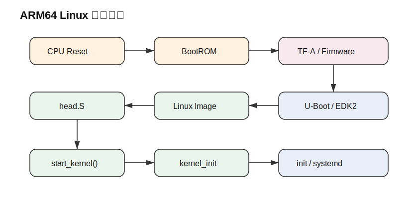
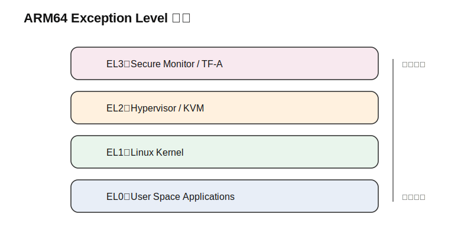
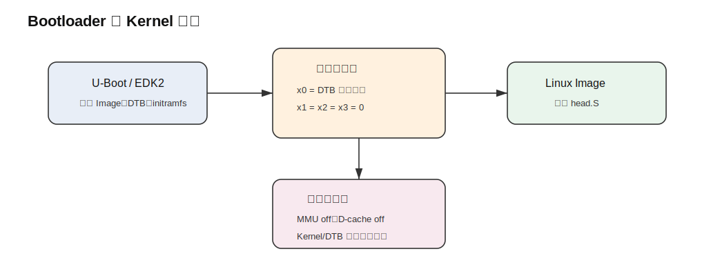
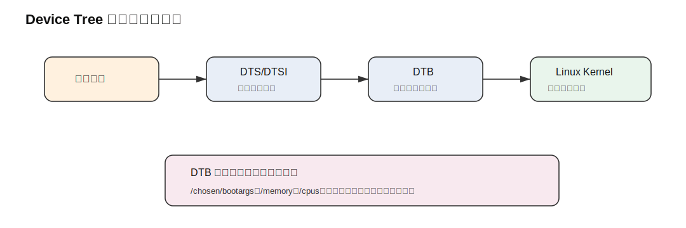
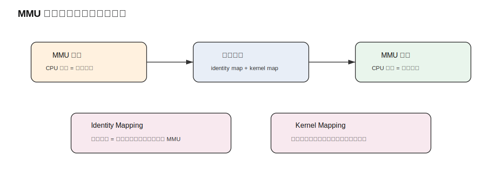
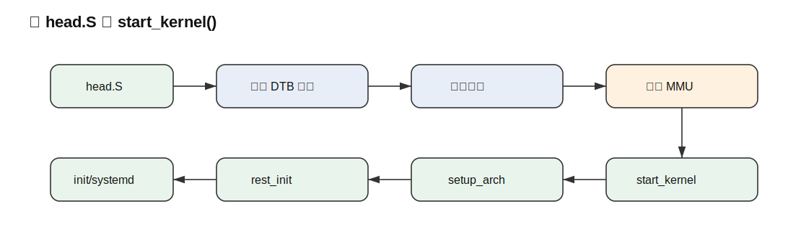

# ARM64 Linux 启动流程详解

> 本文用于系统性讲解 ARM64 Linux 从 CPU 上电、Bootloader 加载内核，到 Linux Kernel 接管系统并启动用户态的完整流程。  

## 1. 文档目标

本文用于系统性讲解 **ARM64 Linux 启动流程**。

目标不是把每一行源码都展开，而是建立一条清晰主线：

```text
从 CPU 上电开始，到 Linux Kernel 接管系统，再到启动 init/systemd。
```

读完本文后，应该能够回答以下问题：

- ARM64 Linux 启动前，BootROM、TF-A、U-Boot 分别做了什么？
- Bootloader 启动 Linux Kernel 时需要传递哪些关键信息？
- Device Tree 为什么对 ARM64 嵌入式 Linux 很重要？
- `arch/arm64/kernel/head.S` 在启动中承担什么作用？
- Kernel 是如何从物理地址执行切换到虚拟地址执行的？
- `start_kernel()` 之后 Linux 做了哪些通用初始化？
- 启动失败时，应该从哪些方向排查？

---

## 2. ARM64 Linux 启动总览



ARM64 Linux 的完整启动链路可以简化为：

```text
CPU 上电 / Reset
    ↓
BootROM
    ↓
TF-A / Secure Firmware
    ↓
U-Boot / EDK2 / Bootloader
    ↓
Linux Kernel Image
    ↓
arch/arm64/kernel/head.S
    ↓
start_kernel()
    ↓
kernel_init()
    ↓
/sbin/init 或 systemd
    ↓
用户态服务启动
```

从阶段划分来看，可以分成三大部分：

| 阶段            | 代表组件                | 主要职责                                |
|---------------|---------------------|-------------------------------------|
| 硬件/固件阶段       | BootROM、TF-A        | 找到启动介质，初始化安全环境，准备异常级别               |
| Bootloader 阶段 | U-Boot、EDK2         | 加载 Kernel、DTB、initramfs，设置 bootargs |
| Kernel 阶段     | head.S、start_kernel | 建立页表，打开 MMU，初始化内核，启动用户态             |

一句话概括：

> ARM64 Linux 启动是一个逐级交接控制权的过程：BootROM 找到固件，固件准备底层环境，Bootloader 加载内核，Kernel
> 建立自己的运行环境，最后启动用户态。

---

## 3. ARM64 启动链路中的关键角色

### 3.1 各阶段职责

| 组件               |    是否通常可修改 | 主要作用                 |
|------------------|-----------:|----------------------|
| BootROM          |     通常不可修改 | 芯片上电后的第一段固化代码        |
| TF-A             |  可由厂商或平台维护 | 初始化 EL3、安全世界、PSCI    |
| U-Boot SPL       |        可修改 | 初始化 DDR，加载完整 U-Boot  |
| U-Boot Proper    |        可修改 | 加载 Kernel、DTB、设置启动参数 |
| Linux `head.S`   |  Kernel 源码 | ARM64 最早期汇编启动        |
| `start_kernel()` |  Kernel 源码 | Linux 通用初始化入口        |
| init/systemd     | rootfs 用户态 | 启动用户态服务              |

### 3.2 主线理解

可以把启动过程理解为“接力”：

```text
BootROM 先跑起来
    ↓
加载安全固件或下一阶段 Bootloader
    ↓
Bootloader 准备 Kernel 所需的启动环境
    ↓
Kernel 接管 CPU
    ↓
Kernel 初始化硬件抽象和内核子系统
    ↓
启动用户态
```

这个接力过程中的每一步，都有明确的职责边界。

---

## 4. ARM64 异常级别：EL0 到 EL3



ARM64 有多个 Exception Level，简称 EL。

| 异常级别 | 常见用途   | 例子                  |
|------|--------|---------------------|
| EL0  | 用户态程序  | bash、systemd、应用程序   |
| EL1  | 操作系统内核 | Linux Kernel        |
| EL2  | 虚拟化层   | KVM、Hypervisor      |
| EL3  | 安全监控层  | TF-A、Secure Monitor |

ARM64 Linux 启动时，Kernel 可能从 EL1 进入，也可能从 EL2 进入。

这会影响：

- 系统寄存器初始化；
- 虚拟化功能是否可用；
- 异常向量配置；
- CPU 特性初始化；
- 后续 KVM 是否能使用。

简化理解：

```text
EL3 通常属于安全固件
EL2 通常属于虚拟化
EL1 是 Linux Kernel 的主要运行层级
EL0 是普通应用程序
```

对于大多数嵌入式 Linux 启动分析来说，不必一开始就深入所有 EL 细节，但必须知道：

> ARM64 Kernel 启动时，不只是加载一段程序，还要处理 CPU 当前处于哪个异常级别。

---

## 5. BootROM 阶段

### 5.1 BootROM 是什么

BootROM 是 SoC 内部固化的启动代码。

它通常位于芯片内部 ROM 中，用户无法修改。

CPU 上电或复位后，会从芯片规定的复位向量开始执行，最早运行的就是 BootROM。

### 5.2 BootROM 的主要任务

BootROM 一般负责：

1. 建立最小执行环境；
2. 判断启动模式；
3. 初始化最基本的启动介质访问能力；
4. 加载下一阶段程序；
5. 校验镜像，部分平台可能涉及安全启动；
6. 跳转到下一阶段。

典型流程：

```text
CPU Reset
    ↓
执行片内 BootROM
    ↓
读取启动模式
    ↓
从 SPI NOR / eMMC / SD / USB / UART 等介质加载下一阶段程序
    ↓
跳转到下一阶段
```

### 5.3 BootROM 阶段的特点

| 特点    | 说明           |
|-------|--------------|
| 很早期   | CPU 刚上电后执行   |
| 很底层   | 直接和芯片启动逻辑相关  |
| 很受限   | 通常只支持有限硬件初始化 |
| 不易调试  | 很多平台没有源码     |
| 平台强相关 | 不同 SoC 差异很大  |

BootROM 一般不会直接启动完整 Linux Kernel，而是加载 TF-A、SPL 或厂商 Bootloader。

---

## 6. TF-A / Secure Firmware 阶段

### 6.1 TF-A 是什么

TF-A 是 Trusted Firmware-A 的简称，是 ARM 平台常见的安全固件实现。

它常用于 ARMv8-A 平台，负责 EL3 层级的初始化和安全世界相关功能。

典型启动链路：

```text
BootROM
    ↓
BL2
    ↓
BL31 / TF-A Runtime Firmware
    ↓
BL33 / U-Boot or EDK2
```

其中：

| 阶段   | 常见含义                                  |
|------|---------------------------------------|
| BL2  | 早期加载阶段                                |
| BL31 | EL3 Runtime Firmware                  |
| BL33 | Non-secure world bootloader，例如 U-Boot |

### 6.2 TF-A 的主要职责

TF-A 可能负责：

- 初始化 EL3 执行环境；
- 配置 Secure / Non-secure 世界；
- 初始化异常向量；
- 设置 PSCI 接口；
- 管理 CPU 上电、关机、挂起；
- 配置 TrustZone 相关资源；
- 跳转到非安全世界的 Bootloader。

### 6.3 PSCI 的作用

PSCI 全称是 Power State Coordination Interface。

Linux 常通过 PSCI 调用固件完成：

- secondary CPU 启动；
- CPU 关机；
- CPU suspend；
- 系统 reset；
- 系统 poweroff。

对于 ARM64 多核 Linux 来说，PSCI 非常关键。

如果 PSCI 或固件配置有问题，可能出现：

- 只能启动一个 CPU；
- secondary CPU bring-up 失败；
- suspend/resume 异常；
- poweroff/reset 不工作。

---

## 7. U-Boot / Bootloader 阶段

### 7.1 Bootloader 的位置

Bootloader 处在固件和 Linux Kernel 之间。

```text
BootROM / TF-A
    ↓
U-Boot / EDK2
    ↓
Linux Kernel
```

在嵌入式 ARM64 平台，常见 Bootloader 是 U-Boot。

在服务器或标准化平台上，也可能使用 EDK2 / UEFI。

### 7.2 Bootloader 的核心任务

Bootloader 的主要任务是：

1. 初始化必要硬件；
2. 加载 Linux Kernel Image；
3. 加载 Device Tree Blob；
4. 加载 initramfs，如果使用；
5. 设置 Kernel command line；
6. 准备寄存器参数；
7. 关闭或清理某些硬件状态；
8. 跳转到 Kernel 入口。

### 7.3 U-Boot 启动 Linux 的典型命令

```bash
load nvme 0:1 ${kernel_addr_r} /boot/Image
load nvme 0:1 ${fdt_addr_r} /boot/dtb/board.dtb

setenv bootargs "console=ttyAMA1,115200 root=/dev/nvme0n1p2 rw rootwait"

booti ${kernel_addr_r} - ${fdt_addr_r}
```

含义：

| 命令/变量           | 说明                   |
|-----------------|----------------------|
| `kernel_addr_r` | Kernel Image 加载地址    |
| `fdt_addr_r`    | DTB 加载地址             |
| `bootargs`      | Kernel 启动参数          |
| `booti`         | 启动 ARM64 Linux Image |
| `-`             | 表示没有 initramfs       |
| `${fdt_addr_r}` | Device Tree 地址       |

### 7.4 `booti` 参数结构

```text
booti <kernel_addr> <initrd_addr> <fdt_addr>
```

例如：

```bash
booti ${kernel_addr_r} - ${fdt_addr_r}
```

表示：

- Kernel Image 地址是 `${kernel_addr_r}`；
- 不使用 initramfs；
- DTB 地址是 `${fdt_addr_r}`。

---

## 8. Bootloader 如何启动 ARM64 Linux



### 8.1 ARM64 Kernel 入口约定

Bootloader 跳转到 ARM64 Kernel 前，需要满足启动协议要求。

最关键的寄存器约定是：

```text
x0 = DTB 物理地址
x1 = 0
x2 = 0
x3 = 0
```

### 8.2 启动时的 CPU/MMU 状态

通常要求：

| 项目           | 状态         |
|--------------|------------|
| MMU          | 关闭         |
| D-cache      | 关闭         |
| I-cache      | 可开可关       |
| x0           | DTB 物理地址   |
| x1-x3        | 0          |
| Kernel Image | 位于合适物理内存地址 |
| DTB          | 位于不会被覆盖的位置 |

### 8.3 为什么 x0 传 DTB 地址

Kernel 刚开始执行时，还没有完整驱动、文件系统和设备模型。

它必须先知道：

- 内存在哪里；
- CPU 有几个；
- 串口在哪里；
- 中断控制器是什么；
- bootargs 是什么；
- rootfs 参数是什么。

这些信息主要来自 DTB。

所以 Bootloader 必须把 DTB 的物理地址通过 `x0` 传给 Kernel。

---

## 9. Device Tree 在启动中的作用



### 9.1 Device Tree 是什么

Device Tree 是一种硬件描述机制。

它不是驱动代码，而是描述硬件结构的数据。

Linux Kernel 通过 Device Tree 知道当前板子上有哪些硬件，以及这些硬件如何连接。

### 9.2 Device Tree 与 Kernel 的关系

```text
硬件板卡
    ↓
Device Tree Source: .dts / .dtsi
    ↓
dtc 编译
    ↓
Device Tree Blob: .dtb
    ↓
Bootloader 加载 DTB
    ↓
Kernel 通过 x0 获取 DTB 物理地址
    ↓
Kernel 解析硬件信息
    ↓
驱动匹配并初始化设备
```

### 9.3 DTS 示例

```dts
/ {
	model = "Example ARM64 Board";
	compatible = "vendor,example-board";

	chosen {
		bootargs = "console=ttyAMA1,115200 root=/dev/nvme0n1p2 rw rootwait";
	};

	memory@80000000 {
		device_type = "memory";
		reg = <0x0 0x80000000 0x0 0x80000000>;
	};

	cpus {
		#address-cells = <1>;
		#size-cells = <0>;

		cpu@0 {
			device_type = "cpu";
			compatible = "arm,armv8";
			reg = <0>;
		};
	};

	uart0: serial@28001000 {
		compatible = "arm,pl011";
		reg = <0x0 0x28001000 0x0 0x1000>;
		interrupts = <0 33 4>;
		status = "okay";
	};
};
```

### 9.4 Device Tree 常见关键节点

| 节点                     | 作用                             |
|------------------------|--------------------------------|
| `/chosen`              | bootargs、stdout-path、initrd 信息 |
| `/memory`              | 描述物理内存                         |
| `/cpus`                | 描述 CPU 拓扑                      |
| `interrupt-controller` | 描述中断控制器                        |
| `serial`               | 描述串口                           |
| `pcie`                 | 描述 PCIe 控制器                    |
| `ethernet`             | 描述网卡 MAC                       |
| `reserved-memory`      | 描述保留内存                         |

### 9.5 对启动影响最大的 DT 内容

启动早期最关键的是：

```text
/chosen/bootargs
/chosen/stdout-path
/memory
/cpus
中断控制器节点
串口节点
存储控制器节点
```

如果这些内容错误，可能导致：

- 串口没有输出；
- Kernel 找不到内存；
- secondary CPU 启动失败；
- rootfs 挂载失败；
- 驱动无法 probe；
- 系统启动到一半卡住。

---

## 10. ARM64 Kernel Image 入口

### 10.1 ARM64 Kernel Image 是什么

ARM64 Linux 常见镜像文件是：

```text
arch/arm64/boot/Image
```

它通常是未压缩的 Kernel Image。

U-Boot 使用 `booti` 启动的就是这种 Image。

### 10.2 Image Header

ARM64 Image 前面有一个头部，用于描述镜像信息。

简化结构：

```text
+--------------------------+
| code0 / code1            |
+--------------------------+
| text_offset              |
+--------------------------+
| image_size               |
+--------------------------+
| flags                    |
+--------------------------+
| reserved                 |
+--------------------------+
| magic                    |
+--------------------------+
| reserved                 |
+--------------------------+
| Kernel text ...          |
+--------------------------+
```

### 10.3 Image Header 的作用

| 字段            | 作用               |
|---------------|------------------|
| `code0/code1` | 跳转到实际入口          |
| `text_offset` | Kernel 文本段偏移     |
| `image_size`  | 镜像大小             |
| `flags`       | 镜像属性             |
| `magic`       | 标识这是 ARM64 Image |

Bootloader 可以根据 Image Header 判断如何加载和跳转。

---

## 11. `head.S`：ARM64 Kernel 最早期启动代码

### 11.1 `head.S` 的位置

ARM64 Linux 最早期启动代码位于：

```text
arch/arm64/kernel/head.S
```

这是 Kernel 从 Bootloader 接管后的第一段关键代码。

### 11.2 `head.S` 的核心职责

`head.S` 主要完成：

1. 保存 Bootloader 传入的参数；
2. 判断当前异常级别；
3. 记录 MMU 状态；
4. 建立早期 identity mapping；
5. 建立早期 kernel mapping；
6. 初始化 CPU 控制寄存器；
7. 开启 MMU；
8. 切换到虚拟地址运行；
9. 跳转到 C 语言入口 `start_kernel()`。

### 11.3 `head.S` 主要做什么

| 工作        | 说明                           |
|-----------|------------------------------|
| 保存启动参数    | 保存 x0 中的 DTB 地址              |
| 检查 CPU 状态 | 判断 MMU、异常级别等                 |
| 创建早期映射    | 创建 identity map 和 kernel map |
| 初始化系统寄存器  | 设置 SCTLR、TCR、MAIR 等          |
| 开启 MMU    | 进入虚拟地址运行                     |
| 跳转 C 入口   | 调用 `start_kernel()`          |

### 11.4 `head.S` 的意义

`head.S` 是一个过渡层。

它把系统从 Bootloader 留下的早期状态，转换到 Linux Kernel 能够正常运行 C 代码的状态。

可以这样理解：

```text
Bootloader 世界
    ↓
head.S 过渡
    ↓
Linux Kernel C 世界
```

如果 `head.S` 阶段出问题，常见现象是：

- 没有任何 Kernel 日志；
- 打开 MMU 后死机；
- earlycon 没输出；
- 系统在极早期异常；
- 串口只打印到某一行就停止。

---

## 12. MMU 打开前后的地址空间变化



### 12.1 为什么要打开 MMU

Linux Kernel 正常运行依赖虚拟内存。

虚拟内存用于：

- 内核地址空间管理；
- 用户态进程隔离；
- 权限控制；
- 页表管理；
- 内存映射；
- 高级内存管理机制。

但刚进入 Kernel 时，MMU 通常是关闭的。

所以启动早期必须完成：

```text
物理地址执行 → 创建页表 → 打开 MMU → 虚拟地址执行
```

### 12.2 MMU 打开前

MMU 关闭时：

```text
CPU 发出的地址 = 物理地址
```

此时 Kernel 代码在哪里，CPU 就从对应物理地址取指执行。

### 12.3 MMU 打开后

MMU 打开后：

```text
CPU 发出的地址 = 虚拟地址
虚拟地址经过页表翻译为物理地址
```

### 12.4 Identity Mapping

Identity Mapping 是：

```text
虚拟地址 = 物理地址
```

例如：

| 虚拟地址         | 物理地址         |
|--------------|--------------|
| `0x80200000` | `0x80200000` |

它的作用是：

> 保证打开 MMU 的瞬间，CPU 还能继续执行当前地址附近的代码。

否则一打开 MMU，地址解释方式改变，CPU 可能马上取不到下一条指令。

### 12.5 Kernel Mapping

Kernel Mapping 是 Linux 正常运行时使用的内核虚拟地址映射。

它把 Kernel 所在物理内存映射到内核虚拟地址空间。

### 12.6 两种映射的关系

| 映射               | 目的              | 使用阶段    |
|------------------|-----------------|---------|
| Identity Mapping | 安全打开 MMU        | 极早期     |
| Kernel Mapping   | Kernel 正常虚拟地址运行 | MMU 打开后 |

一句话总结：

> identity mapping 是为了让 MMU 能安全打开；kernel mapping 是为了让 Linux 进入正常虚拟地址运行环境。

---

## 13. 从 `head.S` 到 `start_kernel()`



### 13.1 过渡流程

```text
Bootloader 跳转 Kernel Image
    ↓
head.S
    ↓
保存 DTB 地址
    ↓
建立早期页表
    ↓
初始化 CPU
    ↓
打开 MMU
    ↓
切换虚拟地址
    ↓
start_kernel()
```

### 13.2 为什么 `start_kernel()` 之前不能直接用普通 C 环境

在进入 `start_kernel()` 前，很多基础环境还不完整：

- 栈可能刚刚建立；
- MMU 刚刚开启或尚未开启；
- BSS 需要清零；
- 全局变量访问依赖地址映射；
- 早期页表还在建立；
- 设备模型没有初始化；
- 中断还没有完整初始化；
- 调度器不可用。

所以早期必须使用汇编精确控制 CPU 状态。

### 13.3 `start_kernel()` 的位置

```text
init/main.c
```

这是 Linux Kernel 通用初始化入口。

从这里开始，代码不再只属于 ARM64，而是逐步进入 Linux 通用内核初始化流程。

---

## 14. `start_kernel()` 之后发生了什么

### 14.1 `start_kernel()` 总览

`start_kernel()` 是 Linux Kernel 初始化主函数。

简化流程：

```text
start_kernel()
    ↓
setup_arch()
    ↓
setup_command_line()
    ↓
mm_init()
    ↓
sched_init()
    ↓
init_IRQ()
    ↓
time_init()
    ↓
console_init()
    ↓
vfs_caches_init()
    ↓
rest_init()
```

实际代码比这复杂很多，但理解主线时可以先按这个模型掌握。

### 14.2 关键初始化内容

| 初始化内容                  | 作用              |
|------------------------|-----------------|
| `setup_arch()`         | 架构相关初始化         |
| `setup_command_line()` | 处理 bootargs     |
| `mm_init()`            | 初始化内存管理         |
| `sched_init()`         | 初始化调度器          |
| `init_IRQ()`           | 初始化中断系统         |
| `time_init()`          | 初始化时钟           |
| `console_init()`       | 初始化控制台          |
| `vfs_caches_init()`    | 初始化 VFS 缓存      |
| `rest_init()`          | 创建关键内核线程并进入后续阶段 |

### 14.3 `setup_arch()` 的作用

ARM64 的 `setup_arch()` 通常位于：

```text
arch/arm64/kernel/setup.c
```

它负责架构相关初始化，例如：

- 解析 Device Tree；
- 初始化 memblock；
- 处理内存布局；
- 获取 bootargs；
- 初始化 CPU feature；
- 设置 NUMA 或 CPU topology；
- 准备 early console；
- 初始化 paging 相关信息。

可以这样理解：

> `head.S` 让 Kernel 能够运行起来；`setup_arch()` 让 Kernel 知道自己运行在什么硬件上。

---

## 15. 从 Kernel 到用户态

### 15.1 `rest_init()`

`start_kernel()` 后期会调用：

```c++
rest_init();
```

`rest_init()` 主要创建两个关键内核线程：

| 线程            | 作用           |
|---------------|--------------|
| `kernel_init` | 后续启动用户态 init |
| `kthreadd`    | 管理内核线程       |

流程：

```text
start_kernel()
    ↓
rest_init()
    ↓
创建 kernel_init
    ↓
创建 kthreadd
    ↓
kernel_init 挂载 rootfs / 执行 init
```

### 15.2 Kernel 查找 init 的路径

Kernel 会尝试启动用户态 init。

常见路径包括：

```text
/sbin/init
/etc/init
/bin/init
/bin/sh
```

现代 Linux 发行版中，通常是：

```text
/sbin/init -> systemd
```

或者直接启动：

```text
/lib/systemd/systemd
```

### 15.3 用户态启动流程

如果使用 systemd，简化流程如下：

```text
kernel_init
    ↓
/sbin/init
    ↓
systemd
    ↓
挂载文件系统
    ↓
启动 udev
    ↓
启动网络服务
    ↓
启动登录服务
    ↓
用户登录 / shell
```

### 15.4 Kernel 阶段和用户态阶段的分界

可以通过日志判断当前系统启动到了哪里。

| 现象                        | 大致阶段                      |
|---------------------------|---------------------------|
| 没有 Kernel 日志              | Kernel 极早期或 Bootloader 问题 |
| 有 Kernel 日志，但 rootfs 挂载失败 | Kernel 已运行，存储/rootfs 问题   |
| 出现 systemd 日志             | 已进入用户态                    |
| 能登录 shell                 | 基本启动完成                    |

---

## 16. ARM64 Linux 启动调试方法

### 16.1 常用 bootargs

```text
console=ttyAMA1,115200
earlycon=pl011,0x28001000
loglevel=8
ignore_loglevel
root=/dev/nvme0n1p2
rootfstype=ext4
rw
rootwait
```

### 16.2 参数说明

| 参数                | 作用           |
|-------------------|--------------|
| `console=`        | 指定控制台        |
| `earlycon=`       | 启用早期串口       |
| `loglevel=8`      | 输出更多日志       |
| `ignore_loglevel` | 忽略日志等级限制     |
| `root=`           | 指定根文件系统      |
| `rootfstype=`     | 指定文件系统类型     |
| `rw`              | 根文件系统读写挂载    |
| `rootwait`        | 等待 root 设备出现 |

### 16.3 使用 `init=/bin/sh`

如果怀疑 systemd 或用户态有问题，可以临时加：

```text
init=/bin/sh
```

这会让 Kernel 直接启动 shell。

用途：

- 绕过 systemd；
- 判断 Kernel 和 rootfs 是否基本可用；
- 手动检查文件系统；
- 手动启动 systemd；
- 缩小问题范围。

例如：

```text
console=ttyAMA1,115200 root=/dev/nvme0n1p2 rw rootwait init=/bin/sh
```

### 16.4 查看实际启动参数

系统起来后：

```bash
cat /proc/cmdline
```

这可以确认 U-Boot 传进来的 bootargs 是否符合预期。

### 16.5 查看启动日志

```bash
dmesg
dmesg -T
journalctl -b
```

如果系统还没有进入用户态，就只能依靠串口输出。

### 16.6 initcall 调试

可以加：

```text
initcall_debug
```

用于观察内核 initcall 执行过程。

适合排查：

- 某个驱动初始化卡住；
- 某个 initcall 耗时过长；
- 系统启动到某一阶段停止。

---

## 17. 常见启动问题排查

### 17.1 没有任何 Kernel 输出

#### 可能原因

| 可能原因            | 说明              |
|-----------------|-----------------|
| Kernel 没有被正确加载  | Image 地址错误或加载失败 |
| DTB 地址错误        | x0 传入错误地址       |
| earlycon 配置错误   | 串口基地址或类型错误      |
| Kernel 极早期崩溃    | 可能发生在 MMU 打开前后  |
| Bootloader 跳转错误 | `booti` 参数不正确   |
| Image 格式不匹配     | 例如用错镜像类型        |

#### 排查路径

```text
无 Kernel 输出
    ↓
确认 U-Boot 是否正常
    ↓
确认 Image 是否加载成功
    ↓
确认 DTB 是否加载成功
    ↓
确认 booti 参数
    ↓
确认 console / earlycon
    ↓
检查 Kernel 配置
    ↓
检查 head.S 极早期阶段
```

---

### 17.2 有 Kernel 输出，但 rootfs 挂载失败

常见日志：

```text
VFS: Cannot open root device
Kernel panic - not syncing: VFS: Unable to mount root fs
```

#### 可能原因

| 可能原因          | 说明                          |
|---------------|-----------------------------|
| `root=` 参数错误  | 分区写错                        |
| 存储驱动缺失        | NVMe/eMMC/SATA 驱动未 built-in |
| 文件系统驱动缺失      | ext4 未 built-in             |
| 没有 `rootwait` | root 设备还没枚举出来               |
| 分区表错误         | Kernel 看不到目标分区              |
| rootfs 损坏     | 文件系统不可挂载                    |

#### 排查建议

```bash
cat /proc/cmdline
ls /dev/nvme*
blkid
mount /dev/nvme0n1p2 /mnt
```

对于没有 initramfs 的嵌入式启动，存储驱动和文件系统驱动最好编进内核，而不是模块。

---

### 17.3 Kernel 找不到 init

常见日志：

```text
Kernel panic - not syncing: No working init found
```

#### 可能原因

| 可能原因             | 说明                     |
|------------------|------------------------|
| `/sbin/init` 不存在 | rootfs 不完整             |
| init 没执行权限       | 权限错误                   |
| 动态链接器缺失          | systemd 无法运行           |
| 动态库缺失            | rootfs 裁剪过度            |
| 架构不匹配            | 例如 x86 rootfs 放到 ARM64 |
| rootfs 挂载错分区     | 不是预期系统                 |

#### 排查命令

```bash
ls -l /sbin/init
file /sbin/init
ldd /sbin/init
ls -l /lib/ld-linux-aarch64.so.1
```

---

### 17.4 systemd 阶段卡住

#### 可能原因

| 可能原因              | 说明            |
|-------------------|---------------|
| `/etc/fstab` 配置错误 | 等待不存在的设备      |
| machine-id 问题     | systemd 初始化异常 |
| udev 卡住           | 设备事件处理异常      |
| 网络服务等待            | DHCP 或链路问题    |
| 某驱动 probe 超时      | 外设初始化阻塞       |
| 时间/随机数问题          | 某些服务等待资源      |

#### 排查命令

```bash
journalctl -b
systemd-analyze blame
systemd-analyze critical-chain
cat /etc/fstab
```

如果系统能用 `init=/bin/sh` 起来，但正常 systemd 起不来，问题大概率在用户态服务、rootfs 或 systemd 配置，而不是 Kernel
最早期启动。

---

### 17.5 多核启动失败

ARM64 多核启动常涉及 PSCI、CPU 节点、GIC、中断、cache coherency 等。

#### 可能原因

| 可能原因        | 说明                     |
|-------------|------------------------|
| PSCI 配置错误   | secondary CPU 无法启动     |
| DT CPU 节点错误 | CPU 描述不正确              |
| GIC 配置问题    | 中断控制器异常                |
| 固件问题        | TF-A 没正确支持 CPU_ON      |
| Kernel 配置问题 | SMP 或 CPU feature 配置异常 |
| 电源管理问题      | cpuidle/cpufreq 相关异常   |

#### 临时定位参数

```text
maxcpus=1
nosmp
nr_cpus=1
cpuidle.off=1
```

这些参数适合定位问题，但不应作为长期解决方案。

---

## 18. 源码阅读路线

### 18.1 推荐阅读顺序

```text
Documentation/arch/arm64/booting.rst
    ↓
arch/arm64/kernel/head.S
    ↓
arch/arm64/kernel/setup.c
    ↓
init/main.c
    ↓
drivers/of/fdt.c
    ↓
arch/arm64/mm/
    ↓
drivers/irqchip/
    ↓
drivers/base/
```

### 18.2 核心文件说明

| 文件/目录                                  | 作用                 |
|----------------------------------------|--------------------|
| `Documentation/arch/arm64/booting.rst` | ARM64 Linux 启动协议   |
| `arch/arm64/kernel/head.S`             | ARM64 最早期入口        |
| `arch/arm64/kernel/setup.c`            | ARM64 架构初始化        |
| `arch/arm64/mm/`                       | ARM64 内存管理、页表      |
| `init/main.c`                          | Linux 通用启动主线       |
| `drivers/of/fdt.c`                     | Device Tree 解析     |
| `drivers/irqchip/`                     | 中断控制器驱动            |
| `drivers/base/`                        | Linux driver model |

### 18.3 建议关注的问题

阅读源码时，不建议一开始就陷入每个寄存器细节。

建议先围绕下面几个问题看：

```text
1. Bootloader 是怎么跳进 Kernel 的？
2. x0 中的 DTB 地址在哪里保存？
3. Kernel 什么时候建立早期页表？
4. MMU 是什么时候打开的？
5. 什么时候从物理地址切到虚拟地址？
6. start_kernel() 是如何被调用的？
7. setup_arch() 如何解析 Device Tree？
8. rootfs 是什么时候挂载的？
9. init/systemd 是什么时候启动的？
```

### 18.4 学习路线建议

#### 第一层：建立主线

先掌握：

```text
BootROM → TF-A → U-Boot → Image → head.S → start_kernel → init
```

#### 第二层：理解关键机制

重点理解：

```text
异常级别
Device Tree
Kernel Image
earlycon
bootargs
early page table
MMU enable
start_kernel
```

#### 第三层：结合问题调试

结合真实问题看：

```text
串口无输出
rootfs 挂载失败
systemd 卡住
secondary CPU 起不来
PCIe 初始化失败
网卡驱动 probe 失败
```

这样学习会更有效。

---

## 19. 一页总结

ARM64 Linux 启动可以浓缩为：

```text
CPU Reset
    ↓
BootROM
    ↓
TF-A / EL3 Firmware
    ↓
U-Boot / Bootloader
    ↓
加载 Image / DTB / initramfs
    ↓
设置 x0 = DTB 物理地址
    ↓
跳转 Kernel Image
    ↓
head.S
    ↓
建立早期页表
    ↓
打开 MMU
    ↓
start_kernel()
    ↓
setup_arch / mm / sched / irq
    ↓
rest_init()
    ↓
kernel_init()
    ↓
/sbin/init / systemd
    ↓
用户态服务
```

核心结论：

1. **BootROM** 是芯片内部第一阶段代码，负责找到下一阶段程序；
2. **TF-A** 负责 EL3、安全世界、PSCI 等底层固件能力；
3. **U-Boot** 负责加载 Kernel Image、DTB、initramfs，并设置 bootargs；
4. **Bootloader 通过 x0 把 DTB 物理地址传给 Kernel**；
5. **Device Tree 告诉 Kernel 当前硬件是什么样子**；
6. **`head.S` 是 ARM64 Kernel 最早期启动代码**；
7. **Kernel 需要先建立早期页表，再打开 MMU**；
8. **`start_kernel()` 是 Linux 通用初始化入口**；
9. **`kernel_init` 最终启动 `/sbin/init` 或 systemd**；
10. **系统进入用户态后，问题就从 Kernel 启动问题逐渐转为 rootfs 和服务问题**。

最后可以用一句话总结：

> ARM64 Linux 启动的本质，是从固件到 Bootloader，再到 Kernel，再到用户态的控制权交接过程。Bootloader 提供最小启动环境，Kernel
> 在 `head.S` 中建立自己的 CPU、页表和 MMU 环境，随后进入 `start_kernel()` 完成通用初始化，最终启动 init/systemd。
