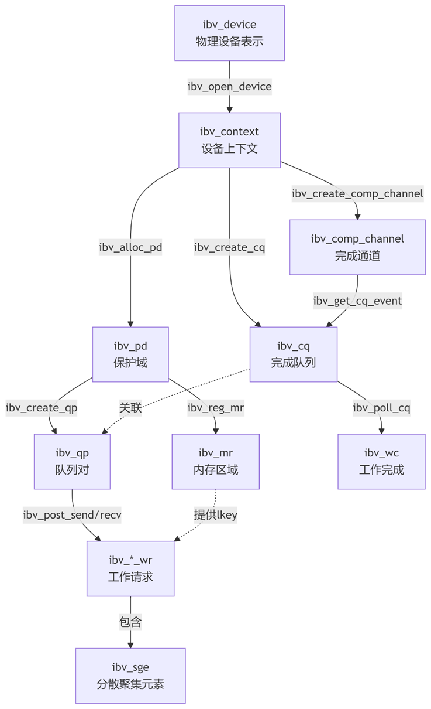
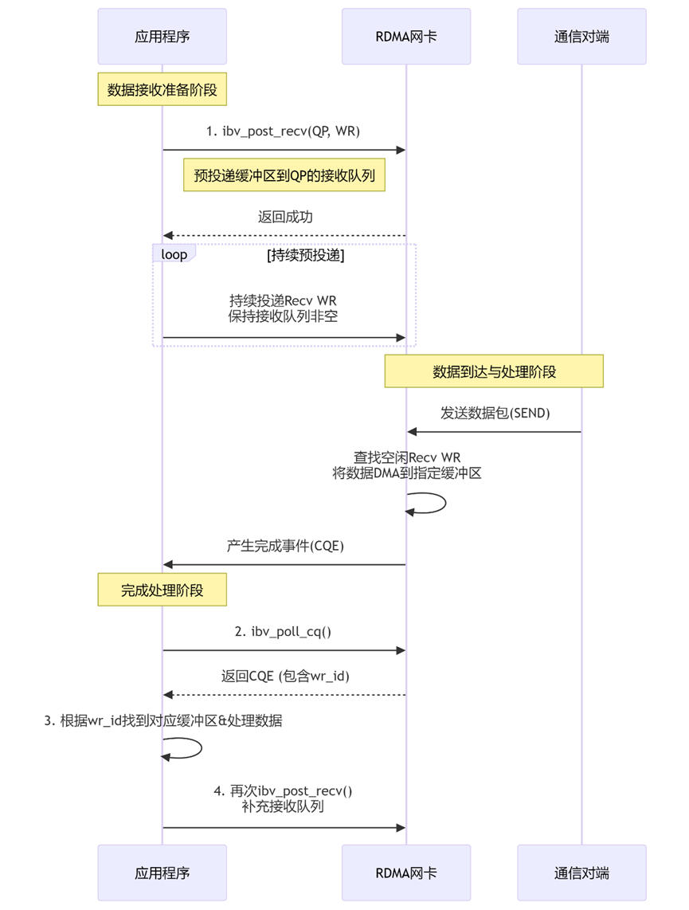
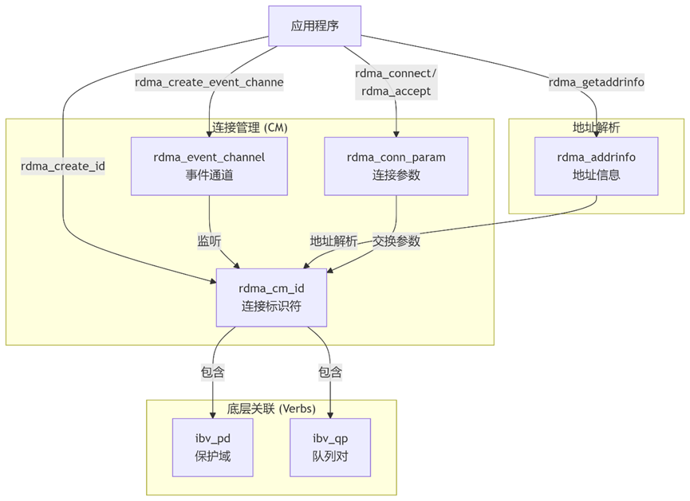
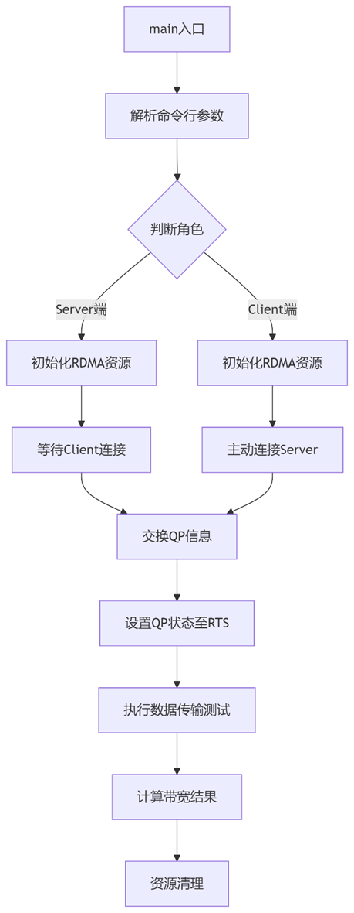

# EN1201 型 25G 以太标准网卡 RDMA API 说明

## 1. 总体说明

本文档主要用于对 EN1201 型 25G 以太标准网卡 RDMA 特性相关 API 进行说明，主要包含用户 RDMA 应用代码编写依赖的 `ibv_verbs`
和 `rdma_cm` 两部分业务核心 API 函数，以及相关的数据结构体的重点说明。
其中，`ibv_verbs` 为底层硬件操作接口的用户态接口，主要用于实现如设备核心资源管理、数据传输操作、设备查询和控制等功能。
`rdma_cm` 为上层通信管理接口的用户态抽象实现，主要用于实现 RDMA 连接生命周期管理、事件驱动模型、TCP/IP 语义集成。

为了更加清晰的说明 API 的功能，本文档以 linux 下标准 RDMA 测试工具 `perftest` 的 `send_bw` 测试功能代码实现为例，
进行相关的 API 应用层使用举例说明。

---

## 2. API函数说明

## 2.1 ibv_verbs 部分 API 函数说明

### 2.1.1 `ibv_get_device_list`

```c++
struct ibv_device **ibv_get_device_list(int *num_devices);
```

**函数作用**：获取可用的 RDMA 设备列表。

**参数说明**

| 参数            | 方向  | 说明     |
|---------------|-----|--------|
| `num_devices` | out | 返回设备数量 |

**返回值**

* 成功：设备指针数组（以 `NULL` 结尾）
* 失败：`NULL`

---

### 2.1.2 `ibv_open_device`

```c++
struct ibv_context *ibv_open_device(struct ibv_device *device);
```

**函数作用**：打开 RDMA 设备，获取设备上下文。

**参数说明**

| 参数       | 方向 | 说明     |
|----------|----|--------|
| `device` | in | 目标设备指针 |

**返回值**

* 成功：设备上下文句柄
* 失败：`NULL`

---

### 2.1.3 `ibv_close_device`

```c++
int ibv_close_device(struct ibv_context *context);
```

**函数作用**：关闭 RDMA 设备上下文。

**参数说明**

| 参数        | 方向 | 说明    |
|-----------|----|-------|
| `context` | in | 设备上下文 |

**返回值**

* 成功：`0`
* 失败：`-1`

---

### 2.1.4 `ibv_alloc_pd`

```c++
struct ibv_pd *ibv_alloc_pd(struct ibv_context *context);
```

**函数作用**：分配保护域（PD，资源隔离容器）。

**参数说明**

| 参数        | 方向 | 说明    |
|-----------|----|-------|
| `context` | in | 设备上下文 |

**返回值**

* 成功：保护域句柄
* 失败：`NULL`

---

### 2.1.5 `ibv_dealloc_pd`

```c++
int ibv_dealloc_pd(struct ibv_pd *pd);
```

**函数作用**：释放保护域（PD）。

**参数说明**

| 参数   | 方向 | 说明    |
|------|----|-------|
| `pd` | in | 目标保护域 |

**返回值**

* 成功：`0`
* 失败：`-1`

---

### 2.1.6 `ibv_reg_mr`

```c++
struct ibv_mr *ibv_reg_mr(struct ibv_pd *pd,
                          void *addr,
                          size_t length,
                          int access);
```

**函数作用**：注册内存区域（MR）用于 RDMA 操作。

**参数说明**

| 参数       | 方向 | 说明               |
|----------|----|------------------|
| `pd`     | in | 目标保护域            |
| `addr`   | in | 内存起始地址           |
| `length` | in | 内存长度             |
| `access` | in | 访问权限位掩码（可 OR 组合） |

`access` 常用位（原文列举）：

* `IBV_ACCESS_LOCAL_WRITE`：本端写权限
* `IBV_ACCESS_REMOTE_READ`：远端读权限
* `IBV_ACCESS_REMOTE_WRITE`：远端写权限
* `IBV_ACCESS_REMOTE_ATOMIC`：远端原子操作权限

**返回值**

* 成功：内存区域句柄
* 失败：`NULL`

---

### 2.1.7 `ibv_dereg_mr`

```c++
int ibv_dereg_mr(struct ibv_mr *mr);
```

**函数作用**：注销内存区域（MR）。

**参数说明**

| 参数   | 方向 | 说明    |
|------|----|-------|
| `mr` | in | 目标 MR |

**返回值**

* 成功：`0`
* 失败：`-1`

---

### 2.1.8 `ibv_create_cq`

```c++
struct ibv_cq *ibv_create_cq(struct ibv_context *context,
                             int cqe,
                             void *cq_context,
                             struct ibv_comp_channel *channel,
                             int comp_vector);
```

**函数作用**：创建完成队列（CQ）。

**参数说明**

| 参数            | 方向 | 说明                   |
|---------------|----|----------------------|
| `context`     | in | 设备上下文                |
| `cqe`         | in | 队列最小容量               |
| `cq_context`  | in | 用户上下文                |
| `channel`     | in | 完成通道（原文：`NULL=阻塞模式`） |
| `comp_vector` | in | 中断向量                 |

**返回值**

* 成功：完成队列句柄
* 失败：`NULL`

---

### 2.1.9 `ibv_create_qp`

```c++
struct ibv_qp *ibv_create_qp(struct ibv_pd *pd,
                             struct ibv_qp_init_attr *qp_init_attr);
```

**函数作用**：创建队列对（QP）。（原文“函数作用”写成了“分配保护域”，这里按函数名含义修正。）

**参数说明**

| 参数             | 方向 | 说明                    |
|----------------|----|-----------------------|
| `pd`           | in | 保护域                   |
| `qp_init_attr` | in | 初始化属性（含 CQ 指针、QP 类型等） |

**返回值**

* 成功：QP 句柄
* 失败：`NULL`

---

### 2.1.10 `ibv_modify_qp`

```c++
int ibv_modify_qp(struct ibv_qp *qp,
                  struct ibv_qp_attr *attr,
                  int attr_mask);
```

**函数作用**：修改队列对（QP）的属性。

**参数说明**

| 参数          | 方向 | 说明                    |
|-------------|----|-----------------------|
| `qp`        | in | 要修改的 QP 指针            |
| `attr`      | in | 新属性结构体指针              |
| `attr_mask` | in | 位掩码，指定 `attr` 中哪些字段有效 |

**返回值**

* 成功：`0`
* 失败：非 0，并设置 `errno`（如 `EINVAL`、`ENOMEM` 等）

---

### 2.1.11 `ibv_post_send`

```c++
int ibv_post_send(struct ibv_qp *qp,
                  struct ibv_send_wr *wr,
                  struct ibv_send_wr **bad_wr);
```

**函数作用**：向 QP 的发送队列（SQ）提交一个或多个发送工作请求（WR）。

**参数说明**

| 参数       | 方向  | 说明                     |
|----------|-----|------------------------|
| `qp`     | in  | 目标 QP（原文强调：需已到 RTS 状态） |
| `wr`     | in  | `ibv_send_wr` 链表头      |
| `bad_wr` | out | 失败时指向链表中第一个失败的 WR      |

**返回值**

* 成功：`0`
* 失败：非 0，并设置 `errno`（如 `EINVAL`、`ENOMEM` 等）

---

### 2.1.12 `ibv_post_recv`

```c++
int ibv_post_recv(struct ibv_qp *qp,
                  struct ibv_recv_wr *wr,
                  struct ibv_recv_wr **bad_wr);
```

**函数作用**：向 QP 的接收队列（RQ）提交一个或多个接收工作请求（WR）。

**参数说明**

| 参数       | 方向  | 说明                         |
|----------|-----|----------------------------|
| `qp`     | in  | 目标 QP                      |
| `wr`     | in  | `ibv_recv_wr` 链表头（描述接收缓冲区） |
| `bad_wr` | out | 失败时指向链表中第一个失败的 WR          |

**返回值**

* 成功：`0`
* 失败：非 0（原文：通常 `ENOMEM`），并设置 `errno`

---

### 2.1.13 `ibv_poll_cq`

```c++
int ibv_poll_cq(struct ibv_cq *cq,
                int num_entries,
                struct ibv_wc *wc);
```

**函数作用**：从完成队列（CQ）检索一个或多个工作完成（WC）条目。

**参数说明**

| 参数            | 方向  | 说明                           |
|---------------|-----|------------------------------|
| `cq`          | in  | 目标 CQ                        |
| `num_entries` | in  | 本次最多检索的完成项数量                 |
| `wc`          | out | 调用者分配的数组，大小至少为 `num_entries` |

**返回值**

* `> 0`：成功获取 N 个完成项
* `= 0`：当前无完成项
* `< 0`：失败（原文：很罕见，例如 CQ 指针无效）

---

### 2.1.14 `ibv_req_notify_cq`

```c++
int ibv_req_notify_cq(struct ibv_cq *cq, int solicited_only);
```

**函数作用**：与 `ibv_get_cq_event` 配合，提供事件驱动方案，避免持续 `ibv_poll_cq` 轮询带来的 CPU 开销。

**参数说明**

| 参数               | 方向 | 说明                  |
|------------------|----|---------------------|
| `cq`             | in | 需要请求事件通知的 CQ        |
| `solicited_only` | in | 控制通知触发条件（哪些完成项触发事件） |

**返回值**

* 成功：`0`
* 失败：非 0，并设置 `errno`（如 `EINVAL`、`ENOMEM` 等）

---

## 2.2 ibv_verbs 部分数据结构体说明

如图1所示，将ibv_verbs中核心的数据结构体进行了概念抽象，通过流程关联的方式来展现数据结构之间的层次和管理关系。



图1 ibv_verbs核心数据结构组织架构图

下文开始对图1中的数据结构体的作用和关键字段进行说明：


---


### 2.2.1 设备与上下文

#### `struct ibv_device`

**用途**：代表系统中的一个 RDMA 设备（如 InfiniBand、RoCE、iWARP 适配器）。
**获取方式**：`ibv_get_device_list()`

**关键字段（通常通过访问函数获取）**

| 字段           | 说明       | 示例                          |
|--------------|----------|-----------------------------|
| `name`       | 设备名称     | `"mthca0"`                  |
| `dev_name`   | 设备节点路径   | `"/dev/infiniband/uverbs0"` |
| `dev_path`   | SysFS 路径 |                             |
| `ibdev_path` | IBDEV 路径 |                             |

**说明**：该结构用于识别和选择要使用的硬件设备。

---

#### `struct ibv_context`

**用途**：已打开设备的上下文；几乎所有后续 verbs 操作都以它为起点派生对象。
**获取方式**：`ibv_open_device()`

**关键字段**

| 字段       | 说明                        |
|----------|---------------------------|
| `device` | 指向关联的 `struct ibv_device` |
| `ops`    | 动词函数指针表（由驱动实现）            |
| `cmd_fd` | 向驱动发送命令的文件描述符             |

**说明**：它代表应用程序与特定 RDMA 设备的一次会话。

> 注意：后续的 PD/MR/CQ/QP 等对象基本都来自这个 `context` 或由它间接创建。

---

### 2.2.2 资源管理

#### `struct ibv_pd`（Protection Domain）

**用途**：保护域（PD），是 MR/QP 等资源的容器，提供内存访问隔离边界。所有需要网络访问的内存都必须注册到某个 PD。
**获取方式**：`ibv_alloc_pd()`

**说明**：PD 通常只作为句柄使用，没有公开字段供应用直接操作。

---

#### `struct ibv_mr`（Memory Region）

**用途**：内存区域（MR），代表一段已注册、可被 RDMA 访问的本地内存。
**获取方式**：`ibv_reg_mr()`

**关键字段**

| 字段       | 说明                          |
|----------|-----------------------------|
| `addr`   | 注册内存的起始地址                   |
| `length` | 注册内存长度                      |
| `lkey`   | 本地键，用于本地操作标识该 MR            |
| `rkey`   | 远程键，发送给对端，允许其对该内存执行 RDMA 操作 |
| `pd`     | 该 MR 所属的保护域                 |

**说明**：`lkey/rkey` 是 RDMA 安全访问的基石，相当于内存访问“密码”。

---

#### `struct ibv_sge`（Scatter/Gather Element）

**用途**：分散/聚集元素（SGE），描述一个内存缓冲区，是组成工作请求（WR）的基本单元。

**关键字段**

| 字段       | 说明                |
|----------|-------------------|
| `addr`   | 缓冲区虚拟地址           |
| `length` | 缓冲区长度             |
| `lkey`   | 缓冲区所在 MR 的 `lkey` |

**说明**：一个 WR 可以包含多个 SGE，实现向量化 IO。

---

### 2.2.3 队列与通信

#### `struct ibv_cq`（Completion Queue）

**用途**：完成队列（CQ），用于存放已完成 WR 的通知（WC）。发送/接收可以共享或使用独立 CQ。
**获取方式**：`ibv_create_cq()`

**关键字段**

| 字段           | 说明                |
|--------------|-------------------|
| `channel`    | 关联的完成事件通道（若创建时指定） |
| `cq_context` | 用户自定义上下文指针        |

**说明**：应用通过 `ibv_poll_cq` 轮询或 `ibv_get_cq_event` 事件监听获取操作结果。

---

#### `struct ibv_qp`（Queue Pair）

**用途**：队列对（QP），RDMA 通信核心，由发送队列（SQ）和接收队列（RQ）组成。
**获取方式**：`ibv_create_qp()`

**关键字段**

| 字段           | 说明                            |
|--------------|-------------------------------|
| `qp_context` | 用户自定义上下文指针                    |
| `pd`         | QP 所属保护域                      |
| `send_cq`    | 发送完成队列                        |
| `recv_cq`    | 接收完成队列                        |
| `qp_num`     | QP 编号（网络唯一标识，需要告知对端）          |
| `state`      | QP 状态（`RESET/INIT/RTR/RTS` 等） |

**说明**：QP 需要经历一系列状态转换（`ibv_modify_qp`）后才能通信。

---

#### `struct ibv_comp_channel`（Completion Channel）

**用途**：完成事件通道，用于异步通知 CQ 事件。
**获取方式**：`ibv_create_comp_channel()`

**说明**：它与文件描述符关联，可加入 `epoll/select` 循环实现事件驱动模型。

---

### 2.2.4 操作与完成

#### `struct ibv_send_wr`（Send Work Request）

**用途**：发送工作请求，描述一个要执行的发送/写/读等操作。

**关键字段**

| 字段           | 说明                                                         |
|--------------|------------------------------------------------------------|
| `wr_id`      | 用户自定义 ID，用于完成时匹配请求                                         |
| `next`       | 指向下一个 WR（链表）                                               |
| `sg_list`    | 指向 `struct ibv_sge` 数组                                     |
| `num_sge`    | SGE 数量                                                     |
| `opcode`     | 操作类型（如 `IBV_WR_SEND/IBV_WR_RDMA_WRITE/IBV_WR_RDMA_READ` 等） |
| `send_flags` | 标志（如 `IBV_SEND_SIGNALED` 请求完成通知）                           |
| `wr`         | 联合体：包含特定操作所需远端信息（如 `wr.rdma.remote_addr`、`wr.rdma.rkey`）   |

---

#### `struct ibv_recv_wr`（Receive Work Request）

**用途**：接收工作请求，描述用于存放外来数据的缓冲区。

**关键字段**

| 字段        | 说明                     |
|-----------|------------------------|
| `wr_id`   | 用户自定义 ID               |
| `next`    | 指向下一个 WR（链表）           |
| `sg_list` | 指向 `struct ibv_sge` 数组 |
| `num_sge` | SGE 数量                 |

**说明**：接收 WR 必须提前发布到接收队列中。

---

#### `struct ibv_wc`（Work Completion）

**用途**：工作完成（WC），描述某个 WR 的最终状态与信息。

**关键字段**

| 字段         | 说明                                    |
|------------|---------------------------------------|
| `wr_id`    | 对应 WR 的 `wr_id`，用于定位哪个请求完成            |
| `status`   | 操作状态（必须首先检查），如 `IBV_WC_SUCCESS` 或错误原因 |
| `opcode`   | 完成的操作类型                               |
| `byte_len` | 传输字节数（对接收与 `RDMA_READ` 有用）            |
| `imm_data` | 立即数数据（网络字节序）                          |
| `qp_num`   | 产生该完成项的 QP 编号                         |

> 注意：处理 WC 时第一件事就是检查 `status`，否则你会把失败当成功继续走，后面调试会很痛苦。

---

### 2.2.5 核心工作流中的数据体协作

SEND-RECV流程如下：

准备接收：App 创建一个 `ibv_recv_wr`，其中包含指向 `ibv_sge` 的指针（该 SGE 指向已由 `ibv_mr` 注册的内存），然后调用 `ibv_post_recv(
qp, &recv_wr, ...)`

准备发送：对端 App 创建一个 `ibv_send_wr` 并调用 `ibv_post_send(qp, &send_wr, ...)`

硬件处理：数据通过网络传输并被写入接收方的内存

完成通知：双方硬件在各自的 `ibv_cq` 中生成 `ibv_wc`

应用处理：接收方 App 调用 `ibv_poll_cq(cq, ..., &wc)`，从 `wc.wr_id` 得知哪个缓冲区有数据，并从 `wc.status` 得知操作成功。

发送方 App 同样轮询 CQ 以确认发送完成

端到端时序图如图2所示：



图2 ibv_verbs recv操作时序图

## 2.3 rdma_cm 部分 API 函数说明

rdma_cm（Connection Manager）接口用于建立/管理 RDMA 连接，典型流程是：
**创建事件通道 → 创建 CM ID →（服务端 bind+listen / 客户端 resolve_addr+resolve_route）→ connect/accept → 事件循环 →
disconnect → 资源销毁**。

> 注意：`rdma_resolve_* / rdma_connect / rdma_accept / rdma_disconnect` 这类函数返回 `0` 往往只表示“请求已成功提交”，真正结果要靠
**CM 事件**确认。

---

### 2.3.1 `rdma_create_event_channel`

```c++
struct rdma_event_channel *rdma_create_event_channel(void);
```

**函数作用**：创建事件通道（event channel）。事件通道对应一个文件描述符，用于接收所有 RDMA CM 事件（连接请求、连接建立、断开等）。这是使用
RDMA CM API 的第一步。

**参数**：无
**返回值**：

* 成功：返回 `struct rdma_event_channel *`
* 失败：返回 `NULL` 并设置 `errno`

---

### 2.3.2 `rdma_create_id`

```c++
int rdma_create_id(struct rdma_event_channel *channel,
                   struct rdma_cm_id **id,
                   void *context,
                   enum rdma_port_space ps);
```

**函数作用**：创建 RDMA 标识符（CM ID），代表一个通信端点，类似 socket 编程中的 `socket`。

**参数说明**

| 参数        | 方向  | 说明                                          |
|-----------|-----|---------------------------------------------|
| `channel` | in  | 事件通道（`rdma_create_event_channel` 创建）        |
| `id`      | out | 返回新创建的 `rdma_cm_id *`                       |
| `context` | in  | 用户上下文指针，可在事件中取回                             |
| `ps`      | in  | 端口空间：`RDMA_PS_TCP`（面向连接）、`RDMA_PS_UDP`（无连接） |

**返回值**：成功 `0`；失败 `-1` 并设置 `errno`。

---

### 2.3.3 `rdma_bind_addr`

```c++
int rdma_bind_addr(struct rdma_cm_id *id, struct sockaddr *addr);
```

**函数作用**：将本地地址绑定到 CM ID。服务器端等价于 socket 的 `bind()`。

**参数说明**

| 参数     | 方向 | 说明                                                     |
|--------|----|--------------------------------------------------------|
| `id`   | in | CM ID（`rdma_create_id` 创建）                             |
| `addr` | in | 本地地址（`sockaddr_in` / `sockaddr_in6`）。若端口为 0，CM 自动选可用端口 |

**返回值**：成功 `0`；失败 `-1` 并设置 `errno`。

---

### 2.3.4 `rdma_listen`

```c++
int rdma_listen(struct rdma_cm_id *id, int backlog);
```

**函数作用**：使已绑定地址的 CM ID 进入监听状态，准备接收客户端连接请求（服务器端 `bind` 之后调用）。

**参数说明**

| 参数        | 方向 | 说明                           |
|-----------|----|------------------------------|
| `id`      | in | 已成功 `rdma_bind_addr` 的 CM ID |
| `backlog` | in | 连接请求队列最大长度（类似 `listen()` 参数） |

**返回值**：成功 `0`；失败 `-1` 并设置 `errno`。

---

### 2.3.5 `rdma_resolve_addr`

```c++
int rdma_resolve_addr(struct rdma_cm_id *id,
                      struct sockaddr *src_addr,
                      struct sockaddr *dst_addr,
                      int timeout_ms);
```

**函数作用**：（客户端）将目标服务器 IP 解析为 RDMA 硬件可识别的地址信息（L2/GID 等）。若提供 `src_addr`，会先绑定本地地址。

**参数说明**

| 参数           | 方向 | 说明                   |
|--------------|----|----------------------|
| `id`         | in | CM ID                |
| `src_addr`   | in | 可选源地址（`NULL` 表示系统选择） |
| `dst_addr`   | in | 目标服务器地址              |
| `timeout_ms` | in | 超时时间（毫秒）             |

**返回值**：成功 `0`（仅表示请求发出）；失败 `-1` 并设置 `errno`。

> 事件确认：`RDMA_CM_EVENT_ADDR_RESOLVED` 表示地址解析完成。

---

### 2.3.6 `rdma_resolve_route`

```c++
int rdma_resolve_route(struct rdma_cm_id *id, int timeout_ms);
```

**函数作用**：（客户端）在 `rdma_resolve_addr` 成功后解析到达服务器的路由路径。

**参数说明**

| 参数           | 方向 | 说明             |
|--------------|----|----------------|
| `id`         | in | 已完成地址解析的 CM ID |
| `timeout_ms` | in | 超时时间（毫秒）       |

**返回值**：成功 `0`（仅表示请求发出）；失败 `-1` 并设置 `errno`。

> 事件确认：这里应等待 `RDMA_CM_EVENT_ROUTE_RESOLVED` 来确认

---

### 2.3.7 `rdma_connect`

```c++
int rdma_connect(struct rdma_cm_id *id, struct rdma_conn_param *conn_param);
```

**函数作用**：（客户端）路由解析完成后向服务器发起连接请求；`conn_param` 用于协商连接属性。

**参数说明**

| 参数           | 方向 | 说明                                                                   |
|--------------|----|----------------------------------------------------------------------|
| `id`         | in | 已完成路由解析的 CM ID                                                       |
| `conn_param` | in | 连接参数（重试次数、RNR 重试、`initiator_depth`、`flow_control` 等）；可为 `NULL` 使用默认值 |

**返回值**：成功 `0`（仅表示请求发出）；失败 `-1` 并设置 `errno`。

> 事件确认：`RDMA_CM_EVENT_ESTABLISHED` 表示连接建立成功。

---

### 2.3.8 `rdma_accept`

```c++
int rdma_accept(struct rdma_cm_id *id, struct rdma_conn_param *conn_param);
```

**函数作用**：（服务器端）收到 `RDMA_CM_EVENT_CONNECT_REQUEST` 后，响应客户端连接请求，完成连接建立。

**参数说明**

| 参数           | 方向 | 说明                                                            |
|--------------|----|---------------------------------------------------------------|
| `id`         | in | 对监听 ID：一般是 `rdma_get_request` 返回的新 CM ID，代表与客户端的连接（你原文提到了这一点） |
| `conn_param` | in | 连接参数；可为 `NULL` 接受客户端提议                                        |

**返回值**：成功 `0`（仅表示请求发出）；失败 `-1` 并设置 `errno`。

> 事件确认：同样等待 `RDMA_CM_EVENT_ESTABLISHED`。

---

### 2.3.9 `rdma_get_cm_event`

```c++
int rdma_get_cm_event(struct rdma_event_channel *channel,
                      struct rdma_cm_event **event);
```

**函数作用**：从事件通道获取下一个待处理 CM 事件（阻塞调用）。获取到的事件必须用 `rdma_ack_cm_event` 确认释放。

**参数说明**

| 参数        | 方向  | 说明        |
|-----------|-----|-----------|
| `channel` | in  | 事件通道      |
| `event`   | out | 返回事件结构体指针 |

**返回值**：成功 `0`；失败 `-1` 并设置 `errno`。

---

### 2.3.10 `rdma_ack_cm_event`

```c++
int rdma_ack_cm_event(struct rdma_cm_event *event);
```

**函数作用**：确认（ack）并释放一个 CM 事件。对每个成功 `rdma_get_cm_event` 得到的事件都必须调用。

**参数**：`event`（由 `rdma_get_cm_event` 返回）
**返回值**：成功 `0`；失败 `-1` 并设置 `errno`。

---

### 2.3.11 `rdma_disconnect`

```c++
int rdma_disconnect(struct rdma_cm_id *id);
```

**函数作用**：发起断开连接。调用后本地端和远端都会收到 `RDMA_CM_EVENT_DISCONNECTED`。

**参数**：`id`（要断开连接的 CM ID）
**返回值**：成功 `0`（仅表示请求发出）；失败 `-1` 并设置 `errno`。

> 事件确认：`RDMA_CM_EVENT_DISCONNECTED`。

---

### 2.3.12 `rdma_destroy_id`

```c++
int rdma_destroy_id(struct rdma_cm_id *id);
```

**函数作用**：销毁 CM ID，释放其关联资源。调用前应确保相关连接已断开。

**参数**：`id`（要销毁的 CM ID）
**返回值**：成功 `0`；失败 `-1` 并设置 `errno`。

---

### 2.3.13 `rdma_destroy_event_channel`

```c++
void rdma_destroy_event_channel(struct rdma_event_channel *channel);
```

**函数作用**：销毁事件通道并释放资源。

**参数**：`channel`（由 `rdma_create_event_channel` 创建）
**返回值**：无。

---

### 2.3.14 `rdma_create_qp`

```c++
int rdma_create_qp(struct rdma_cm_id *id,
                   struct ibv_pd *pd,
                   struct ibv_qp_init_attr *qp_init_attr);
```

**函数作用**：为 CM ID 创建并关联 QP。封装了“创建 QP + 绑定到 CM ID”的流程。

**参数说明**

| 参数             | 方向 | 说明                                  |
|----------------|----|-------------------------------------|
| `id`           | in | CM ID                               |
| `pd`           | in | 保护域                                 |
| `qp_init_attr` | in | QP 初始化属性（队列深度、QP 类型、capabilities 等） |

**返回值**：成功 `0`（并设置 `id->qp` 指向新 QP）；失败 `-1` 并设置 `errno`。

---

### 2.3.15 `rdma_destroy_qp`

```c++
void rdma_destroy_qp(struct rdma_cm_id *id);
```

**函数作用**：销毁与 CM ID 关联的 QP。

**参数**：`id`（其 `qp` 字段非空的 CM ID）
**返回值**：无。

---

## 2.4 rdma_cm部分数据结构体说明

如图3所示，将rdma cm api中核心的数据结构体进行了概念抽象，通过流程关联的方式来展现数据结构之间的层次和管理关系



图3 rdma cm核心数据结构组织架构图


---

### 2.4.1 事件通道（Event Channel）

#### `struct rdma_event_channel`

**作用**：事件通道是 CM API 的基石，本质上对应一个文件描述符，用于异步接收所有连接管理相关事件（连接请求、地址解析完成、连接建立/断开等）。应用通常用
`select()/poll()/epoll()` 监听它。

**获取方式**：`rdma_create_event_channel()`
**销毁方式**：`rdma_destroy_event_channel()`

**说明**：

* 创建任何连接标识（`rdma_cm_id`）之前必须先创建事件通道
* 一个事件通道可被多个 `rdma_cm_id` 共享；通常一个应用实例用一个通道即可
* 其本质是内部事件队列的句柄，保证事件有序交付

---

### 2.4.2 连接标识（Connection Identifier）

#### `struct rdma_cm_id`

**作用**：CM API 中最核心的结构体，等价于 socket 编程中的“套接字描述符”，代表通信端点或监听器；封装了 verbs 层资源以及潜在连接状态。

**获取方式**：`rdma_create_id()`
**销毁方式**：`rdma_destroy_id()`

**关键字段（常用）**

| 字段              | 说明                                              |
|-----------------|-------------------------------------------------|
| `verbs`         | 指向关联的 `ibv_context`（Verbs 设备上下文），CM 与 Verbs 的桥梁 |
| `pd`            | 关联的 `ibv_pd`（保护域）；若创建 ID 时未指定，CM 可自动创建          |
| `qp`            | 关联的 `ibv_qp`（队列对）；连接建立后 CM 可自动创建/配置 QP          |
| `event_channel` | 关联的 `rdma_event_channel`                        |
| `ps`            | 端口空间：`RDMA_PS_TCP`（可靠连接）或 `RDMA_PS_UDP`（不可靠数据报） |
| `port_num`      | 绑定的端口号                                          |
| `route`         | 解析到的路径信息（地址、路由等）                                |

**说明**：

* 一个 `rdma_cm_id` 可用于监听（服务端）、发起连接（客户端）或代表已建立连接
* 连接建立后，可通过 `id->qp` 直接使用 Verbs API 进行数据传输

---

### 2.4.3 连接事件（Connection Events）

#### `struct rdma_cm_event`

**作用**：表示从事件通道接收到的一个连接管理事件，包含事件类型与相关详细信息。

**获取方式**：`rdma_get_cm_event()`
**确认方式**：`rdma_ack_cm_event()`（必须调用，否则会资源泄漏）

**关键字段**

* `event`：事件类型（最关键）
* `id`：与该事件相关的 `rdma_cm_id`

    * 对 `RDMA_CM_EVENT_CONNECT_REQUEST`：这是新生成的 `rdma_cm_id`，代表新连接
    * 对其他事件：通常是最初发起操作的 `rdma_cm_id`
* `listen_id`：仅对 `RDMA_CM_EVENT_CONNECT_REQUEST` 有效，指向正在监听的原始 `rdma_cm_id`
* `param`：联合体，包含事件特定数据

    * `.conn`：连接事件（请求/接受/建立等）
    * `.ud`：UD 数据报事件

**常见事件类型与触发场景**

| 事件类型                            | 触发场景        |
|---------------------------------|-------------|
| `RDMA_CM_EVENT_ADDR_RESOLVED`   | 本地/目标地址解析完成 |
| `RDMA_CM_EVENT_ROUTE_RESOLVED`  | 路由解析完成      |
| `RDMA_CM_EVENT_CONNECT_REQUEST` | 服务端收到连接请求   |
| `RDMA_CM_EVENT_ESTABLISHED`     | 连接已建立       |
| `RDMA_CM_EVENT_DISCONNECTED`    | 连接已断开       |
| `RDMA_CM_EVENT_REJECTED`        | 连接请求被拒绝     |

---

### 2.4.4 连接与监听参数（Connection & Listen Parameters）

#### `struct rdma_conn_param`

**作用**：在建立连接（`rdma_connect/rdma_accept`）时指定协商参数。

**关键字段**

| 字段                    | 说明                                 |
|-----------------------|------------------------------------|
| `private_data`        | 指向要发送给对端的私有数据（交换应用层信息：缓冲区地址、key 等） |
| `private_data_len`    | 私有数据长度                             |
| `responder_resources` | 作为响应方可支持的未完成操作数量                   |
| `initiator_depth`     | 作为发起方可支持的未完成操作数量                   |
| `retry_count`         | 连接重试次数                             |
| `rnr_retry_count`     | RNR NAK 重试次数（`7` 表示无限重试）           |

**说明**：客户端和服务端通常需要协商一致的参数。

---

#### `struct rdma_ud_param`

**作用**：类似 `rdma_conn_param`，但用于不可靠数据报（UD）连接。

**关键字段**

| 字段                           | 说明                 |
|------------------------------|--------------------|
| （包含 `rdma_conn_param` 的全部字段） |                    |
| `ah_attr`                    | 地址句柄属性，描述数据报目标地址信息 |
| `qkey`                       | Q_Key，UD 通信权限验证    |

---

#### `struct sockaddr / struct sockaddr_in / struct sockaddr_in6`

**作用**：CM API 使用标准 socket 地址结构表示 IPv4/IPv6 地址与端口。
**用法**：用于 `rdma_bind_addr()`、`rdma_resolve_addr()` 等。

---

### 2.4.5 地址信息（Address Information）

#### `struct rdma_addrinfo`

**作用**：类似 socket 的 `struct addrinfo`，用于高级地址解析与 RDMA 参数配置，封装源/目的地址及相关 RDMA 参数。

**获取方式**：`rdma_getaddrinfo()`
**销毁方式**：`rdma_freeaddrinfo()`

**关键字段**

| 字段                 | 说明                         |
|--------------------|----------------------------|
| `ai_flags`         | 解析标志                       |
| `ai_family`        | 地址族：`AF_INET` / `AF_INET6` |
| `ai_qp_type`       | QP 类型（如 `IBV_QPT_RC`）      |
| `ai_port_space`    | 端口空间（如 `RDMA_PS_TCP`）      |
| `ai_src_addr`      | 源地址（可选约束）                  |
| `ai_dst_addr`      | 目标地址                       |
| `ai_src_canonname` | 源规范名                       |
| `ai_dst_canonname` | 目标规范名                      |
| `ai_route`         | 解析出的路由信息                   |
| `ai_connect`       | 连接参数（`rdma_conn_param`）    |

**说明**：`rdma_getaddrinfo` 可以一次性完成地址解析、路由解析和参数设置，能显著简化连接流程。

---

### 2.4.6 核心工作流中的数据体协作（RC 可靠连接示例）

下面是一次典型的 RC 连接建立过程：

#### 服务端

1. 创建事件通道 `ec`：`rdma_create_event_channel()`
2. 创建监听 `listen_id`：`rdma_create_id(ec, ...)`
3. 绑定地址：`rdma_bind_addr(listen_id, addr)`
4. 进入监听：`rdma_listen(listen_id, backlog)`
5. 等待连接请求事件：`rdma_get_cm_event(ec, &event)`

    * 收到 `RDMA_CM_EVENT_CONNECT_REQUEST` 时，`event->id` 是新的 `rdma_cm_id`（代表新连接）
6. 准备 `conn_param`，接受连接：`rdma_accept(event->id, &conn_param)`
7. 等待 `RDMA_CM_EVENT_ESTABLISHED`，确认连接建立

#### 客户端

1. 创建事件通道 `ec` 和 `cm_id`
2. 解析服务端地址：`rdma_resolve_addr(cm_id, ..., timeout)`
3. 等待 `RDMA_CM_EVENT_ADDR_RESOLVED`
4. 解析路由：`rdma_resolve_route(cm_id, timeout)`
5. 等待 `RDMA_CM_EVENT_ROUTE_RESOLVED`
6. 准备 `conn_param`，发起连接：`rdma_connect(cm_id, &conn_param)`
7. 等待 `RDMA_CM_EVENT_ESTABLISHED`，确认连接建立

#### 连接建立后的数据通路

连接建立后，双方可通过 `cm_id->qp` 获取 QP，并使用 Verbs API（如 `ibv_post_send/ibv_post_recv`）进行数据传输；断开连接会收到
`RDMA_CM_EVENT_DISCONNECTED`。

---

## 3. API应用举例说明

send_bw 是 RDMA（Remote Direct Memory Access）性能测试工具中用于测量单向发送带宽的关键测试。
以下是其核心实现逻辑和调用流程如下图4所示：



图4 perftest send_bw整体调用流程图

服务端核心代码逻辑：

```c++
void run_server(struct resources *res) {
    // 1. 创建监听Socket
    server_sock = create_server_socket(PORT);

    // 2. 等待Client连接
    client_sock = accept_connection(server_sock);

    // 3. 交换QP信息（通过TCP）
    exchange_qp_info(client_sock, res->qp->qp_num, res->gid);

    // 4. 修改QP状态至RTR（Ready to Receive）
    modify_qp_to_rtr(res->qp, remote_qp_num, remote_gid);

    // 5. 修改QP状态至RTS（Ready to Send）
    modify_qp_to_rts(res->qp);

    // 6. 准备接收缓冲区
    post_receive(res);

    // 7. 执行测试循环
    for (i = 0; i < num_iters; i++) {
        // 等待接收完成事件
        poll_completion(res->cq);
        // 重新提交接收Buffer（流水线）
        post_receive(res);
    }

    // 8. 发送测试结果给Client
    send_result(client_sock);
}
```

客户端核心代码逻辑：

```c++
void run_client(struct resources *res) {
    // 1. 连接Server
    server_sock = connect_to_server(SERVER_IP, PORT);
    // 2. 交换QP信息
    exchange_qp_info(server_sock, res->qp->qp_num, res->gid);
    // 3. 修改QP状态至RTS
    modify_qp_to_rts(res->qp);
    // 4. 内存填充测试数据
    fill_buffer(res->buf, BUFFER_SIZE);
    // 5. 执行发送测试（计时开始）
    start_time = get_time();
    for (i = 0; i < num_iters; i++) {
        // 提交Send请求
        post_send(res);
        // 等待发送完成
        poll_completion(res->cq);
    }
    end_time = get_time();
    // 6. 计算带宽
    double time_us = end_time - start_time;
    double bw_gbps = (num_iters * msg_size * 8) / (time_us * 1e3);
    printf("Bandwidth: %.2f Gb/s\n", bw_gbps);
    // 7. 接收Server的确认
    recv_result(server_sock);
}
```

Client 端：`ibv_post_send()` 提交 SEND 请求，

Server 端：`ibv_post_recv()` 提交 RECV 请求，

双方通过 `ibv_poll_cq()` 轮询完成队列（CQ）。
