# EN1201 型 25G 智能网卡系统测试报告

## 1 概述

在整个系统测试阶段,相关的系统测试工作的开展需要进行各方面的明确，在系统测试计划中主要是针对系统测试阶段各个不同岗位所担负的相关职责，防范由于职责不清所造成的系统测试工作的混乱现象。明确定义相关的系统测试范围，防止由于测试分工而造成的遗测。在该计划中一定要对系统测试过程中可能出现的各种风险进行预防和规避。

### 1.1 编写目的

本测试报告为 EN1201 型智能网卡的测试报告，目的在于总结测试阶段的测试项及分析测试结果，同时对软件质量进行相关的评估，给项目经理和公司管理者提供相关的质量数据，为项目验收和交付打下基础。

### 1.2 项目背景

针对 DPU 网卡的重要特性，我们构建并落实了一系列详实的测试方案。这些方案的主要目标在于协助深入了解产品的各项特征，为其在实际应用中的灵活使用以及未来的深入研究提供全方位的支持。

### 1.3 测试项列表

表 1 测试项列表

| 测试内容 | 测试子项       | 测试编号 |
|------|------------|------|
| 功能测试 | Ping 联通性测试 | 3.1  |
| 功能测试 | RDMA 功能测试  | 3.2  |
| 功能测试 | 网络性能测试     | 3.3  |
| 功能测试 | 1588PTP 测试 | 3.4  |

### 1.4 参考文档

参考《EN1201 型智能网卡用户手册》。

### 1.5 术语与缩略语

表 2 术语与缩略语

| 符号   | 意义                                |
|------|-----------------------------------|
| DPU  | Data Processing Unit              |
| ICMP | Internet Control Message Protocol |
| RDMA | Remote Direct Memory Access       |

### 1.6 修订记录

表 3 修订记录

| 修订版本  | 修订日期  | 修订人   | 描述    |
|-------|-------|-------|-------|
| <br/> | <br/> | <br/> | <br/> |

---

## 2 测试环境

### 2.1 测试硬件需求

表 4 测试硬件需求

| 序号 | 硬件名称                    | 数量 | 单位 | 其他说明                            |
|----|-------------------------|----|----|---------------------------------|
| 1  | 飞腾 2000 开发板 HOST 主机         | 1  | 套  | 欧拉 linux                         |
| 2  | 25G Mellanox ConnectX-5 | 1  | 块  | <br/>                           |
| 3  | 25G 载板                   | 1  | 套  | <br/>                           |
| 4  | 25G 子卡                  | 1  | 套  | <br/>                           |
| 5  | 25G 光模块                  | 若干 | 个  | <br/>                           |
| 6  | 网线                      | 若干 | 条  | <br/>                           |
| 7  | 调试电脑                    | 1  | 台  | <br/>                           |
| 8  | 其他                      | 若干 | 个  | HUB 交换器、显示器、串口线、光纤、风扇、电源线、Jtag 线、 |

---

### 2.2 测试拓扑

本测试内容中涵盖的所有测试拓扑结构如下表所列：
表 5 测试拓扑结构

| 拓扑类型  | 功能测试          | 拓扑结构                                                               |
|-------|---------------|--------------------------------------------------------------------|
| 测试拓扑 1 | QX 子卡对接标卡（CX5） | 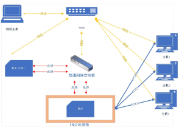 |

---

### 2.3 测试环境说明

本报告中提到的测试端 A、测试端 B、测试端 C 分别是：
表 6

| 测试设备名称 | 系统配置详情  | IP           |
|--------|---------|--------------|
| 测试端 A   | 25G 智能网卡 | 10.10.10.110 |
| 测试端 B   | CX5 标卡   | 10.10.10.60  |

---

### 2.4 测试方法和工具说明

表 7

| 测试内容  | 测试方法     | 测试工具        |
|-------|----------|-------------|
| 功能    | 黑盒、手工、回归 | Jira，UI 配置工具 |
| 可靠性   | 黑盒、手工、回归 | <br/>       |
| 安全性   | 黑盒、手工、回归 | <br/>       |
| 兼容性   | 黑盒、手工、回归 | <br/>       |
| 安装和手册 | 黑盒、手工、回归 | <br/>       |

#### 2.4.1 测试工具说明

perftest 是 Linux-RDMA 官方开源基准套件，用于测试 RDMA/InfiniBand 网络带宽、延迟及消息速率，支持 Send、Read、Write 等操作，输出 Gbps、MPPS、μs 级指标，便于性能调优和硬件选型。

---

### 2.5 测试环境加载

#### 2.5.1 网络驱动加载

| 进入网络驱动目录 | cd /home/qx_25G_0901/linux_kernel_qx/                                         |
|----------|-------------------------------------------------------------------------------|
| 加载网络驱动   | insmod auxiliary.ko && insmod qx_unic3.ko                                     |
| 配置网络端口 IP | ifconfig enp5s0f0 10.10.10.110/24 up<br/>ifconfig enp5s0f1 10.10.20.110/24 up |

*
    1. 进入网络驱动目录

`cd /home/qx_25G_0901/linux_kernel_qx/`

*
    2. 加载网络驱动

`insmod auxiliary.ko && insmod qx_unic3.ko`

*
    3. 配置网络端口 IP（两个端口分别配置）

`ifconfig enp5s0f0 10.10.10.110/24 up`

`ifconfig enp5s0f1 10.10.20.110/24 up`

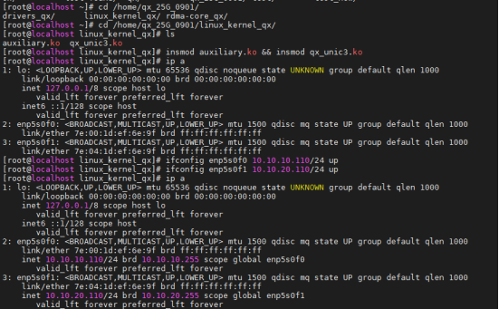

---

#### 2.5.2 RDMA 驱动加载

*
    1. 进入 RDMA 驱动目录

```bash
cd /home/qx_25G_0901/
```

*
    2. 加载 RDMA 驱动（添加执行权限并运行加载脚本）

```bash
chmod +x ./*
./load.sh
```

*
    3. 查看 RDMA 设备信息

```bash
ibv_devinfo -vv
```

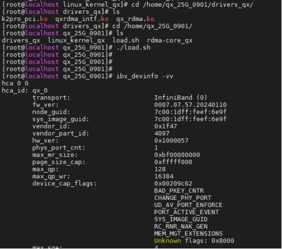

---

#### 2.5.3 RDMA_CORE 编译

*
    1. 进入 RDMA_CORE 目录

```bash
cd /home/qx_25G_0901/rdma-core_qx/
```

*
    2. 编译 RDMA_CORE 前置操作（添加执行权限、清理旧构建目录、创建新构建目录、执行编译）

```bash
chmod +x ./*
rm -rf build
mkdir build
EXTRA_CMAKE_FLAGS="-DNO_MAN_PAGES=1" ./build.sh
```

*
    3. 设置 RDMA_CORE 路径（进入构建目录、复制二进制文件、复制头文件、配置环境变量）

```bash
cd build
cp bin/* /usr/bin/
cp -Lr ./include/infiniband/ /usr/include/
cp -Lr ./include/rdma /usr/include/
export LDFLAGS=-L/home/qx_25G_0901/rdma-core_qx/build/lib
export LD_LIBRARY_PATH=/home/qx_25G_0901/rdma-core_qx/build/lib
```

RDMA_CORE 编译


RDMACORE 编译成功

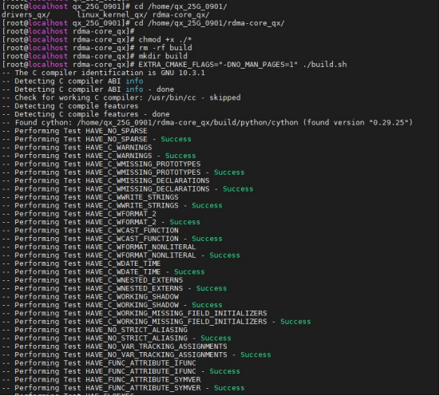

RDMACORE 路径

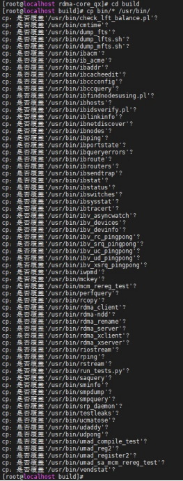
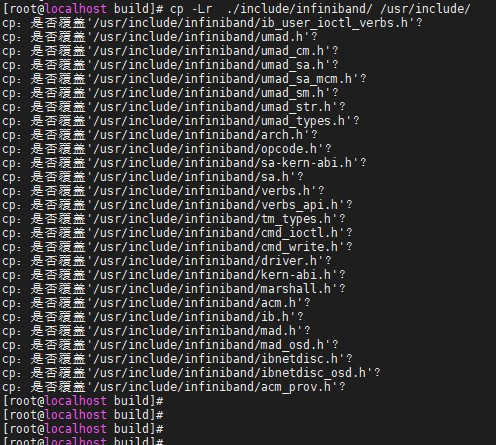

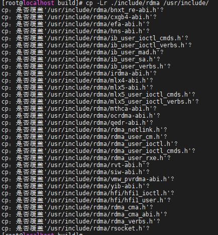
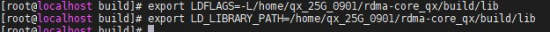

---

## 3 主要功能测试

### 3.1 ICMP 协议一致性测试

| 测试项  | ICMP 协议一致性测试                                                                         |
|------|-------------------------------------------------------------------------------------|
| 测试目的 | 验证 25G 智能网卡符合 ICMO 协议一致性                                                                |
| 参考组网 | <br/><br/>25G 智能网卡直连 CX5                                                              |
| 预置条件 | 按拓扑部署测试场景，本测试项，只用到 25G 智能网卡和 25G-CX5 网卡                                                 |
| 测试步骤 | 1. 25G 智能网卡扫描 PCIE<br/>2. CX5ping25G 智能网卡                                              |
| 预期结果 | A. 欧拉 linux 主机检测到网卡为 25G 网卡 pcie 信息；<br/>B. CX5 与 25G 智能网卡可以 ping 通，链路正常。<br/>满足 A、B，则通过；否则，失败。 |
| 测试结论 | 通过                                                                                  |
| 测试后置 | <br/>                                                                               |

测试结果：
A. 测试端 A（欧拉 Linux 主机）检测到网卡的 pcie 信息

_Detect_NIC_PCIe_Info.png.png)

B. CX5 与 25G 智能网卡可以 ping 通，链路正常

25G 智能网卡 IP 信息：

_Euler_Host.png)

CX5 ping 25G 智能网卡：

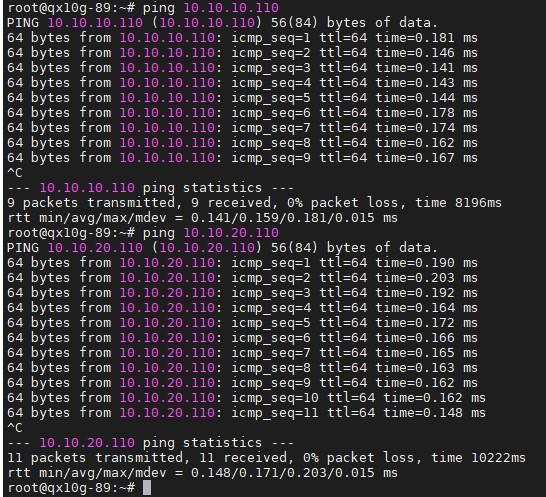

---

### 3.2 RDMA 基础测试

#### 3.2.1 RDMA Read 时延测试

| 测试项  | RDMA Read 时延测试                                                                                                                                                                         |
|------|---------------------------------------------------------------------------------------------------------------------------------------------------------------------------------------|
| 测试目的 | 测试 RDMA read 时延功能的性能                                                                                                                                                                    |
| 参考组网 | 25G 智能网卡直连 CX5                                                                                                                                                                          |
| 预置条件 | 按拓扑部署测试场景，本测试项，只用到 25G 智能网卡和 25G-CX5 网卡                                                                                                                                                   |
| 测试步骤 | 1. 25G 智能网卡正常加载驱动<br/>2. CX5 端网卡输入测试命令：ib_send_lat -d mlx5_0 -x 3 -a -n 1000 -F --use_hugepages<br/>3. 25G 端网卡输入测试命令：ib_send_lat -d qx_0 -x 1 -a -n 1000 -F  --use_hugepages 10.10.10.60 |
| 预期结果 | A. RDMA 驱动正常加载<br/>B. RDMA Read 时延测试正常<br/>满足 A、B，则通过；否则，失败。                                                                                                                             |
| 测试结论 | 通过                                                                                                                                                                                    |
| 测试后置 | <br/>                                                                                                                                                                                 |

**测试步骤**

*
    1. 25G 智能网卡正常加载驱动（参考 2.5.2 RDMA 驱动加载步骤）
*
    2. CX5 端网卡输入测试命令

```bash
ib_send_lat -d mlx5_0 -x 3 -a -n 1000 -F --use_hugepages
```

*
    3. 25G 端网卡输入测试命令

```bash
ib_send_lat -d qx_0 -x 1 -a -n 1000 -F --use_hugepages 10.10.10.60
```

测试结果：


---

#### 3.2.2 RDMA Read 带宽测试

| 测试项  | RDMA Read 带宽测试                                                                                                                                                                                   |
|------|-------------------------------------------------------------------------------------------------------------------------------------------------------------------------------------------------|
| 测试目的 | 测试 RDMA read 带宽功能的性能                                                                                                                                                                              |
| 参考组网 | 25G 智能网卡直连 CX5                                                                                                                                                                                    |
| 预置条件 | 按拓扑部署测试场景，本测试项，只用到 25G 智能网卡和 25G-CX5 网卡                                                                                                                                                             |
| 测试步骤 | 1. 25G 智能网卡正常加载驱动<br/>2. CX5 端网卡输入测试命令：ib_send_bw -d mlx5_0 -x 3 -a -n 1000 -F -q 16 --use_hugepages<br/>3. 25G 端网卡输入测试命令：ib_send_bw -d qx_0 -x 1 -a -n 1000 -F -q 16  --use_hugepages 10.10.10.60 |
| 预期结果 | A. RDMA 驱动正常加载<br/>B. RDMA Read 带宽测试正常<br/>满足 A、B，则通过；否则，失败。                                                                                                                                       |
| 测试结论 | 通过                                                                                                                                                                                              |
| 测试后置 | <br/>                                                                                                                                                                                           |

**测试步骤**

*
    1. 25G 智能网卡正常加载驱动（参考 2.5.2 RDMA 驱动加载步骤）
*
    2. CX5 端网卡输入测试命令

```bash
ib_send_bw -d mlx5_0 -x 3 -a -n 1000 -F -q 16 --use_hugepages
```

*
    3. 25G 端网卡输入测试命令

```bash
ib_send_bw -d qx_0 -x 1 -a -n 1000 -F -q 16 --use_hugepages 10.10.10.60
```

测试结果：

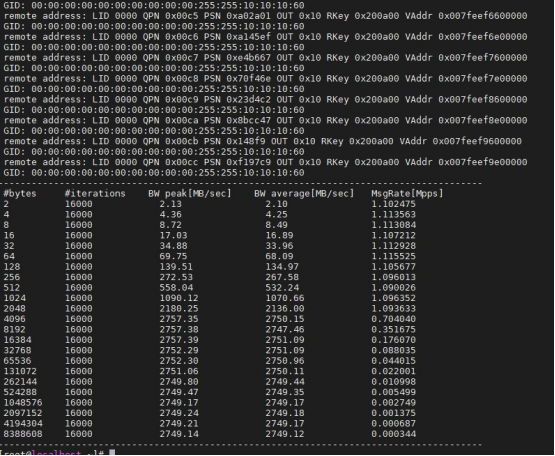

#### 3.2.3 RDMA Write 时延测试

| 测试项  | RDMA Read 时延测试                                                                                                                                                                           |
|------|-----------------------------------------------------------------------------------------------------------------------------------------------------------------------------------------|
| 测试目的 | 测试 RDMA Write 时延功能的性能                                                                                                                                                                     |
| 参考组网 | 25G 智能网卡直连 CX5                                                                                                                                                                            |
| 预置条件 | 按拓扑部署测试场景，本测试项，只用到 25G 智能网卡和 25G-CX5 网卡                                                                                                                                                     |
| 测试步骤 | 1. 25G 智能网卡正常加载驱动<br/>2. CX5 端网卡输入测试命令：ib_write_lat -d mlx5_0 -x 3 -a -n 1000 -F --use_hugepages<br/>3. 25G 端网卡输入测试命令：ib_write_lat -d qx_0 -x 1 -a -n 1000 -F  --use_hugepages 10.10.10.60 |
| 预期结果 | A. RDMA 驱动正常加载<br/>B. RDMA Write 时延测试正常<br/>满足 A、B，则通过；否则，失败。                                                                                                                              |
| 测试结论 | 通过                                                                                                                                                                                      |
| 测试后置 | <br/>                                                                                                                                                                                   |

**测试步骤**

*
    1. 25G 智能网卡正常加载驱动（参考 2.5.2 RDMA 驱动加载步骤）
*
    2. CX5 端网卡输入测试命令

```bash
ib_write_lat -d mlx5_0 -x 3 -a -n 1000 -F --use_hugepages
```

*
    3. 25G 端网卡输入测试命令

```bash
ib_write_lat -d qx_0 -x 1 -a -n 1000 -F --use_hugepages 10.10.10.60
```

测试结果：

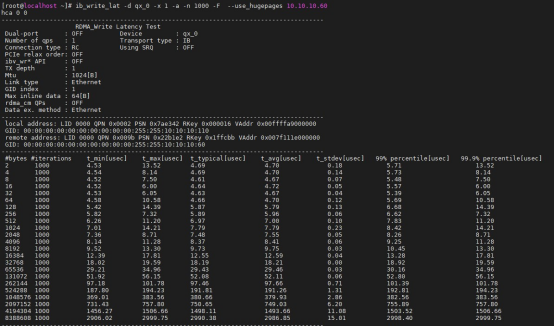

---

#### 3.2.4 RDMA Write 带宽测试

| 测试项  | RDMA Write 带宽测试                                                                                                                                                                                    |
|------|---------------------------------------------------------------------------------------------------------------------------------------------------------------------------------------------------|
| 测试目的 | 测试 RDMA Write 带宽功能的性能                                                                                                                                                                               |
| 参考组网 | 25G 智能网卡直连 CX5                                                                                                                                                                                      |
| 预置条件 | 按拓扑部署测试场景，本测试项，只用到 25G 智能网卡和 25G-CX5 网卡                                                                                                                                                               |
| 测试步骤 | 1. 25G 智能网卡正常加载驱动<br/>2. CX5 端网卡输入测试命令：ib_write_bw -d mlx5_0 -x 3 -a -n 1000 -F -q 16 --use_hugepages<br/>3. 25G 端网卡输入测试命令：ib_write_bw -d qx_0  -x 1 -a -n 1000 -F -q 16 --use_hugepages 10.10.10.60 |
| 预期结果 | A. RDMA 驱动正常加载<br/>B. RDMA Write 带宽测试正常<br/>满足 A、B，则通过；否则，失败。                                                                                                                                        |
| 测试结论 | 通过                                                                                                                                                                                                |
| 测试后置 | <br/>                                                                                                                                                                                             |

**测试步骤**

*
    1. 25G 智能网卡正常加载驱动（参考 2.5.2 RDMA 驱动加载步骤）
*
    2. CX5 端网卡输入测试命令

```bash
ib_write_lat -d mlx5_0 -x 3 -a -n 1000 -F --use_hugepages
```

*
    3. 25G 端网卡输入测试命令

```bash
ib_write_lat -d qx_0 -x 1 -a -n 1000 -F --use_hugepages 10.10.10.60
```

**测试结果：**

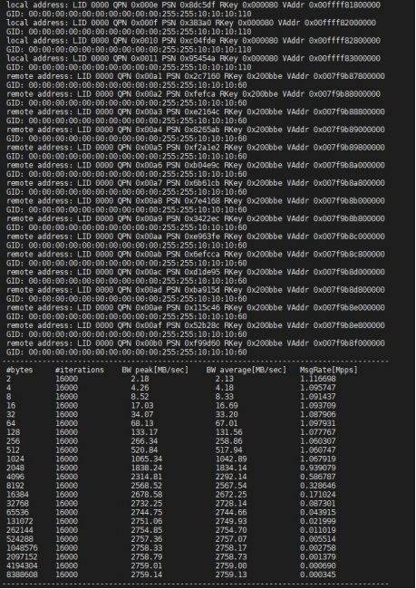

#### 3.2.5 RDMA Send 时延测试

| 测试项  | RDMA Read 时延测试                                                                                                                                                                         |
|------|---------------------------------------------------------------------------------------------------------------------------------------------------------------------------------------|
| 测试目的 | 测试 RDMA read 功能的性能                                                                                                                                                                      |
| 参考组网 | 25G 智能网卡直连 CX5                                                                                                                                                                          |
| 预置条件 | 按拓扑部署测试场景，本测试项，只用到 25G 智能网卡和 25G-CX5 网卡                                                                                                                                                   |
| 测试步骤 | 1. 25G 智能网卡正常加载驱动<br/>2. CX5 端网卡输入测试命令：ib_send_lat -d mlx5_0 -x 3 -a -n 1000 -F --use_hugepages<br/>3. 25G 端网卡输入测试命令：ib_send_lat -d qx_0 -x 1 -a -n 1000 -F  --use_hugepages 10.10.10.60 |
| 预期结果 | A. RDMA 驱动正常加载<br/>B. RDMA 时延测试正常<br/>满足 A、B，则通过；否则，失败。                                                                                                                                  |
| 测试结论 | 通过                                                                                                                                                                                    |
| 测试后置 | <br/>                                                                                                                                                                                 |

**测试步骤**

*
    1. 25G 智能网卡正常加载驱动（参考 2.5.2 RDMA 驱动加载步骤）
*
    2. CX5 端网卡输入测试命令

```bash
ib_send_lat -d mlx5_0 -x 3 -a -n 1000 -F --use_hugepages
```

*
    3. 25G 端网卡输入测试命令

```bash
ib_send_lat -d qx_0 -x 1 -a -n 1000 -F --use_hugepages 10.10.10.60
```

测试结果：

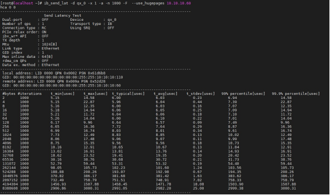

#### 3.2.6 RDMA Send 带宽测试

| 测试项  | RDMA Send 带宽测试                                                                                                                                                                                   |
|------|-------------------------------------------------------------------------------------------------------------------------------------------------------------------------------------------------|
| 测试目的 | 测试 RDMA Send 带宽功能的性能                                                                                                                                                                              |
| 参考组网 | 25G 智能网卡直连 CX5                                                                                                                                                                                    |
| 预置条件 | 按拓扑部署测试场景，本测试项，只用到 25G 智能网卡和 25G-CX5 网卡                                                                                                                                                             |
| 测试步骤 | 1. 25G 智能网卡正常加载驱动<br/>2. CX5 端网卡输入测试命令：ib_send_bw -d mlx5_0 -x 3 -a -n 1000 -F -q 16 --use_hugepages<br/>3. 25G 端网卡输入测试命令：ib_send_bw -d qx_0 -x 1 -a -n 1000 -F -q 16  --use_hugepages 10.10.10.60 |
| 预期结果 | A. RDMA 驱动正常加载<br/>B. RDMA Send 带宽测试正常<br/>满足 A、B，则通过；否则，失败。                                                                                                                                       |
| 测试结论 | 通过                                                                                                                                                                                              |
| 测试后置 | <br/>                                                                                                                                                                                           |

**测试步骤**

*
    1. 25G 智能网卡正常加载驱动（参考 2.5.2 RDMA 驱动加载步骤）
*
    2. CX5 端网卡输入测试命令

```bash
ib_send_bw -d mlx5_0 -x 3 -a -n 1000 -F -q 16 --use_hugepages
```

*
    3. 25G 端网卡输入测试命令

```bash
ib_send_bw -d qx_0 -x 1 -a -n 1000 -F -q 16 --use_hugepages 10.10.10.60
```

**测试结果：**
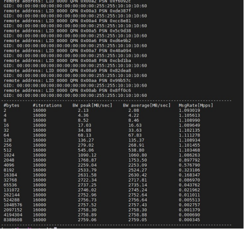

## 3.3 网络性能测试

### 3.3.1 UDP 性能测试

| 测试项  | UDP 带宽测试                                                                                                             |
|------|---------------------------------------------------------------------------------------------------------------------|
| 测试目的 | 测试 UDP 的性能                                                                                                            |
| 参考组网 | 25G 智能网卡直连 CX5                                                                                                        |
| 预置条件 | 按拓扑部署测试场景，本测试项，只用到 25G 智能网卡和 25G-CX5 网卡                                                                                 |
| 测试步骤 | 1. 25G 智能网卡正常加载驱动<br/>2. CX5 端网卡输入测试命令：iperf3 -s<br/>3. 25G 端网卡输入测试命令：iperf3 -c 10.10.10.60 -u -P 8 -t 10 -b 0 -l 9000 |
| 预期结果 | A. 网络驱动正常加载<br/>B. UDP 带宽达到线速<br/>满足 A、B，则通过；否则，失败。                                                                   |
| 测试结论 | 通过                                                                                                                  |
| 测试后置 | <br/>                                                                                                               |

**测试步骤**

*
    1. 25G 智能网卡正常加载驱动（参考 2.5.1 网络驱动加载步骤）
*
    2. CX5 端网卡输入测试命令

```bash
iperf3 -s
```

*
    3. 25G 端网卡输入测试命令

```bash
iperf3 -c 10.10.10.60 -u -P 8 -t 10 -b 0 -l 9000
```

**测试结果：**

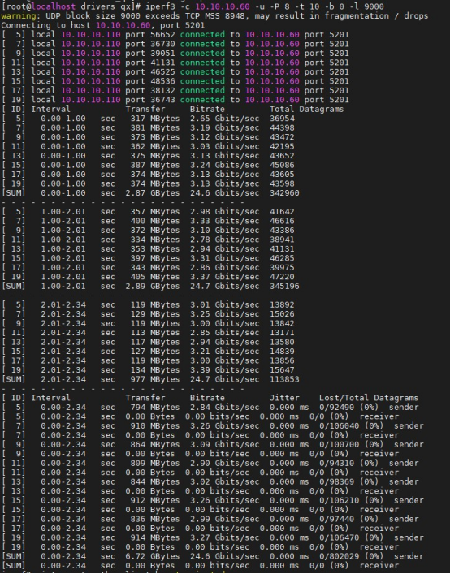

### 3.3.2 TCP 性能测试

| 测试项  | TCP 带宽测试                                                                                                          |
|------|------------------------------------------------------------------------------------------------------------------|
| 测试目的 | 测试 TCP 的性能                                                                                                         |
| 参考组网 | 25G 智能网卡直连 CX5                                                                                                     |
| 预置条件 | 按拓扑部署测试场景，本测试项，只用到 25G 智能网卡和 25G-CX5 网卡                                                                              |
| 测试步骤 | 1. 25G 智能网卡正常加载驱动<br/>2. CX5 端网卡输入测试命令：iperf3 -s<br/>3. 25G 端网卡输入测试命令：iperf3 -c 10.10.10.60 -P 8 -t 10 -b 0 -l 9000 |
| 预期结果 | A. 网络驱动正常加载<br/>B. TCP 带宽达到线速<br/>满足 A、B，则通过；否则，失败。                                                                |
| 测试结论 | 通过                                                                                                               |
| 测试后置 | <br/>                                                                                                            |

**测试步骤**

*
    1. 25G 智能网卡正常加载驱动（参考 2.5.1 网络驱动加载步骤）
*
    2. CX5 端网卡输入测试命令

```bash
iperf3 -s
```

*
    3. 25G 端网卡输入测试命令

```bash
iperf3 -c 10.10.10.60 -P 8 -t 10 -b 0 -l 9000
```

**测试结果：**
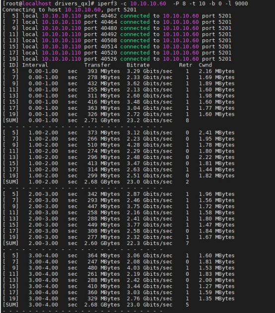

## 3.4 1588PTP 测试

| 测试项  | 1588PTP 协议一致性测试                                                                                                       |
|------|----------------------------------------------------------------------------------------------------------------------|
| 测试目的 | 验证 25G 智能网卡符合 1588PTP 协议一致性                                                                                              |
| 参考组网 | 25G 智能网卡直连 CX5                                                                                                         |
| 预置条件 | 按拓扑部署测试场景，本测试项，只用到 25G 智能网卡和 25G-CX5 网卡                                                                                  |
| 测试步骤 | 1. 25G 智能网卡正常加载驱动<br/>2. CX5 端网卡输入测试命令：ptp4l -i enp1s0f0np0 -H -2 -m<br/>3. 25G 端网卡输入测试命令：ptp4l -i enp5s0f0 -H -2 -s -m |
| 预期结果 | A. 网络驱动正常加载；<br/>B. PTP 同步信息在 100s 内收敛；<br/>C. PTP offset 不超过 100ns<br/>满足 A、B、C，则通过；否则，失败。                                |
| 测试结论 | 通过                                                                                                                   |
| 测试后置 | <br/>                                                                                                                |

**测试步骤**

*
    1. 25G 智能网卡正常加载驱动（参考 2.5.1 网络驱动加载步骤）
*
    2. CX5 端网卡输入测试命令

```bash
ptp4l -i enp1s0f0np0 -H -2 -m
```

*
    3. 25G 端网卡输入测试命令

```bash
ptp4l -i enp5s0f0 -H -2 -s -m
```

**测试结果：**
25G 智能网卡做从，收敛时间与精度符合预期

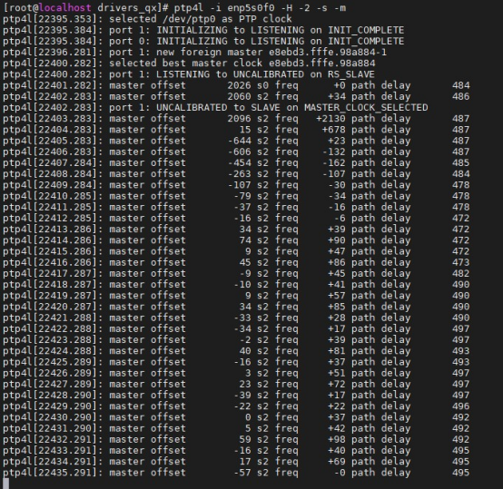
