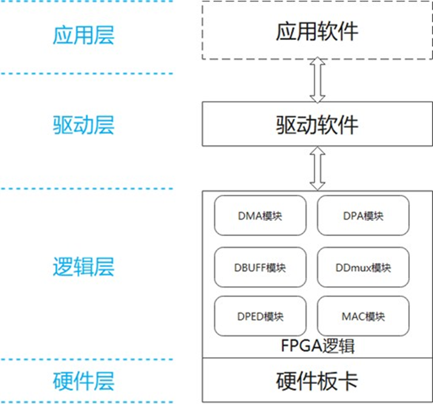
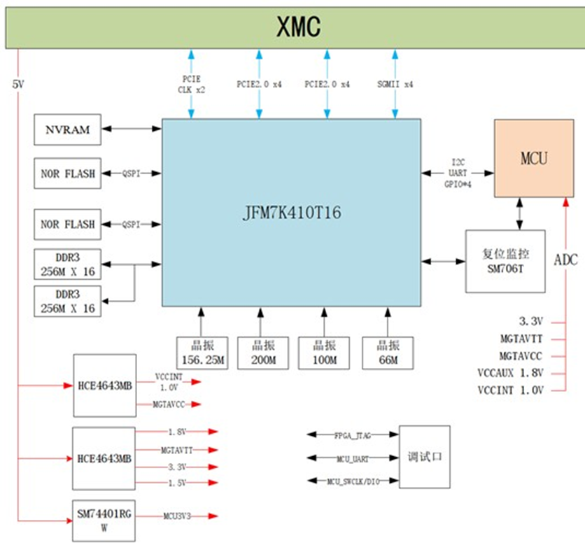
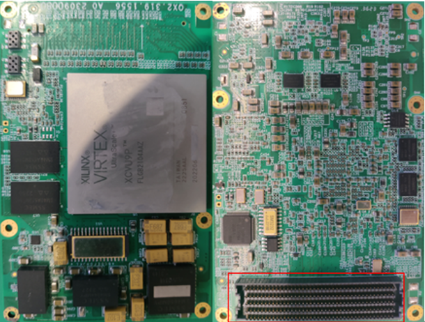
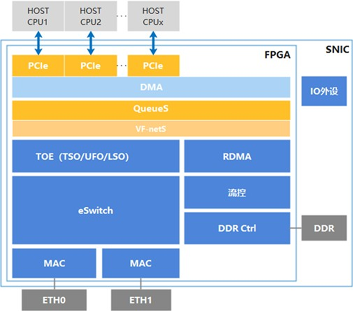
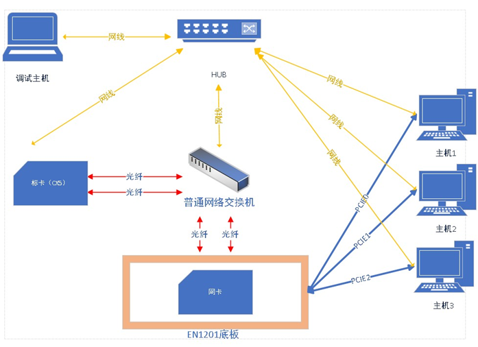
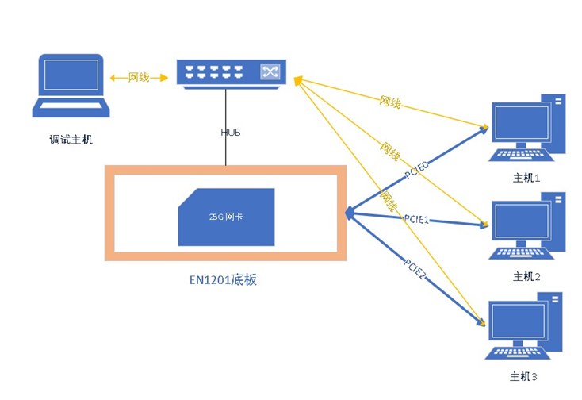
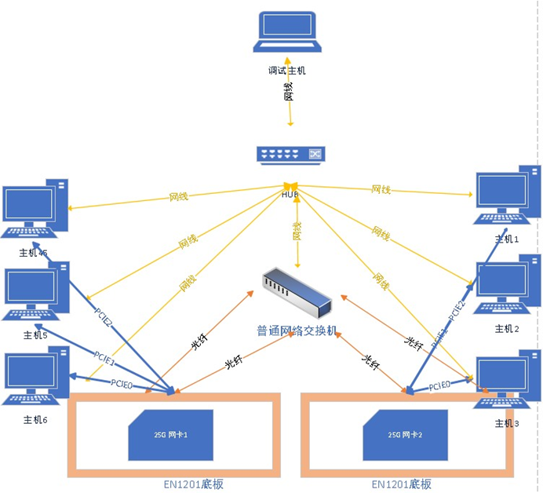
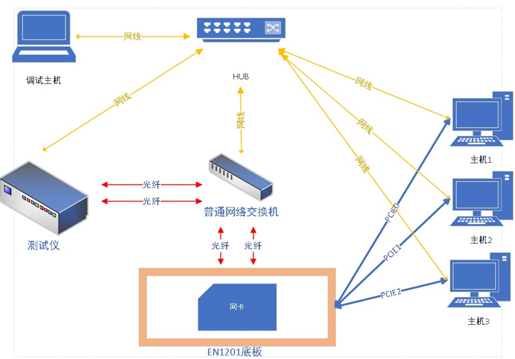

# EN1201型智能网卡用户手册

## 1. 范围

### 1.1 标识

- a) 系统名称和标识：EN1201 型 DPU 25G 智能网卡；
- b) 软件名称和标识：EN1201 型 DPU 25G 智能网卡；

### 1.2 系统概述

#### 1.2.1 产品名称和用途

25G 智能网卡(或称 DPU 25G 网卡)，项目代号 EN1201，支持 Ethernet 协议，能够通过 PCIe 总线和主机单元耦合，
采用 25Gbps 以太网作为各子系统单元信息交互的主干网络。

25G 智能网卡能够为功能子系统提供高速以太网接入和通信服务，满足高速、高可靠的数据和控制信息的传输要求。

本文主要描述了 EN1201 型智能网卡软件用户手册。

#### 1.2.2 产品组成

根据DPU 25G 网卡的工作原理，将系统架构简化为4个层次，自下而上分别是物理层、逻辑层、驱动层和应用层，如图1所示。

本项目实现了其中的物理层、逻辑层和驱动层，主要由硬件板卡、FPGA逻辑和驱动软件组成。



图1 产品架构框图

DPU 25G 网卡的硬件板卡为2块电路板，由载板和子卡组合而成，

智能网卡的硬件电路主要由 FPGA、DDR3、FLASH、MCU、时钟电路、电源电路和连接器等电子元器件组成。如图2所示



图2 硬件组成框图

### 1.3 文档概述

本文档主要描述 EN1201 型 25G 网卡软件运行所需环境、软件的使用方法、功能和性能，软件的限制条件等，帮助软件用户正确使用 DPU
25G 网卡软件。

## 2. 引用文档

- GJB438B-2009 军用软件开发文档通用要求
- GJB2786A-2009 军用软件开发通用要求
- GJB 1267-1991 军用软件维护要求
- GJB1268A-2004 军用软件验收要

## 3. 系统综述

### 3.1  硬件介绍

DPU 25G 网卡硬件如下图所示：将反面如图红框所示反扣到相应载板上。



图 3 EN1201 型外观图（从左到右依次是正面和反面）

FPGA 逻辑主要支持二层转发、组播复刻、队列管理、中断管理；

1588v2 精确时钟同步；PFC 反压、ECN 拥塞控制无损以太网；
提供数据、控制通道和 IO 外设等。



图 4 NIC 逻辑场景

> 注意：子卡通电后需要考虑散热。

### 3.2 软件介绍

DPU 25G 网卡软件主要为硬件的驱动，驱动软件包括底层驱动和协议栈。

底层驱动主要处理底层收发包，数据搬运以及队列、中断管理和业务配置。

驱动软件和 FPGA 联动配合完成主机侧业务的卸载，通过驱动下发卸载配置到 FPGA，
软件在处理数据报文时根据用户配置选择处理或不处理当前业务（卸载到 FPGA 上处理）。

#### 3.2.1 软件编译与安装

##### 1. 网络驱动

代码目录

```text
path_default/nic_drivers/generic_nic_framwork-2025-08-01153845/linux_kernel_qx
```

编译

```text
cd （网络驱动路径）;make
```

加载驱动

```text
insmod auxiliary.ko & insmod qx_unic3.ko
```

##### 2. RDMA 驱动

代码目录

```text
cd path_default/rdma_drivers/drivers；
chmod +x ./* # 使脚本都有可执行权限
```

编译

```text
cd （驱动路径）;make
```

加载驱动

可以直接在驱动目录下运行脚本

```bash
./load.sh
```

手动加载驱动

```text
insmod k2pro_pci.ko
modprobe rdma_ucm
insmod qx_rdma.ko
```

##### 3. RDMA CORE

进入源码目录：

```text
cd path_default/rdma_drivers/rdma-core;
chmod +x ./* # 使脚本都有可执行权限
```

清理构建目录并重新构建：

```text
rm -rf build;mkdir build
EXTRA_CMAKE_FLAGS="-DNO_MAN_PAGES=1" ./build.sh
```

安装用户态库到系统目录：

```text
cd build;
cp lib/lib*so* /usr/lib/
cp bin/* /usr/bin/
cp -Lr ./include/infiniband/ /usr/include/
cp -Lr ./include/rdma /usr/include/
```

指定用户态库路径

```text
export LDFLAGS=-L/path_default/rdma_drivers/rdma-core/build/lib # 修改为实际的rdma-core库路径
export LD_LIBRARY_PATH=/path_default /rdma_drivers/rdma-core/build/lib
```

##### 4. perftest工具

进入源码目录，配置和编译：

```text
cd path_default/perftest
```

```text
./autogen.sh;
./configure;
make
```

安装：

```text
cp path_default/perftest/ib_* /usr/bin -f
```

##### 5. linuxptp

进入源码目录

```text
cd path_default/linuxptp-3.1.1;
```

编译

```text
make clean && make
```

正常生成 `ptp4l` 即可

## 4. 典型测试场景及拓扑图

### 4.1 子卡对接标卡（CX5）



拓扑一 QX 子卡对接标卡（CX5）

### 4.2 单子卡多主机测试



拓扑二 QX 单子卡多主机

### 4.3 双子卡对接测试



拓扑三 QX 子卡对接

### 4.4 子卡对接测试仪



拓扑四 QX 子卡对接测试仪

## 5. 命令行工具（CLI）介绍与示例

### 5.1 网络性能测试命令行

：

#### 1. 测试准备与说明

配置同网段接口，PING包可达；

#### 2. TCP测试

##### 服务器端命令

```bash
 iperf3 -s # 基础测试, 在默认端口5201启动服务器
```

```bash
iperf3 -s -p 12345 # 指定端口测试，在指定端口12345启动服务器
```

##### 客户端命令

基础测试

```bash
iperf3 -c 10.10.10.60 -t 10 # 基础TCP测试，持续10秒
```

设置时长

```shell
iperf3 -c 10.10.10.60 -t 60 # 设置测试时长为60秒
```

多并行流

```shell
iperf3 -c 10.10.10.60 -P 8 # 关键参数：使用8个并行连接，压测高速链路
```

#### 3. UDP测试

##### 服务器端命令

```bash
 iperf3 -s # 基础测试, 在默认端口5201启动服务器
```

```bash
iperf3 -s -p 12345 # 指定端口测试，在指定端口12345启动服务器
```

##### 客户端命令

基础测试

```shell
iperf3 -c 10.10.10.60 -u # 基础UDP测试，默认1Mbps带宽（主要测延迟/丢包）
```

指定带宽

```shell
iperf3 -c 10.10.10.60 -u -b 1G # 指定UDP发送带宽为目标1Gbps
```

设置包长

```shell
iperf3 -c 10.10.10.60 -u -b 1G -l 1470 # 设置UDP数据包长度为1470字节（测试巨帧）
```

绑定网卡

```shell
iperf3 -c 10.10.10.60 -B 10.10.10.110 # 指定从客户端的哪个源IP地址发出流量
```

### 5.2 RDMA 命令行测试

#### 5.2.1 测试准备与说明：

- RDMA 测试，测试前网卡基本网络业务需要通；
- perftest 遍历包长时需要配置大页

```shell
- echo 1024 >  /sys/kernel/mm/hugepages/hugepages-2048kB/nr_hugepages # 大小根据用户环境自己配置
```

- 串口打印太多时，可关闭打印

```shell
echo 0 >/proc/sys/kernel/print
```

- 10.10.10.60 是对端网卡接口 ip, `qx_0`、`mlx5_0` 是设备名称，`ibv_devinfo –vv` 可查；
- 多 QP 操作当前支持到16。

#### 5.2.2 测试操作

##### 1. send 延时操作 qx_0 -> mlx5_0

QX 端

```shell
ib_send_lat -d qx_0 -x 1 -a -n 1000 -F --use_hugepages 10.10.10.60
```

CX5 端

```shell
 ib_send_lat -d mlx5_0 -x 3 -a -n 1000 -F --use_hugepages
```

##### 2. send 带宽操作qx_0 -> mlx5_0

QX 端

```shell
ib_send_bw -d qx_0 -x 1 -a -n 1000 -F -q 16 --use_hugepages 10.10.10.60
```

CX5 端

```shell
ib_send_bw -d mlx5_0 -x 3 -a -n 1000 -F -q 16 --use_hugepages
```

##### 3. read 延时操作qx_0 -> mlx5_0

QX 端

```shell
ib_read_lat -d qx_0 -x 1 -a -n 1000 -F --use_hugepages 10.10.10.60
```

CX5 端

```shell
 ib_read_lat -d mlx5_0 -x 3 -a -n 1000 -F --use_hugepages
```

##### 4. read 带宽操作qx_0 -> mlx5_0

QX 端

```shell
ib_read_bw -d qx_0 -x 1 -a -n 1000 -F -q 16 --use_hugepages 10.10.10.60
```

CX5 端

```shell
ib_read_bw -d mlx5_0 -x 3 -a -n 1000 -F -q 16 --use_hugepages
```

##### 5. write 延时操作qx_0 -> mlx5_0

QX 端

```shell
ib_write_lat -d qx_0 -x 1 -a -n 1000 -F --use_hugepages 10.10.10.60
```

CX5 端

```shell
ib_write_lat -d mlx5_0 -x 3 -a -n 1000 -F --use_hugepages
```

##### 6. write 带宽操作 qx_0 -> mlx5_0

QX 端

```shell
ib_write_bw -d qx_0 -x 1 -a -n 1000 -F -q 16 --use_hugepages 10.10.10.60
```

CX5 端

```shell
ib_write_bw -d mlx5_0 -x 3 -a -n 1000 -F -q 16 --use_hugepages
```

##### 7. 多 QP 操作 SEND

QX 端

```shell
ib_send_bw -d qx_0 -x 1 -a -n 1000 -F -q 16 --use_hugepages 10.10.10.60
```

CX5 端

```shell
ib_send_bw -d mlx5_0 -x 3 -a -n 1000 -F -q 16 --use_hugepages
```

##### 8. 多 QP 操作 READ

QX 端

```shell
ib_read_bw -d qx_0 -x 1 -a -n 1000 -F -q 16 --use_hugepages 10.10.10.60
```

CX5 端

```shell
ib_read_bw -d mlx5_0 -x 3 -a -n 1000 -F -q 16 --use_hugepages
```

##### 9. 多 QP 操作 WRITE

QX 端

```shell
ib_write_bw -d qx_0 -x 1 -a -n 1000 -F -q 16 --use_hugepages 10.10.10.60
```

CX5 端

```shell
ib_write_bw -d mlx5_0 -x 3 -a -n 1000 -F -q 16 --use_hugepages
```

### 5.3 1588 测试命令行

测试准备与说明：
1、1588 测试使用开源工具

```text
git clone git@github.com:richardcochran/linuxptp.git
```

需要 host 和 cx5 配合测试，cx5 作为 master，host 作为 slave，负责运行 PTP 协议，计算主从设备的时钟偏移和延迟。

master 执行：

```bash
ptp4l -i enp1s0f0np0 -H -2 -m # enp1s0f0np0 为设备驱动接口名称
```

slave 执行

```bash
ptp4l -i enp1s0f0 -H -2 -s -m # enp5s0f0 为设备驱动接口名称
```

