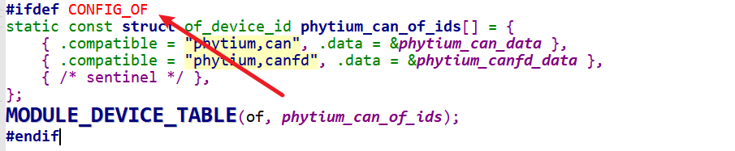
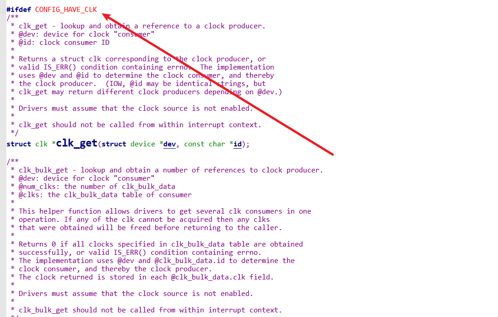

# CAN 总线时钟无法读取

```text
[    3.079436] CAN device driver interface
[    3.084189] phytium_can_platform 28207000.can: no clock found
[    3.090021] phytium_can_platform 28207400.can: no clock found
[    3.095831] phytium_can_platform 28207800.can: no clock found
```

## 原因

1.设备树can节点的clock名称与驱动中的名称不匹配

2.相关条件编译宏没打开

## 解决办法

### 1.修改源代码

在源码目录下

```shell
vi drivers/net/can/phytium/phytium_can_platform.c
```

在probe函数中

```c
/*原始代码*/
cdev->clk = devm_clk_get(&pdev->dev, "can_clk");
/*修改后*/
cdev->clk = devm_clk_get(&pdev->dev, "phytium_can_clk");
```

### 2.修改phytium_defconfig

在phytium_defconfig加入

```text
CONFIG_OF=y
CONFIG_HAVE_CLK=y
```

原因

1.设备树通过device id表中compatible属性匹配



2.通过CONFIG_HAVE_CLK声明平台支持时钟框架，防止启动代码调用devm_clk_get( )想获取一个时钟时返回NULL



3.重新编译内核

```shell
oebuild bitbake openeuler-image
```


