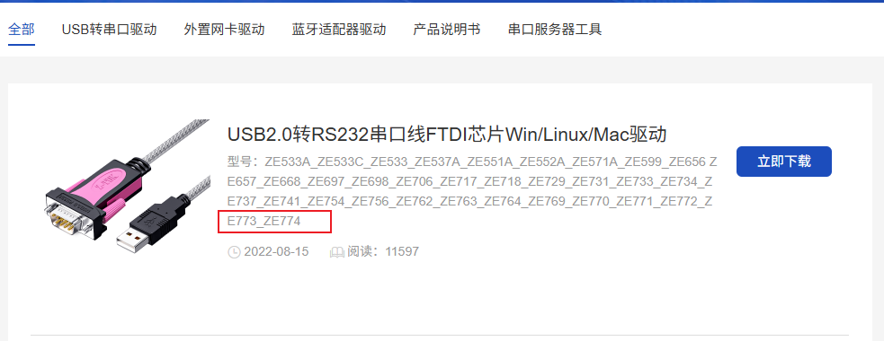
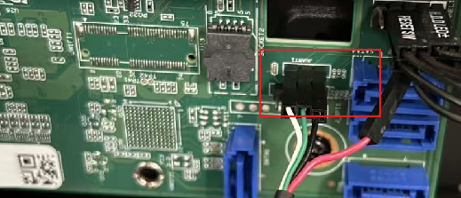

# 安装 openeuler embedded 系统到集特主板

## 1. 构建 iso 镜像

使用 oebuild 构建 `openeuler-image-phytium.iso` 镜像

然后使用烧录工具 [balenaEtcher](https://etcher.balena.io/) 制作启动U盘。

## 2. 集特主板串口连接

购买 USB-TTL 串口转接线，型号为 ，在[这个网站](https://www.z-tek.com)下载 `ZE773`驱动安装到 Windows 上



集特主板上有3 pin和4 pin的串口接线柱，我们选择连接 3pin。
连接 `GND TX RX`



另一端连接 Windows PC，并配置串口波特率为 115200.

## 3. 安装 iso

按 `del` 进入集特主板的 BIOS，然后选择启动设备为 U 盘。

系统启动后会进入选择安装介质和安装位置的命令行提示，按提示选择安装介质为 U 盘，目的地为 SSD

```text
System booting cost:70.98 563.16
reloading /etc/inittab
starting pid 1611, tty '/dev/ttyAMA0': '-/bin/sh /init.d/install-efi.sh'
Check ISO/vfat/ext4 and CD-ROM...
-------------------------------
/dev/nvme0n1
MODEL=Colorful CN600 256GB
UEVENT=MAJOR=247
MINOR=0
DEVNAME=nvme0
NVME_TRTYPE=pcie

-------------------------------
/dev/sda
VENDOR=Kingston
MODEL=DataTraveler 3.0
UEVENT=DEVTYPE=scsi_device
DRIVER=sd
MODALIAS=scsi:t-0x00

Please type the target where iso image is, or press n to exit ( nvme0n1
nvme0n1p1
nvme0n1p2
nvme0n1p3 sda ):
```

安装完成后移除安装介质，然后重新启动系统。
