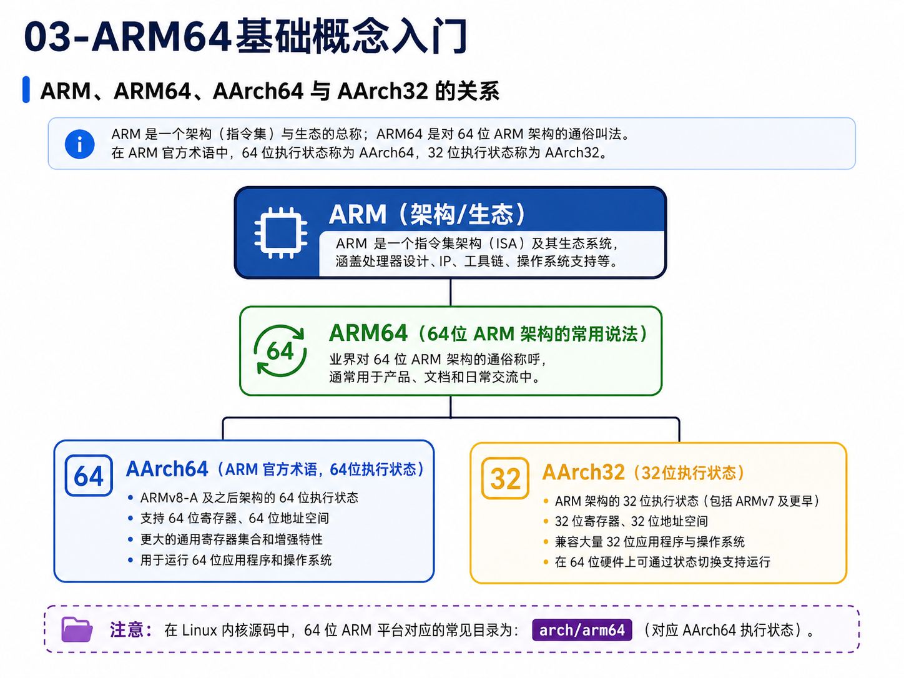
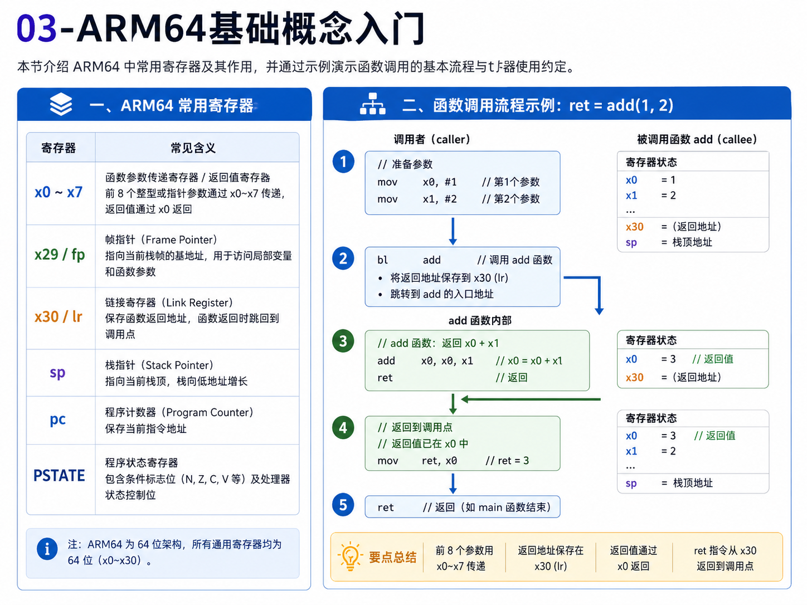
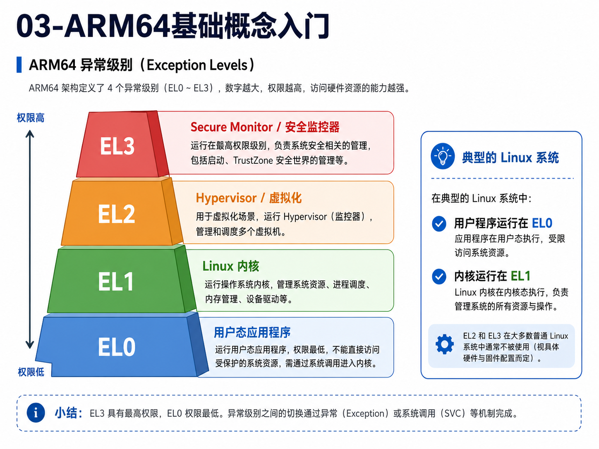
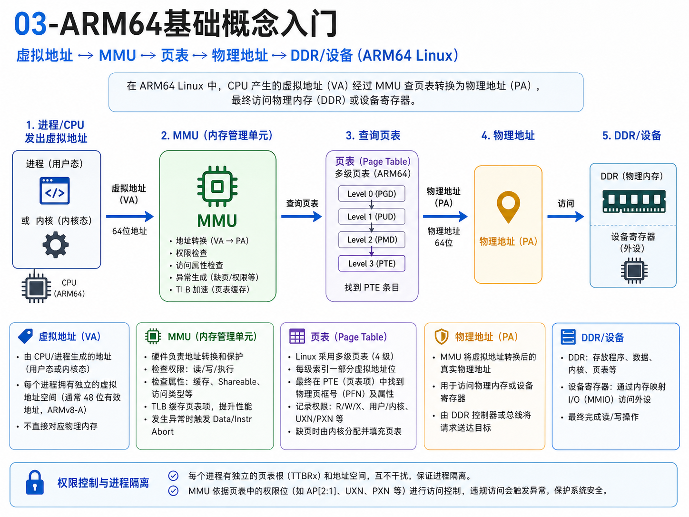
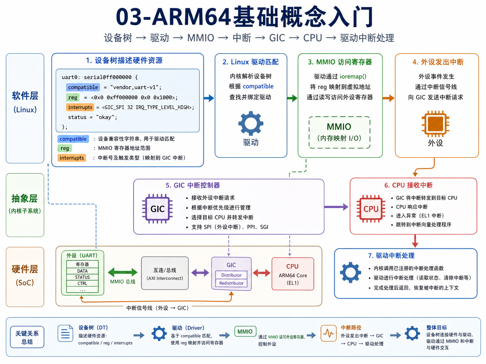
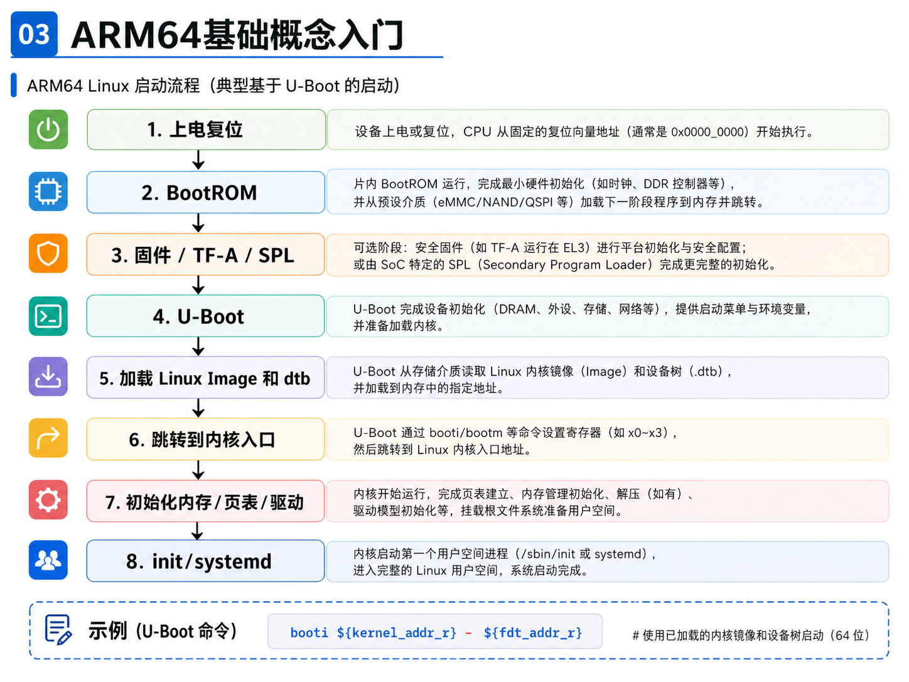

# 03-ARM64基础概念入门

## 1 为什么要学习 ARM64

ARM64 是现在嵌入式 Linux、服务器、手机、开发板和国产处理器平台中非常常见的 CPU 架构。

在 Linux 驱动开发、内核移植、U-Boot、设备树、异常中断、系统调用、性能调试中，经常会遇到 ARM64 相关概念，例如：

```text
寄存器
异常级别
MMU
页表
中断
GIC
设备树
启动流程
函数调用约定
系统调用
```

学习 ARM64 的目的，不是一开始就把 ARM 架构手册全部啃完，而是先建立整体框架，知道 Linux 在 ARM64 平台上是怎么运行起来的。

简单理解：

```text
ARM64 = 64 位 ARM 架构
```

它也常被称为：

```text
AArch64
ARMv8-A 及之后的 64 位执行状态
```

## 2 ARM、ARM64、AArch64 的关系

这几个词非常容易混淆。

简单理解：

```text
ARM：一个处理器架构体系或生态名称
ARM64：通常指 64 位 ARM 架构的通俗说法
AArch64：ARM 官方术语，表示 64 位执行状态
AArch32：ARM 官方术语，表示 32 位执行状态
```

常见说法对比如下：

| 名称      | 含义                   |
|---------|----------------------|
| ARM     | 泛指 ARM 架构或 ARM 处理器生态 |
| ARM64   | 64 位 ARM 架构的常用叫法     |
| AArch64 | ARM 官方术语，64 位执行状态    |
| AArch32 | ARM 官方术语，32 位执行状态    |

Linux 内核中，ARM64 相关目录通常是：

```text
arch/arm64/
```

配图如下：



## 3 ARM64 寄存器基础

ARM64 有一组通用寄存器，常见写法是：

```text
x0 ~ x30
```

这些是 64 位寄存器，对应的低 32 位可以写成：

```text
w0 ~ w30
```

例如：

```text
x0：64 位
w0：x0 的低 32 位
```

常见寄存器及作用：

| 寄存器      | 常见作用         |
|----------|--------------|
| x0 ~ x7  | 函数参数、返回值     |
| x29 / fp | 帧指针          |
| x30 / lr | 链接寄存器，保存返回地址 |
| sp       | 栈指针          |
| pc       | 程序计数器        |
| PSTATE   | 程序状态寄存器      |

初学时建议先记住：

```text
x0 ~ x7 常用于传参数
x0 常用于返回值
sp 指向当前栈顶
x30 / lr 保存返回地址
x29 / fp 常用于维护栈帧
pc 表示当前执行位置
```

配图如下：



## 4 ARM64 函数调用的简单理解

例如 C 代码：

```c
ret = add(1, 2);
```

在 ARM64 上可以粗略理解为：

```text
x0 = 1
x1 = 2
bl add
add 返回后 x0 = 返回值
```

其中：

```asm
bl add
```

表示跳转到 `add` 函数，并把返回地址保存到 `lr/x30`。

函数返回时通常使用：

```asm
ret
```

大致过程是：

```text
调用者准备参数
bl 跳转到被调用函数
被调用函数执行
返回值放入 x0
ret 返回调用者
```

## 5 ARM64 异常级别

ARM64 有异常级别（Exception Level），常见写法是：

```text
EL0
EL1
EL2
EL3
```

简单理解如下：

| 异常级别 | 常见用途                   |
|------|------------------------|
| EL0  | 用户态应用程序                |
| EL1  | 操作系统内核                 |
| EL2  | Hypervisor / 虚拟化       |
| EL3  | Secure Monitor / 安全监控器 |

在典型 Linux 系统中，最重要的是：

```text
用户程序运行在 EL0
Linux 内核运行在 EL1
```

配图如下：



## 6 用户态、内核态与系统调用

在 ARM64 Linux 中，可以粗略理解为：

```text
用户态：EL0
内核态：EL1
```

普通应用程序运行在用户态，例如：

```text
shell
vim
gcc
python
普通业务程序
```

Linux 内核运行在内核态，例如：

```text
调度器
内存管理
文件系统
网络协议栈
设备驱动
中断处理
```

用户态程序如果需要访问系统资源，不能直接操作硬件，而是通过系统调用进入内核。

ARM64 上，用户态进入内核的一种常见方式是：

```asm
svc #0
```

`svc` 是 Supervisor Call，可以简单理解为：

```text
用户态程序通过 svc 请求内核服务
```

## 7 MMU、虚拟地址、物理地址与页表

ARM64 Linux 通常开启 MMU。

MMU 是 Memory Management Unit，内存管理单元。  
它负责把虚拟地址转换成物理地址。

简单理解：

```text
虚拟地址：程序看到的地址
物理地址：硬件访问的地址
MMU：负责地址转换
页表：记录虚拟地址到物理地址的映射规则
```

大致流程：

```text
CPU 发出虚拟地址
        |
        v
MMU 查询页表
        |
        v
转换成物理地址
        |
        v
访问 DDR 或设备
```

Linux 依靠 MMU 实现：

```text
进程地址空间隔离
内核和用户空间隔离
内存权限控制
按需分页
虚拟内存管理
```

配图如下：



## 8 设备树、驱动、MMIO、中断与 GIC

ARM64 嵌入式 Linux 平台经常使用设备树描述硬件。

设备树主要告诉内核：

```text
CPU 有哪些
内存在哪里
串口地址是多少
中断号是多少
网卡、I2C、SPI、GPIO 等设备在哪里
设备使用哪些 clock、reset、irq、reg 资源
```

一个设备树节点中最常见的信息通常包括：

```text
compatible
reg
interrupts
```

它们的含义可以粗略理解为：

```text
compatible：设备兼容字符串，用于匹配驱动
reg：设备寄存器物理地址范围
interrupts：设备中断资源
```

驱动与设备交互时，常常会涉及：

```text
MMIO：CPU 通过地址访问设备寄存器
GIC：ARM64 平台常见中断控制器
中断处理：外设发中断，GIC 转发给 CPU，驱动处理
```

配图如下：



## 9 MMIO 与 DMA 的基本区别

在 ARM64 SoC 上，大量外设通过 MMIO 访问。

简单理解：

```text
MMIO = 用地址访问设备寄存器
```

例如驱动中常见：

```c
readl(base + offset);
writel(value, base + offset);
```

DMA 则是：

```text
DMA = 设备直接访问系统内存搬运数据
```

二者区别如下：

| 对比项  | MMIO         | DMA     |
|------|--------------|---------|
| 主动方  | CPU          | 设备      |
| 访问对象 | 设备寄存器        | 系统内存    |
| 主要用途 | 配置设备、读写状态    | 大块数据搬运  |
| 常见接口 | readl/writel | DMA API |

## 10 ARM64 Linux 启动流程简述

ARM64 Linux 启动流程可以粗略理解为：

```text
上电复位
        |
        v
BootROM
        |
        v
固件 / TF-A / SPL
        |
        v
U-Boot
        |
        v
加载 Linux Image 和 dtb
        |
        v
跳转到内核入口
        |
        v
初始化内存/页表/驱动
        |
        v
init/systemd
```

在 U-Boot 中，常见启动命令类似：

```bash
booti ${kernel_addr_r} - ${fdt_addr_r}
```

其中：

```text
kernel_addr_r：内核 Image 加载地址
fdt_addr_r：设备树 dtb 加载地址
```

配图如下：



## 11 Linux 内核中 ARM64 的常见目录

Linux 内核中 ARM64 相关代码主要在：

```text
arch/arm64/
```

常见目录如下：

| 路径                  | 作用             |
|---------------------|----------------|
| arch/arm64/kernel   | 架构相关核心代码       |
| arch/arm64/mm       | ARM64 内存管理代码   |
| arch/arm64/boot/dts | 设备树源码          |
| arch/arm64/include  | ARM64 架构头文件    |
| drivers/irqchip     | 中断控制器驱动，例如 GIC |
| drivers/of          | 设备树解析相关代码      |

## 12 常见命令和观察方法

查看当前架构：

```bash
uname -m
```

ARM64 上通常输出：

```text
aarch64
```

查看 CPU 信息：

```bash
lscpu
```

查看内核命令行：

```bash
cat /proc/cmdline
```

查看内存信息：

```bash
cat /proc/meminfo
```

查看中断：

```bash
cat /proc/interrupts
```

查看 I/O 内存资源：

```bash
cat /proc/iomem
```

查看当前设备树：

```bash
ls /proc/device-tree
```

反编译当前运行设备树：

```bash
dtc -I fs -O dts /proc/device-tree > running.dts
```

查看系统调用路径：

```bash
strace echo hello
```

查看程序反汇编：

```bash
objdump -d ./test
```

## 13 常见理解误区

### 13.1 ARM64 不等于某一款芯片

ARM64 是架构，不是具体芯片。  
飞腾、鲲鹏、Ampere、Apple Silicon、部分高通平台等都可以是 ARM64，但外设和启动细节可能不同。

### 13.2 AArch64 和 arm64 基本是同一类语境

AArch64 是 ARM 官方术语，arm64 是 Linux 中常见架构命名。  
看到 `arch/arm64`，本质上就是在看 ARM64/AArch64 相关代码。

### 13.3 用户程序不能直接访问硬件

用户程序通常运行在 EL0，不能直接操作 MMIO、页表、中断控制器等硬件资源。  
需要通过系统调用进入内核，由驱动和内核完成硬件访问。

### 13.4 设备树里的地址不是普通 C 指针

设备树中的 `reg` 描述的是物理地址资源。  
驱动中访问寄存器时，通常要先 `ioremap`，再用 `readl/writel`。

### 13.5 DMA 地址不是普通指针

设备 DMA 使用 DMA 地址，不是 CPU 普通虚拟地址。  
驱动必须通过 DMA API 获取和同步 DMA 地址。

## 14 总结

ARM64 基础概念可以这样串起来：

```text
ARM64 是 64 位 ARM 架构
CPU 执行 ARM64 指令
函数调用依赖寄存器和栈
用户程序通常运行在 EL0
Linux 内核运行在 EL1
系统调用通过 svc 从用户态进入内核态
MMU 负责虚拟地址到物理地址转换
设备树描述硬件资源
MMIO 用于 CPU 访问设备寄存器
GIC 负责中断管理与分发
U-Boot 负责常见的启动加载流程
```

一句话总结：

```text
学习 ARM64 的核心，是理解 CPU 执行、异常级别、地址转换、设备访问、中断分发和 Linux 启动之间的关系。
```
