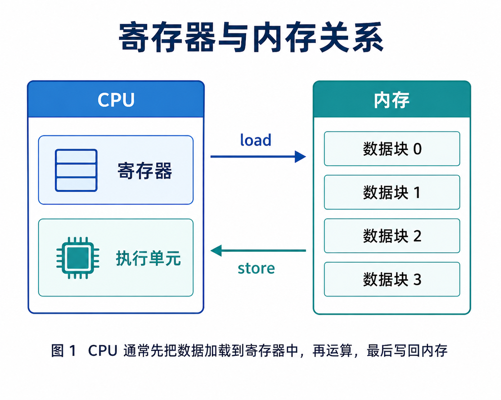
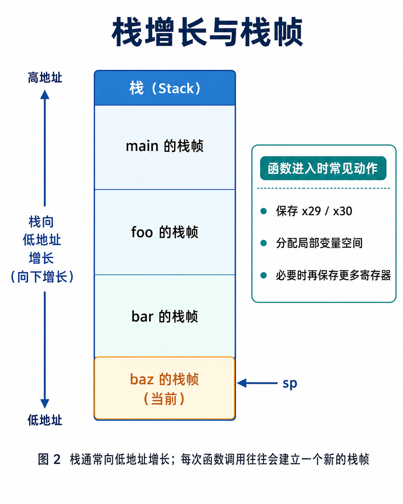
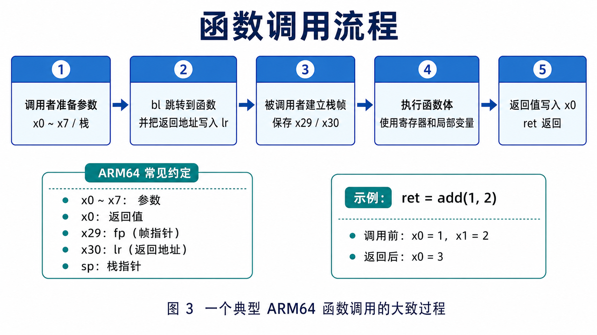
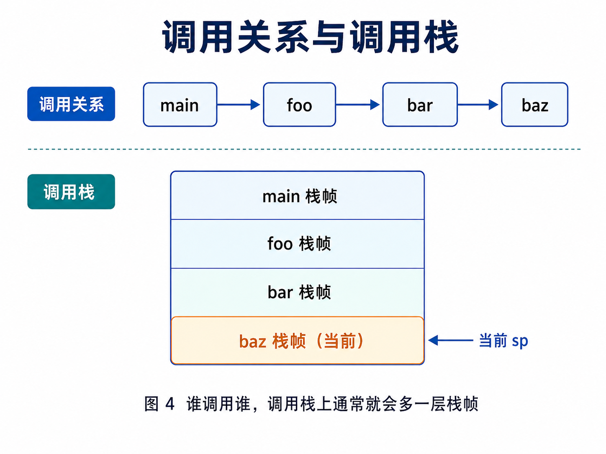
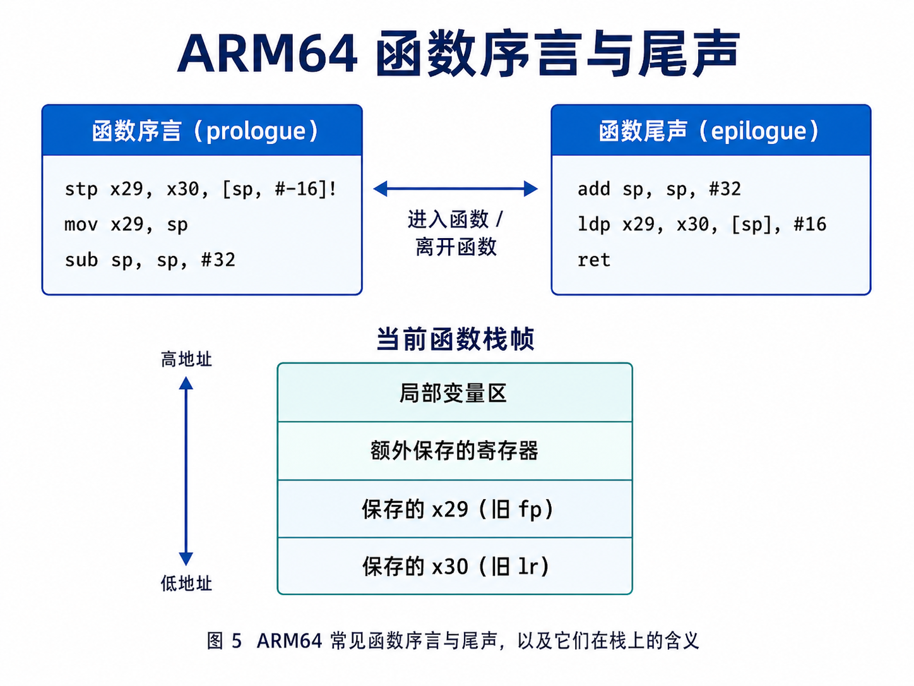
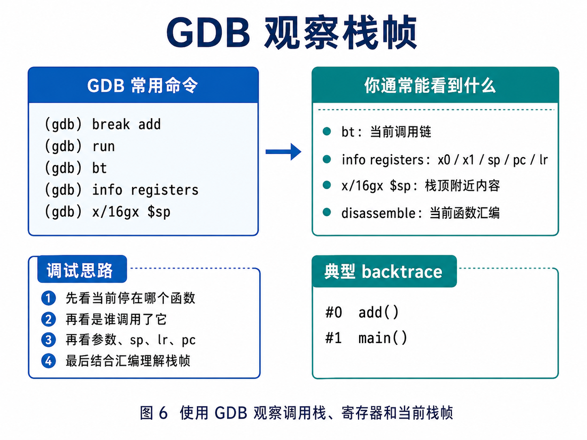

# 03-CPU寄存器栈和函数调用基础

## 1 为什么要学习 CPU 寄存器、栈和函数调用

学习 C 语言、汇编、操作系统、驱动开发和调试时，经常会遇到这些概念：

```text
CPU 寄存器
栈
函数调用
参数传递
返回地址
栈帧
调用约定
```

这些概念解释的是一个核心问题：

```text
CPU 是如何执行函数调用的？
```

例如 C 代码中写：

```c
int c = add(a, b);
```

表面上只是调用了一个函数，但在 CPU 层面，通常要完成：

```text
准备参数
跳转到函数入口
保存返回地址
建立函数栈空间
执行函数代码
返回调用者
取得返回值
```

## 2 CPU 寄存器是什么

CPU 寄存器是 CPU 内部的高速存储单元。

它们数量很少，但访问速度非常快。CPU 执行指令时，经常需要把数据放到寄存器中处理。

简单理解：

```text
寄存器 = CPU 内部临时存放数据的地方
```

例如 CPU 做加法时，通常不是直接在内存里完成，而是：

```text
从内存加载数据到寄存器
在寄存器中完成计算
把结果写回内存
```



## 3 寄存器和内存的区别

| 对比项  | 寄存器        | 内存          |
|------|------------|-------------|
| 位置   | CPU 内部     | CPU 外部的 DDR |
| 数量   | 很少         | 很大          |
| 速度   | 极快         | 相对较慢        |
| 访问方式 | 指令直接访问     | 通过地址访问      |
| 用途   | 临时计算、地址、状态 | 存放代码、数据、堆、栈 |

简单理解：

```text
寄存器少而快，内存大而慢。
```

## 4 常见 ARM64 寄存器

ARM64 中常见寄存器包括：

| 寄存器      | 常见作用         |
|----------|--------------|
| x0 ~ x7  | 参数传递、返回值     |
| x0       | 第一个参数、返回值    |
| x1       | 第二个参数        |
| x29 / fp | 帧指针          |
| x30 / lr | 链接寄存器，保存返回地址 |
| sp       | 栈指针          |
| pc       | 程序计数器        |
| PSTATE   | CPU 状态和条件标志  |

初学阶段重点记住：

```text
x0 ~ x7 常用于传递参数
x0 常用于返回值
sp 指向当前栈顶
x30/lr 常用于保存返回地址
x29/fp 常用于维护栈帧
pc 表示当前执行位置
```

## 5 栈是什么

栈是内存中的一块区域，通常用于保存：

```text
函数局部变量
函数返回地址
调用者保存的寄存器
临时数据
函数调用过程中的上下文
```

简单理解：

```text
栈 = 函数调用时使用的一块临时内存区域
```

栈的关键特点是：

```text
后进先出（LIFO）
```

## 6 栈顶和栈增长方向

栈由 `sp` 管理，`sp` 指向当前栈顶。

在很多架构中，包括常见 ARM64 Linux 环境，栈通常向低地址方向增长：

```text
分配栈空间：sp 减小
释放栈空间：sp 增大
```



例如函数进入时分配 32 字节栈空间，可以粗略理解为：

```asm
sub sp, sp, #32
```

函数返回前释放这 32 字节：

```asm
add sp, sp, #32
```

## 7 函数调用时发生了什么

例如：

```c
int ret;

ret = add(1, 2);
```

大致过程如下：

```text
调用者准备参数 1 和 2
调用者跳转到 add 函数
CPU 保存返回地址
add 函数建立自己的栈空间
add 函数执行计算
add 函数把返回值放到约定位置
add 函数返回调用者
调用者继续执行后续代码
```



## 8 函数参数如何传递

函数参数如何传递，由调用约定决定。

调用约定会规定：

```text
参数放在哪些寄存器
返回值放在哪里
哪些寄存器由调用者保存
哪些寄存器由被调用者保存
栈如何对齐
```

在 ARM64 常见调用约定中，整数和指针参数通常优先使用：

```text
x0 ~ x7
```

返回值通常放在：

```text
x0
```

例如：

```c
int add(int a, int b);
```

调用 `add(1, 2)` 时，可以粗略理解为：

```text
x0 = 1
x1 = 2
调用 add
add 返回后 x0 = 返回值
```

## 9 返回地址、lr 和 ret

函数调用时，CPU 必须知道函数执行完后返回哪里。

在 ARM64 中，常见调用指令是：

```asm
bl function_name
```

`bl` 可以理解为：

```text
branch with link
```

它做两件事：

```text
跳转到目标函数
把返回地址保存到 lr
```

函数返回时通常使用：

```asm
ret
```

`ret` 会根据 `lr` 中保存的返回地址回到调用者。

## 10 栈帧是什么

每次函数调用，通常会在栈上建立一段属于自己的区域，这段区域就叫栈帧。

栈帧中常见内容包括：

```text
返回地址
旧的帧指针
局部变量
临时变量
保存的寄存器
传给其他函数的栈参数
```

简单理解：

```text
栈帧 = 一个函数调用期间使用的栈空间
```

调用关系和调用栈之间往往是一一对应的：



## 11 ARM64 函数序言与尾声

很多 ARM64 函数在进入时，会做类似下面的事：

```asm
stp x29, x30, [sp, #-16]!
mov x29, sp
sub sp, sp, #32
```

可以粗略理解为：

```text
1. 先把旧的 fp / lr 压栈
2. 建立新的帧指针
3. 再为局部变量分配空间
```

在返回前，常见尾声类似：

```asm
add sp, sp, #32
ldp x29, x30, [sp], #16
ret
```

可以粗略理解为：

```text
1. 释放局部变量空间
2. 恢复旧的 fp / lr
3. 返回调用者
```



## 12 GDB 如何观察调用现场

GDB 调试时，经常会用到调用栈。

查看调用栈：

```bash
bt
```

或者：

```bash
backtrace
```

查看寄存器：

```bash
info registers
```

查看某个寄存器：

```bash
p/x $sp
p/x $pc
p/x $x0
```

查看栈附近内存：

```bash
x/32gx $sp
```

当程序停在某个函数里时，可以按下面顺序观察：

```text
先看当前停在哪个函数
再看是谁调用了它
再看参数、sp、lr、pc
最后结合汇编理解栈帧
```



## 13 objdump 观察函数调用

可以用 `objdump` 查看程序反汇编。例如：

```bash
gcc -g -O0 test.c -o test
objdump -d test > test.asm
```

查看函数：

```bash
grep -A30 "<add>:" test.asm
```

重点观察：

```text
函数入口有没有调整 sp
是否保存 x29 / x30
参数是否使用 x0 / x1
返回值是否放入 x0
函数末尾是否 ret
```

初学时建议先使用：

```bash
-O0
```

因为优化较高时，局部变量可能消失，函数也可能被内联。

## 14 简单实验

### 14.1 准备测试代码

创建 `test.c`：

```c
#include <stdio.h>

int add(int a, int b)
{
    int c;

    c = a + b;
    return c;
}

int main(void)
{
    int ret;

    ret = add(1, 2);
    printf("ret = %d\n", ret);

    return 0;
}
```

### 14.2 编译并反汇编

执行：

```bash
gcc -g -O0 test.c -o test
objdump -d test > test.asm
```

查看 `add` 函数：

```bash
grep -A30 "<add>:" test.asm
```

重点观察：

```text
参数如何传入
返回值如何返回
是否使用栈
是否有 ret 指令
```

### 14.3 用 GDB 查看调用栈

执行：

```bash
gdb ./test
```

在 GDB 中：

```text
break add
run
bt
info registers
x/32gx $sp
```

观察：

```text
当前停在哪个函数
调用栈是什么
sp 当前值是多少
x0 / x1 中是否有参数
```

## 15 常见理解误区

### 15.1 寄存器不是内存

寄存器在 CPU 内部，不是 DDR 内存的一部分。

### 15.2 局部变量不一定总在栈上

优化后，局部变量可能在寄存器中，也可能被优化掉。

### 15.3 栈不是无限大的

递归太深、大局部数组、错误调用都可能导致栈溢出。内核代码中尤其要避免巨大局部变量。

### 15.4 函数返回不是魔法

函数能返回调用者，是因为调用时保存了返回地址。在 ARM64 中，这通常和 `lr / x30` 有关。

### 15.5 调用约定非常重要

不同架构、不同 ABI 的参数传递和寄存器保存规则可能不同。阅读汇编时必须结合具体架构和调用约定。

## 16 总结

CPU 寄存器、栈和函数调用可以这样理解：

```text
寄存器是 CPU 内部的高速临时存储
栈是函数调用使用的临时内存区域
函数调用需要传递参数、保存返回地址、建立栈帧、返回结果
```

ARM64 上可以先记住：

```text
x0 ~ x7 常用于传递参数
x0 常用于返回值
sp 指向当前栈顶
x30 / lr 常用于保存返回地址
x29 / fp 常用于维护栈帧
pc 表示当前执行位置
```

一句话总结：

```text
函数调用的本质，是 CPU 按调用约定使用寄存器和栈，在不同代码位置之间跳转并保存返回上下文。
```

后面学习异常入口、中断现场保存、系统调用入口、内核线程切换和 crash 调试时，都会反复遇到这些内容。
