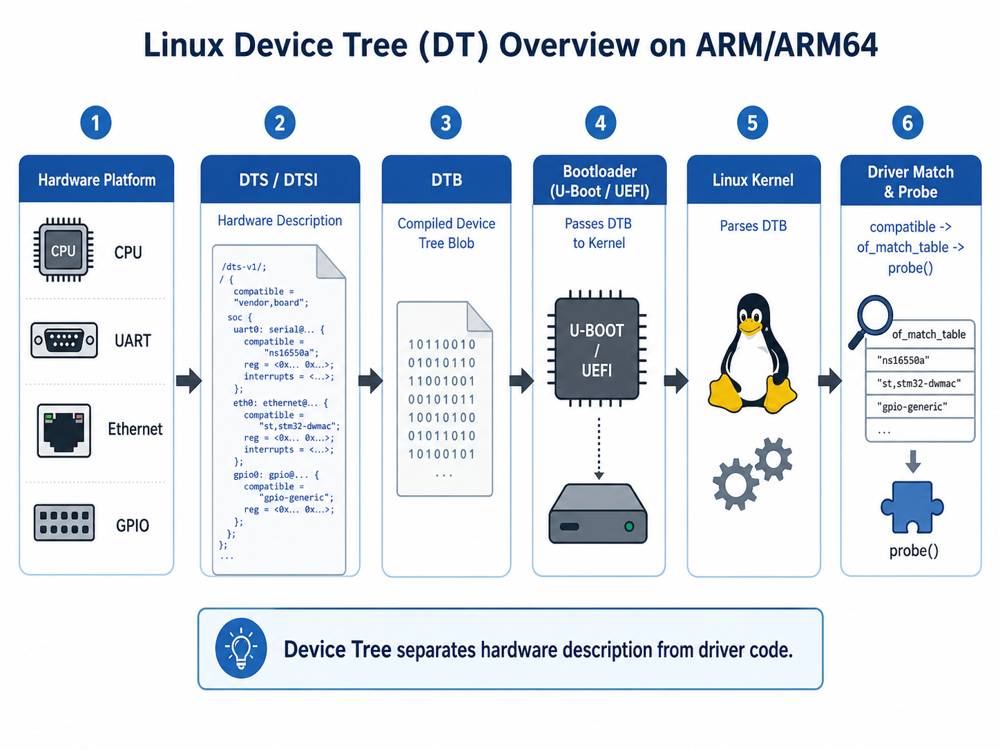
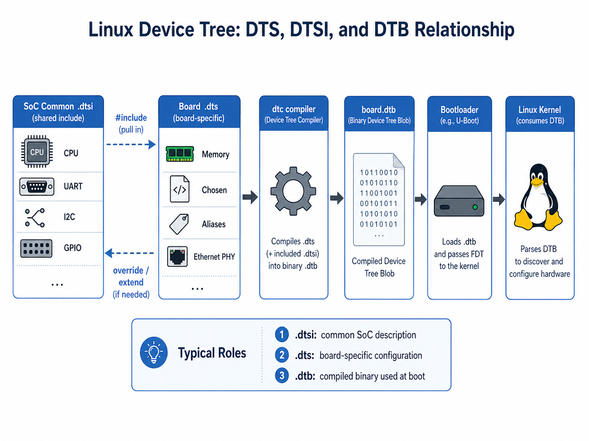
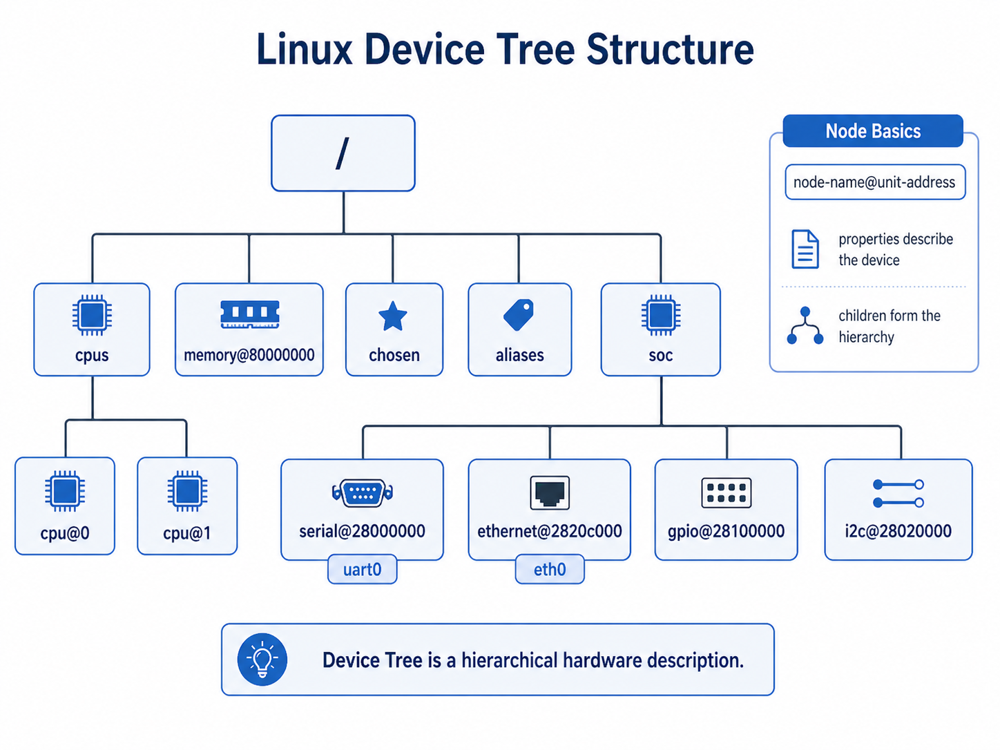
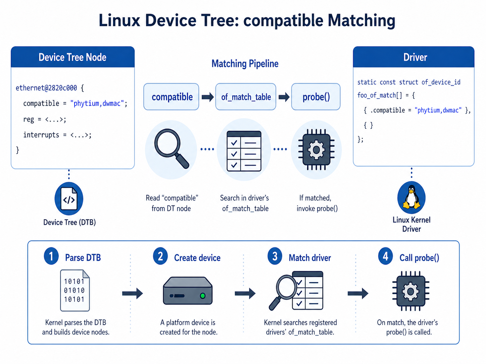
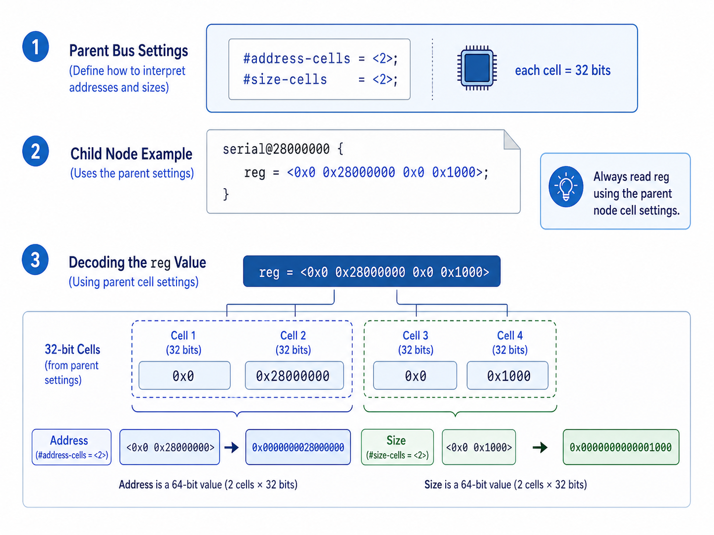
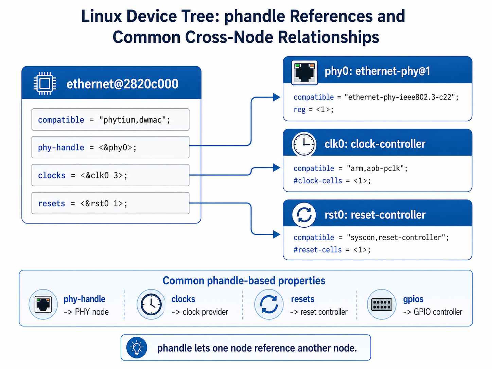

# 06-DTS设备树基础概念

## 1. 文档目标

本文用于整理 Linux 内核中 **DTS / Device Tree / 设备树** 的基础概念，帮助理解：

- 什么是设备树
- 为什么 ARM/ARM64 平台常用设备树
- DTS、DTSI、DTB 分别是什么
- 设备树如何描述硬件
- Linux 内核如何使用设备树匹配驱动
- 常见设备树节点和属性如何阅读

设备树是嵌入式 Linux、ARM64 Linux 启动、驱动适配和板级移植中非常核心的基础知识。



## 2. 什么是设备树

设备树，英文叫 **Device Tree**，是一种用于描述硬件资源的数据结构。

它主要告诉操作系统：

- 系统中有哪些硬件设备
- 这些设备挂在哪些总线上
- 设备使用哪些寄存器地址
- 设备使用哪些中断号
- 设备使用哪些 GPIO、时钟、电源、复位资源
- 设备应该由哪个驱动程序管理

简单理解：

> 设备树就是一份“硬件说明书”，Linux 内核启动时读取它，然后根据里面的信息初始化硬件和匹配驱动。

## 3. 为什么需要设备树

在传统 PC 平台上，很多硬件信息可以通过 BIOS / UEFI / ACPI 等机制告诉操作系统。

但是在 ARM / ARM64 嵌入式平台上，不同厂商、不同开发板之间硬件差异非常大，例如：

- UART 地址不同
- 网卡 MAC 地址不同
- PHY 连接方式不同
- GPIO 用途不同
- 中断控制器配置不同
- I2C / SPI / PCIe / USB 资源不同

如果这些硬件信息全部写死在内核代码里，会导致：

- 每块板子都要改内核源码
- 驱动代码和板级硬件强耦合
- 内核难以维护
- 同一个 SoC 的不同板卡难以复用代码

设备树的作用就是把：

> **硬件描述信息** 从 **Linux 内核 C 代码** 中分离出来。

这样 Linux 内核驱动可以尽量保持通用，而不同板子的硬件差异通过不同的 DTS 文件来描述。

## 4. DTS、DTSI、DTB 的关系

设备树相关文件常见有三类：

| 文件类型 | 全称 | 作用 |
|---|---|---|
| `.dts` | Device Tree Source | 板级设备树源码 |
| `.dtsi` | Device Tree Source Include | 可被多个 DTS 复用的公共片段 |
| `.dtb` | Device Tree Blob | 编译后的二进制设备树文件 |

它们之间的关系可以理解为：

```text
.dtsi  +  .dts
        |
        |  dtc 编译
        v
      .dtb
        |
        |  Bootloader 加载并传给 Linux
        v
    Linux Kernel
```



例如：

```text
pd2008-devboard.dts
    include pd2008.dtsi
    include phytium.dtsi

编译后生成：

pd2008-devboard.dtb
```

## 5. DTS 文件是什么

`.dts` 是设备树源码文件，主要描述一块具体开发板的硬件信息。

例如：

```dts
/dts-v1/;

#include "soc.dtsi"

/ {
    model = "Example ARM64 Board";
    compatible = "example,arm64-board";

    memory@80000000 {
        device_type = "memory";
        reg = <0x0 0x80000000 0x0 0x40000000>;
    };

    chosen {
        bootargs = "console=ttyAMA0,115200";
    };
};
```

这里描述了板卡型号、兼容字符串、内存起始地址和大小、启动参数。

## 6. DTSI 文件是什么

`.dtsi` 是公共设备树片段，通常描述 SoC 级别的公共硬件。

例如一个 SoC 可能有 CPU、GIC 中断控制器、UART、I2C、SPI、GPIO、Ethernet MAC、PCIe 控制器等。这些硬件在同一颗 SoC 的不同开发板上基本相同，所以适合放在 `.dtsi` 里。

板级 `.dts` 文件再根据具体开发板情况启用或修改某些节点。

```dts
&uart0 {
    status = "okay";
};

&ethernet0 {
    phy-mode = "rgmii";
    status = "okay";
};
```

这种写法表示：引用前面 `.dtsi` 中已经定义好的 `uart0` 和 `ethernet0` 节点，然后在板级 DTS 中修改它们的属性。

## 7. DTB 文件是什么

`.dtb` 是设备树源码编译后的二进制文件。Linux 内核启动时不会直接读取 `.dts` 文件，而是读取 `.dtb` 文件。

一般流程是：

```text
DTS 源码
  |
  | dtc 编译
  v
DTB 二进制文件
  |
  | U-Boot / UEFI 加载
  v
Linux Kernel 启动时解析
```

在 ARM64 平台上，常见启动方式是：

```bash
booti ${kernel_addr_r} - ${fdt_addr_r}
```

其中：

- `${kernel_addr_r}` 是 Linux Kernel Image 加载地址
- `-` 表示没有 initrd
- `${fdt_addr_r}` 是 DTB 加载地址

## 8. 设备树的基本结构

设备树是一棵树形结构。根节点是 `/`，下面可以挂很多子节点。



示例：

```dts
/ {
    compatible = "example,board";

    cpus {
        cpu@0 {
            device_type = "cpu";
            compatible = "arm,cortex-a53";
        };
    };

    memory@80000000 {
        device_type = "memory";
        reg = <0x0 0x80000000 0x0 0x40000000>;
    };

    soc {
        uart0: serial@28000000 {
            compatible = "arm,pl011";
            reg = <0x0 0x28000000 0x0 0x1000>;
            interrupts = <0 32 4>;
            status = "okay";
        };
    };
};
```

这棵树大致表示：

```text
/
├── cpus
│   └── cpu@0
├── memory@80000000
└── soc
    └── serial@28000000
```

## 9. 节点的基本概念

设备树中每一个硬件设备通常用一个节点表示。

节点的一般格式是：

```text
node-name@unit-address {
    property1 = "value";
    property2 = <value>;
};
```

例如：

```dts
serial@28000000 {
    compatible = "arm,pl011";
    reg = <0x0 0x28000000 0x0 0x1000>;
    interrupts = <0 32 4>;
    status = "okay";
};
```

| 部分 | 含义 |
|---|---|
| `serial` | 节点名称 |
| `@28000000` | 单元地址，通常对应寄存器基地址 |
| `compatible` | 用于匹配驱动 |
| `reg` | 描述寄存器地址范围 |
| `interrupts` | 描述中断信息 |
| `status` | 表示设备是否启用 |

## 10. compatible 属性

`compatible` 是设备树中最重要的属性之一。它用于告诉 Linux：这个硬件设备应该由哪个驱动程序来匹配和管理。

```dts
uart0: serial@28000000 {
    compatible = "arm,pl011", "arm,primecell";
    reg = <0x0 0x28000000 0x0 0x1000>;
    interrupts = <0 32 4>;
    status = "okay";
};
```

Linux 驱动中通常会有类似代码：

```c
static const struct of_device_id pl011_match[] = {
    { .compatible = "arm,pl011" },
    { }
};
MODULE_DEVICE_TABLE(of, pl011_match);
```

如果设备树中的 `compatible` 和驱动中的 `of_device_id` 匹配，内核就会调用该驱动的 `probe()` 函数。



## 11. reg 属性

`reg` 属性通常用于描述设备的寄存器地址范围。

```dts
serial@28000000 {
    reg = <0x0 0x28000000 0x0 0x1000>;
};
```

这表示该设备的寄存器区域为：

```text
起始地址：0x0000000028000000
大小：    0x0000000000001000
```

为什么这里有 4 个 cell？这是因为父节点通常会定义：

```dts
#address-cells = <2>;
#size-cells = <2>;
```

表示地址使用 2 个 32-bit cell 表示，大小也使用 2 个 32-bit cell 表示。

所以：

```dts
reg = <0x0 0x28000000 0x0 0x1000>;
```

可以拆成：

```text
address = <0x0 0x28000000>
size    = <0x0 0x1000>
```

在 ARM64 平台上，地址经常是 64-bit，所以常见 `#address-cells = <2>`。



## 12. interrupts 属性

`interrupts` 属性用于描述设备使用的中断。

```dts
interrupts = <0 32 4>;
```

它的具体含义取决于中断控制器的 binding。

以 GIC 为例，常见格式是：

```text
<中断类型 中断号 触发方式>
```

例如 `<0 32 4>` 可以理解为：

- `0`：SPI 类型中断
- `32`：中断号
- `4`：触发方式，例如 level high

实际阅读时不要死记所有数字含义，应结合对应平台的 interrupt-controller binding 文档。

## 13. status 属性

`status` 属性用于表示设备节点是否启用。

```dts
status = "okay";
```

表示设备启用。

```dts
status = "disabled";
```

表示设备禁用。

很多 SoC `.dtsi` 中会先把外设定义出来，但默认关闭：

```dts
uart0: serial@28000000 {
    compatible = "arm,pl011";
    reg = <0x0 0x28000000 0x0 0x1000>;
    status = "disabled";
};
```

然后在具体板级 `.dts` 中启用：

```dts
&uart0 {
    status = "okay";
};
```

## 14. phandle 和标签引用

设备树中经常需要一个节点引用另一个节点。例如网卡 MAC 需要引用 PHY：

```dts
ethernet0: ethernet@2820c000 {
    compatible = "phytium,dwmac";
    reg = <0x0 0x2820c000 0x0 0x2000>;
    phy-handle = <&phy0>;
    status = "okay";
};

mdio {
    phy0: ethernet-phy@1 {
        reg = <1>;
    };
};
```

这里 `phy0:` 是标签，`<&phy0>` 是引用这个标签。这种引用机制叫 **phandle**。

常见使用场景包括：

- `clocks = <&clk_controller ...>;`
- `resets = <&reset_controller ...>;`
- `gpios = <&gpio0 3 GPIO_ACTIVE_HIGH>;`
- `phy-handle = <&phy0>;`
- `interrupt-parent = <&gic>;`



## 15. 设备树和驱动 probe 的关系

设备树并不是驱动本身，它只是硬件描述。

驱动匹配的大致流程是：

```text
Linux 启动
  |
  v
解析 DTB
  |
  v
根据设备树创建 platform_device / amba_device 等设备对象
  |
  v
驱动注册 platform_driver
  |
  v
通过 compatible 匹配设备和驱动
  |
  v
调用 driver probe()
```

以 platform driver 为例：

设备树节点：

```dts
foo@10000000 {
    compatible = "vendor,foo";
    reg = <0x0 0x10000000 0x0 0x1000>;
    interrupts = <0 40 4>;
    status = "okay";
};
```

驱动代码：

```c
static const struct of_device_id foo_of_match[] = {
    { .compatible = "vendor,foo" },
    { }
};

static struct platform_driver foo_driver = {
    .probe = foo_probe,
    .remove = foo_remove,
    .driver = {
        .name = "foo",
        .of_match_table = foo_of_match,
    },
};
```

匹配关系：

```text
DTS compatible = "vendor,foo"
        |
        v
foo_of_match[] 中也有 "vendor,foo"
        |
        v
foo_probe() 被调用
```

## 16. 设备树和 platform_device 的关系

很多 SoC 内部外设会通过设备树生成 `platform_device`。

```dts
serial@28000000 {
    compatible = "arm,pl011";
    reg = <0x0 0x28000000 0x0 0x1000>;
    interrupts = <0 32 4>;
    status = "okay";
};
```

内核解析后，会创建一个对应的设备对象。

驱动中可以通过这些接口获取资源：

```c
platform_get_resource(pdev, IORESOURCE_MEM, 0);
platform_get_irq(pdev, 0);
devm_ioremap_resource(dev, res);
```

这些资源本质上来自设备树里的 `reg`、`interrupts`、`clocks`、`resets`、`gpios` 等属性。

## 17. 常见根节点内容

一个典型设备树根节点可能包括：

```dts
/ {
    model = "Example Board";
    compatible = "vendor,example-board";

    aliases {
        serial0 = &uart0;
        ethernet0 = &eth0;
    };

    chosen {
        stdout-path = "serial0:115200n8";
        bootargs = "console=ttyAMA0,115200 root=/dev/nvme0n1p2 rw rootwait";
    };

    memory@80000000 {
        device_type = "memory";
        reg = <0x0 0x80000000 0x0 0x40000000>;
    };
};
```

| 节点 | 作用 |
|---|---|
| `/` | 根节点 |
| `aliases` | 定义设备别名 |
| `chosen` | 启动时传递给内核的特殊信息 |
| `memory` | 描述系统内存 |
| `cpus` | 描述 CPU |
| `soc` | 描述 SoC 内部外设 |

## 18. chosen 节点

`chosen` 节点不是普通硬件设备，而是启动阶段使用的特殊节点。

```dts
chosen {
    stdout-path = "serial0:115200n8";
    bootargs = "console=ttyAMA0,115200 root=/dev/nvme0n1p2 rw rootwait";
};
```

它通常用于：

- 指定启动控制台
- 传递 bootargs
- 传递 initrd 信息
- 传递 bootloader 设置的信息

需要注意：U-Boot 也可能在启动前修改 `chosen` 节点，例如写入 bootargs。所以实际 Linux 看到的设备树，不一定完全等于源码中的 `.dts`。

## 19. aliases 节点

`aliases` 用于给设备节点设置别名。

```dts
aliases {
    serial0 = &uart0;
    ethernet0 = &eth0;
};
```

它可以影响设备编号和命名。

例如：

```dts
serial0 = &uart0;
serial1 = &uart1;
```

可能影响 Linux 中串口编号：

```text
ttyAMA0
ttyAMA1
```

所以在调试串口、网卡、I2C、SPI 编号时，`aliases` 节点也需要关注。

## 20. memory 节点

`memory` 节点用于描述系统物理内存。

```dts
memory@80000000 {
    device_type = "memory";
    reg = <0x0 0x80000000 0x0 0x40000000>;
};
```

表示：

```text
内存起始地址：0x80000000
内存大小：    0x40000000，即 1GB
```

有些平台可能有多个不连续内存区域：

```dts
memory@80000000 {
    device_type = "memory";
    reg = <0x0 0x80000000 0x0 0x80000000>,
          <0x8 0x00000000 0x0 0x80000000>;
};
```

调试内存问题时，需要同时关注 DTS 中的 memory 节点、U-Boot 是否修改了 memory 节点、Linux 启动日志中的 memory 信息、`/proc/iomem` 和 `free -h`。

## 21. address-cells 和 size-cells

`#address-cells` 和 `#size-cells` 决定了子节点中 `reg` 属性的解释方式。

```dts
soc {
    #address-cells = <2>;
    #size-cells = <2>;

    uart0: serial@28000000 {
        reg = <0x0 0x28000000 0x0 0x1000>;
    };
};
```

表示地址占 2 个 cell，大小占 2 个 cell。一个 cell 是 32 bit。

所以：

```dts
reg = <0x0 0x28000000 0x0 0x1000>;
```

解释为：

```text
地址：0x0000000028000000
大小：0x0000000000001000
```

如果父节点是：

```dts
#address-cells = <1>;
#size-cells = <1>;
```

那么：

```dts
reg = <0x28000000 0x1000>;
```

就表示：

```text
地址：0x28000000
大小：0x1000
```

所以阅读 `reg` 时，必须先看父节点的 `#address-cells` 和 `#size-cells`，否则很容易读错。

## 22. ranges 属性

`ranges` 属性用于描述子总线地址到父总线地址的映射关系。

简单理解：

> 子节点看到的地址，不一定就是 CPU 看到的物理地址，中间可能需要经过 ranges 转换。

示例：

```dts
soc {
    #address-cells = <1>;
    #size-cells = <1>;
    ranges = <0x0 0x0 0x20000000>;

    uart@1000 {
        reg = <0x1000 0x100>;
    };
};
```

在更复杂的平台上，PCIe、SoC bus、外部 bus 都可能使用 `ranges` 描述地址窗口。

## 23. 设备树编译工具 dtc

设备树源码通常使用 `dtc` 编译。

```bash
dtc -I dts -O dtb -o board.dtb board.dts
```

| 参数 | 作用 |
|---|---|
| `-I dts` | 输入格式是 dts |
| `-O dtb` | 输出格式是 dtb |
| `-o board.dtb` | 输出文件 |
| `board.dts` | 输入文件 |

也可以把 dtb 反编译成 dts：

```bash
dtc -I dtb -O dts -o board.dump.dts board.dtb
```

这在调试 U-Boot 传给 Linux 的实际 DTB 时非常有用。

## 24. Linux 内核中编译 DTB

在 Linux 内核源码中，ARM64 DTS 通常位于：

```text
arch/arm64/boot/dts/
```

例如：

```text
arch/arm64/boot/dts/phytium/
arch/arm64/boot/dts/rockchip/
arch/arm64/boot/dts/renesas/
arch/arm64/boot/dts/freescale/
```

编译 DTB 可以使用：

```bash
make ARCH=arm64 dtbs
```

也可以只编译某一个 DTB：

```bash
make ARCH=arm64 phytium/pd2008-devboard-dsk.dtb
```

编译结果通常在：

```text
arch/arm64/boot/dts/<vendor>/*.dtb
```

## 25. 如何查看运行中的设备树

Linux 启动后，可以通过 `/proc/device-tree` 查看内核当前使用的设备树。

```bash
ls /proc/device-tree
cat /proc/device-tree/compatible
cat /proc/device-tree/chosen/bootargs
ls /proc/device-tree/soc
```

需要注意：`/proc/device-tree` 里很多字符串没有换行，直接 `cat` 可能显示不美观。可以用：

```bash
tr '\0' '\n' < /proc/device-tree/compatible
```

也可以导出当前运行设备树：

```bash
dtc -I fs -O dts -o running.dts /proc/device-tree
```

这个命令非常有用，因为它看到的是 Linux 当前实际使用的设备树。

## 26. 常见调试方法

### 26.1 查看启动日志

```bash
dmesg | grep -i dts
dmesg | grep -i dtb
dmesg | grep -i machine
dmesg | grep -i of:
```

也可以查看具体驱动：

```bash
dmesg | grep -i uart
dmesg | grep -i eth
dmesg | grep -i phy
dmesg | grep -i gpio
```

### 26.2 查看驱动是否匹配

```bash
ls /sys/bus/platform/devices/
ls /sys/bus/platform/drivers/
```

如果设备树节点被创建为 platform device，通常能在 `/sys/bus/platform/devices/` 下看到。

### 26.3 查看 compatible

```bash
find /proc/device-tree -name compatible
tr '\0' '\n' < /proc/device-tree/path/to/node/compatible
```

### 26.4 反编译 DTB

```bash
dtc -I dtb -O dts -o dump.dts board.dtb
```

### 26.5 导出运行时设备树

```bash
dtc -I fs -O dts -o running.dts /proc/device-tree
```

这个方法适合检查 U-Boot 是否修改了 bootargs、memory，`status` 是否真的是 `okay`，以及实际加载的 dtb 是否是自己修改的版本。

## 27. 常见问题

### 27.1 修改 DTS 后为什么没有效果？

常见原因包括：

1. 只改了 `.dts`，没有重新编译 `.dtb`
2. 编译了 `.dtb`，但是没有复制到启动分区
3. U-Boot 实际加载的不是这个 `.dtb`
4. U-Boot 启动脚本中写死了另一个 DTB 路径
5. U-Boot 在启动前动态修改了设备树
6. Linux 实际使用的是 ACPI，而不是 Device Tree
7. 修改的是 `.dtsi`，但目标 `.dts` 没有包含它

排查时建议先确认运行时设备树：

```bash
dtc -I fs -O dts -o running.dts /proc/device-tree
```

然后检查 `running.dts` 是否包含自己的修改。

### 27.2 status 写 okay 了为什么驱动没有 probe？

可能原因包括：

1. `compatible` 没有和驱动匹配
2. 驱动没有编译进内核或模块没有加载
3. 节点挂载位置不对，内核没有创建对应 device
4. 依赖资源缺失，例如 clocks、resets、pinctrl、power-domain
5. `reg` 或 `interrupts` 描述错误
6. 父节点 status 仍然是 disabled
7. 驱动 probe 失败，但日志中报错被忽略了

排查顺序建议：

```text
确认 running.dts
  |
  v
确认 status = "okay"
  |
  v
确认 compatible 和驱动 of_match_table 一致
  |
  v
确认驱动已编译或模块已加载
  |
  v
查看 dmesg 中 probe 失败原因
```

### 27.3 reg 地址怎么看？

阅读 `reg` 不要直接数值硬看，先找父节点的 `#address-cells` 和 `#size-cells`。

```dts
#address-cells = <2>;
#size-cells = <2>;
reg = <0x0 0x28000000 0x0 0x1000>;
```

解释为：

```text
地址：0x0000000028000000
大小：0x0000000000001000
```

### 27.4 DTS 中的地址一定是真实物理地址吗？

不一定。

很多 MMIO 设备的 `reg` 最终会对应 CPU 物理地址空间中的一段 MMIO 地址。

但是如果节点位于某个总线下面，例如 PCIe、simple-bus、外部 bus，那么 `reg` 中的地址可能是子总线地址，需要通过父节点的 `ranges` 转换成 CPU 物理地址。

所以要结合当前节点的父节点、`#address-cells`、`#size-cells`、`ranges` 和 bus binding 一起理解。

## 28. 设备树学习重点

初学设备树不需要一开始就掌握所有 binding 细节，建议先抓住以下主线：

```text
DTS 描述硬件
DTB 是 DTS 编译结果
Bootloader 把 DTB 传给 Linux
Linux 解析 DTB
Linux 根据 compatible 匹配驱动
驱动从设备树读取 reg / interrupts / clocks / resets / gpios 等资源
probe() 中完成硬件初始化
```

最重要的几个属性是：

| 属性 | 作用 |
|---|---|
| `compatible` | 匹配驱动 |
| `reg` | 描述寄存器地址范围 |
| `interrupts` | 描述中断 |
| `status` | 控制设备启用/禁用 |
| `clocks` | 描述时钟资源 |
| `resets` | 描述复位资源 |
| `gpios` | 描述 GPIO 资源 |
| `pinctrl-*` | 描述引脚复用和电气配置 |
| `phy-handle` | 引用 PHY 节点 |
| `ranges` | 描述地址映射关系 |

## 29. 小结

设备树是 ARM/ARM64 Linux 板级适配中的核心机制。它的本质不是驱动代码，而是硬件描述数据。

可以用一句话概括：

> DTS 描述硬件，DTB 传给内核，内核解析设备树并根据 compatible 匹配驱动，驱动再根据 reg、interrupts、clocks、gpios 等属性获取硬件资源并初始化设备。

对于驱动开发和板级移植来说，设备树的核心能力是：

- 看懂节点结构
- 看懂 `compatible`
- 看懂 `reg`
- 看懂 `interrupts`
- 理解 `status`
- 理解 phandle 引用
- 能从 `/proc/device-tree` 查看运行时设备树
- 能通过 `dmesg` 判断驱动是否匹配和 probe 是否成功

掌握这些内容后，就可以开始阅读和修改具体平台的 DTS 文件，例如串口、网卡、GPIO、I2C、SPI、PCIe 等设备节点。
