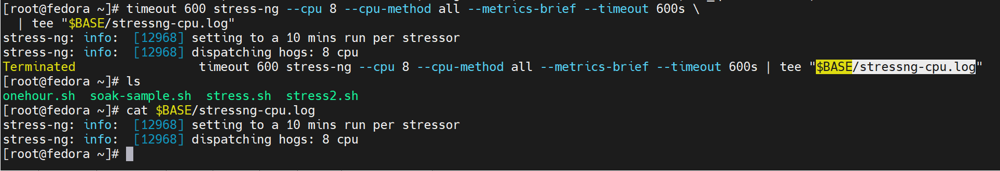
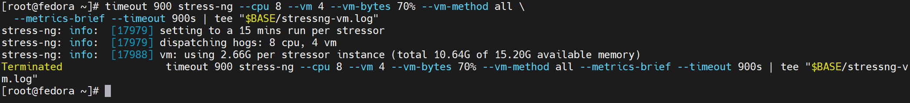

# SMP

## 1. 实验一：构建基线内核

版本：Image-5.10.0-baseline_2026Q1-2

配置：只打开 nvme 和 ext4 文件系统

试试指定单核启动：

```shell
setenv bootargs 'console=ttyAMA1,115200 console=ttyAMA0,115200 \
earlycon=pl011,0x28001000 loglevel=8 ignore_loglevel \
root=/dev/nvme0n1p3 rootfstype=ext4 rw rootwait \
nr_cpus=1 nosmp nmi_watchdog=0 panic=-1 init=/lib/systemd/systemd'
ext4load nvme 0:3 ${kernel_addr_r} /boot/Image-5.10.0-baseline_2026Q1-Alpha
ext4load nvme 0:3 ${fdt_addr_r} /boot/dtb/pd2008-devboard-dsk.dtb
booti ${kernel_addr_r} - ${fdt_addr_r}
```

```shell
setenv bootargs 'console=ttyAMA1,115200 console=ttyAMA0,115200 \
earlycon=pl011,0x28001000 loglevel=8 ignore_loglevel \
root=/dev/nvme0n1p3 rootfstype=ext4 rw rootwait \
nr_cpus=6 nosmp nmi_watchdog=0 panic=-1 init=/lib/systemd/systemd'
ext4load nvme 0:3 ${kernel_addr_r} /boot/Image-5.10.0-baseline_2026Q1-Alpha
ext4load nvme 0:3 ${fdt_addr_r} /boot/dtb/pd2008-devboard-dsk.dtb
booti ${kernel_addr_r} - ${fdt_addr_r}
```

## 2. 使用 EFI 命令启动

```shell
# 1) 正常设置 bootargs（你已经有了）
setenv bootargs 'console=ttyAMA1,115200 console=ttyAMA0,115200 earlycon=pl011,0x28001000 loglevel=8 ignore_loglevel root=/dev/nvme0n1p3 rootfstype=ext4 rw rootwait nr_cpus=2 nmi_watchdog=0 panic=-1 init=/lib/systemd/systemd'

# 2) load kernel + dtb
ext4load nvme 0:3 ${kernel_addr_r} /boot/Image
ext4load nvme 0:3 ${kernel_addr_r} /boot/Image-5.10.0-baseline_2026Q1-2
ext4load nvme 0:3 ${fdt_addr_r} /boot/dtb/pd2008-devboard-dsk.dtb

# 3) 把 bootargs 写入 dtb 的 /chosen/bootargs
fdt addr ${fdt_addr_r}
fdt resize 1024
fdt set /chosen bootargs "${bootargs}"

# 4) 再 bootefi
bootefi ${kernel_addr_r} ${fdt_addr_r}
```

CPU 压测


CPU + MM 压测


```shell
setenv bootargs 'console=ttyAMA1,115200 console=ttyAMA0,115200 earlycon=pl011,0x28001000 loglevel=8 ignore_loglevel root=/dev/nvme0n1p2 rootfstype=ext4 rw rootwait nr_cpus=8 nmi_watchdog=0 panic=-1 init=/lib/systemd/systemd'
```

```shell
ext4load nvme 0:2 ${kernel_addr_r} /boot/Image
```

```shell
ext4load nvme 0:2 ${kernel_addr_r} /boot/Image-5.10.0-baseline_2026Q1-2
```

```shell
ext4load nvme 0:2 ${kernel_addr_r} /boot/Image-P
```

```shell
ext4load nvme 0:2 ${fdt_addr_r} /boot/dtb/pd2008-devboard-dsk.dtb
```

```shell
fdt addr ${fdt_addr_r}
fdt resize 1024
fdt set /chosen bootargs "${bootargs}"
bootefi ${kernel_addr_r} ${fdt_addr_r}
```

```shell
fdt addr ${fdt_addr_r}
fdt resize 1024
fdt set /chosen bootargs "${bootargs}"
booti ${kernel_addr_r} ${fdt_addr_r}
```

在 PC 上:

```shell
python3 -m http.server 8000 --bind 0.0.0.0
```

在开发板上:

```shell
curl -fL http://192.168.11.100:8000/Image-P -o ./Image-P
```

## 3. 编译嵌入式内核

直接在开发板上编译Linux内核。

## 4. 网络配置 nmcli

setenv boot_p3_efi \
`pci init; nvme scan; \
setenv bootargs ${bootargs_p2}; \
ext4load nvme 0:3 ${kernel_addr_r} /boot/Image; \
ext4load nvme 0:3 ${fdt_addr_r} /boot/dtb/pd2008-devboard-dsk.dtb; \
fdt addr ${fdt_addr_r}; \
fdt resize 1024; \
fdt set /chosen bootargs "${bootargs}"; \
bootefi ${kernel_addr_r} ${fdt_addr_r}`


```bash
setenv boot_p3_efi '\
pci init; nvme scan; \
setenv bootargs ${bootargs_p3}; \
ext4load nvme 0:3 ${kernel_addr_r} /boot/Image-5.10.0-baseline_2026Q1-2; \
ext4load nvme 0:3 ${fdt_addr_r} /boot/dtb/pd2008-devboard-dsk.dtb; \
fdt addr ${fdt_addr_r}; \
fdt resize 1024; \
fdt set /chosen bootargs "${bootargs}"; \
bootefi ${kernel_addr_r} ${fdt_addr_r}'
```

