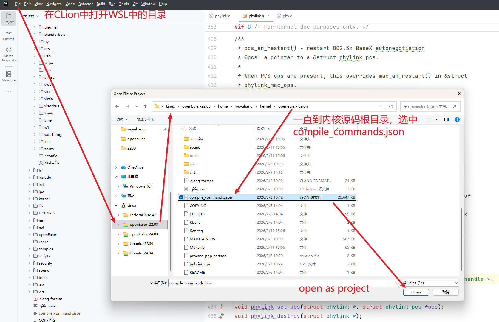

# 内核开发工作流：代码编译、索引、修改

本文档描述一种推荐的内核开发工作流：

> openeuler-fusion：每分支独立 O 目录构建 & IDE 索引（compile_commands.json）
>
> 适用场景：WSL / Linux 下开发内核，频繁切分支、改代码、需要稳定的 IDE 索引与增量编译体验，这里使用的 IDE 为 CLion。

- **一个源码目录（仓库永远干净）**
- **每个分支固定一个 out-of-tree 构建目录（O=...）**
- 通过内核自带脚本生成 `compile_commands.json`，供 IDE/clangd 索引
- 通过 `$O` 下的 `*.cmd` 精确查看“到底编译了哪些文件/目标”

---

## 1. 约定：branch → build dir（固定映射）

每个 git 分支对应一个固定的构建目录（避免 /tmp 被清理、避免多分支互相污染）。

```bash
BR=$(git rev-parse --abbrev-ref HEAD)
O=$HOME/build/openeuler-fusion/${BR}
mkdir -p "$O"
echo "BR=$BR"
echo "O=$O"
````

**激活 ARM64 交叉编译环境**

```text
source ~/env-aarch64.sh
```

---

## 2. 配置：.config 的来源、复制、更新（都发生在 $O）

### 2.1 关键规则

- out-of-tree 构建时，配置文件路径固定是：`$O/.config`
- 因此：
    - `make menuconfig` 会写 `$O/.config`
    - `make olddefconfig` 会更新 `$O/.config`
    - `make` 编译会读取 `$O/.config`

> 命令执行目录：仍然在**源码树根目录**（仓库目录）执行，只是通过 `O="$O"` 指向构建目录。

---

### 2.2 第一次建立配置（推荐 3 选 1）

#### 方案 A：从 defconfig 开始（适合“从零起步”）

```bash
make O="$O" ARCH=arm64 phytium_defconfig
# 或者
make O="$O" ARCH=arm64 defconfig
````

#### 方案 B：复制一个“已知可用”的 config（你现在最常用）

比如你从 ISO/板子上拿到的 `config-5.10.0-136.12.0.86.aarch64`：

```bash
cp -f /path/to/config-5.10.0-136.12.0.86.aarch64 "$O/.config"
make O="$O" ARCH=arm64 olddefconfig
```

解释：

* `cp`：把基线配置变成 `$O/.config`
* `olddefconfig`：根据当前源码树的 Kconfig 补齐新增项（自动选默认值），保证 `.config` 和源码一致

#### 方案 C：从当前构建目录继承（同一分支复用）

如果你之前已经编译过，同一个 `$O` 里本来就有 `.config`，无需重复生成。

---

### 2.3 交互式修改配置（menuconfig）

当你需要手动打开/关闭选项时：

```bash
make O="$O" ARCH=arm64 menuconfig
```

注意：

* 仍然在仓库根目录执行
* 但它编辑的是 `$O/.config`

---

### 2.4 配置变更后的标准动作（务必记住）

只要你改过 `.config`（无论 cp、menuconfig、脚本修改），建议立刻做一次：

```bash
make O="$O" ARCH=arm64 olddefconfig
```

原因：

* Kconfig 选项可能会联动
* 自动补齐新增/缺失项，避免“配置和源码不匹配”导致的奇怪编译/运行问题

---

### 2.5 让配置可追溯：保存一个“分支基线 config”

建议在仓库里保存一份可追溯配置（而不是把 `$O/.config` 提交）：

例如：

* `configs/release_oe-136.12.0_arm64.config`
* `configs/fusion_arm64.config`

保存方式：

```bash
mkdir -p configs
cp -f "$O/.config" configs/fusion_arm64.config
```

恢复方式：

```bash
cp -f configs/fusion_arm64.config "$O/.config"
make O="$O" ARCH=arm64 olddefconfig
```

> 这样你既保持仓库干净，又能在团队里共享“我们用的到底是哪份配置”。

---

## 2. 编译：始终 out-of-tree（源码树保持干净）

```bash
make O="$O" ARCH=arm64 -j"$(nproc)" Image modules dtbs
```

说明：

* `O="$O"`：所有中间产物、`.config`、`.cmd`、目标文件都落到 `$O` 里
* 源码目录不会产生大量临时文件，切分支不需要清理工作区

---

## 3. 生成 compile_commands.json（内核自带工具）

内核自带脚本：`scripts/clang-tools/gen_compile_commands.py`
它会基于 `$O` 下的 `*.cmd` 文件生成 compile database。

### 3.1 推荐命令（生成到仓库根目录）

```bash
python3 scripts/clang-tools/gen_compile_commands.py -d "$O" > compile_commands.json
```

检查是否生成成功：

```bash
ls -lah compile_commands.json
head -n 5 compile_commands.json
```

> 注意：`compile_commands.json` 是一个“快照”。只要你不大改配置/Makefile，它可以长期复用；
> 但当你改了 `.config` / Kconfig / Makefile 或新增编译单元时，建议重新生成一次。

### 3.2 为什么 compile_commands 里会出现 $O 路径？

`compile_commands.json` 的 `directory` 字段就是编译工作目录，out-of-tree 构建时自然就是 `$O`。
这是正常现象，不代表 IDE 在索引 “/tmp 里的源码”。

为了避免 `/tmp` 被清理导致索引失效，建议使用稳定目录（例如 `$HOME/build/...`）。

---

## 4. 查看“到底编译了哪些目标”：用 $O 里的 .cmd（比看 .o 更准）

内核 Kbuild 会为每个目标生成类似：

* `$O/path/.foo.o.cmd`

它记录了该目标的编译命令、依赖等信息，是“真实发生过编译”的强证据。

### 4.1 最近发生编译的目标（按时间排序）

```bash
find "$O" -name '.*.o.cmd' -printf '%T@ %p\n' 2>/dev/null | sort -n | tail -n 50
```

### 4.2 查看某个子系统（示例：drivers/net/phy）

```bash
find "$O/drivers/net/phy" -name '.*.o.cmd' -print
```

### 4.3 只看最近 10 分钟内变动的 cmd（可选）

```bash
find "$O" -name '.*.o.cmd' -mmin -10 -print 2>/dev/null
```

---

## 5. 增量编译与索引刷新策略

### 5.1 改 C 代码（一般情况）

* 直接 `make O="$O" ...` 即可增量编译（只重编受影响目标）
* compile_commands 通常仍可用；如果 IDE 报错/缺条目，再重新生成一次

### 5.2 改 Kconfig / Makefile / .config（影响编译单元或宏）

建议流程：

```bash
make O="$O" ARCH=arm64 olddefconfig
make O="$O" ARCH=arm64 -j"$(nproc)" Image modules dtbs
python3 scripts/clang-tools/gen_compile_commands.py -d "$O" > compile_commands.json
```

### 5.3 切分支

切到新分支后，重新设置 `$O`（每分支独立）：

```bash
BR=$(git rev-parse --abbrev-ref HEAD)
O=$HOME/build/openeuler-fusion/${BR}
mkdir -p "$O"
```

然后按需 `make` / 生成 compile db。

---

## 6. .gitignore 建议

在 out-of-tree 模式下，仓库一般不产生构建产物。

可选择是否把 `compile_commands.json` 放进仓库：

* **不提交**（推荐）：每人本地生成，避免频繁变动
* **提交**：统一 IDE 配置，但切分支/改配置会导致频繁更新

如果选择不提交，在仓库 `.gitignore` 里加：

```text
compile_commands.json
```

---

## 7. 快速命令合集（复制即用）

```bash
# 1) 设置每分支 O 目录
BR=$(git rev-parse --abbrev-ref HEAD)
O=$HOME/build/openeuler-fusion/${BR}
mkdir -p "$O"

# 2) 编译（增量）
make O="$O" ARCH=arm64 -j"$(nproc)" Image modules dtbs

# 3) 生成 compile db
python3 scripts/clang-tools/gen_compile_commands.py -d "$O" > compile_commands.json

# 4) 看最近编译了哪些目标
find "$O" -name '.*.o.cmd' -printf '%T@ %p\n' 2>/dev/null | sort -n | tail -n 50
```

---

## 8. 在 CLion 中索引、阅读、修改代码

以项目方式打开 `compile_commands.json` 文件，然后 CLion 会对代码进行索引，索引完成后可以方便地阅读和修改代码，并重新编译验证修改的成果。



## 9. 常见问题（FAQ）

### Q1：compile_commands.json 生成后可以一直用吗？

可以。它是一次构建的命令快照。
当你改动 `.config` / Kbuild 规则、或者新增/删除编译单元时，建议重新生成一次。

### Q2：改了代码必须全量编译吗？

不需要。内核的 `make` 默认就是增量编译。
只有在你做了会大范围影响依赖的改动（比如大量头文件/配置变更）时，增量编译才会接近全量。

### Q3：为什么 IDE 里会显示 $O 下很多路径？

因为 out-of-tree 构建时编译工作目录就是 `$O`，这是正常的。
建议将 `$O` 放在 `$HOME/build/...` 等稳定目录，避免 `/tmp` 清理导致索引失效。
