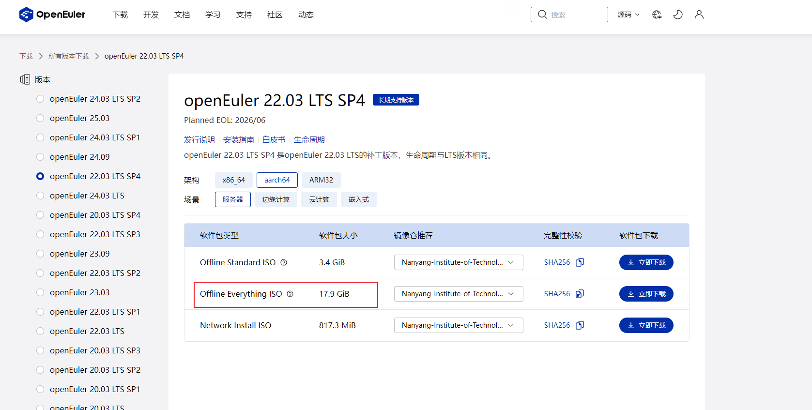
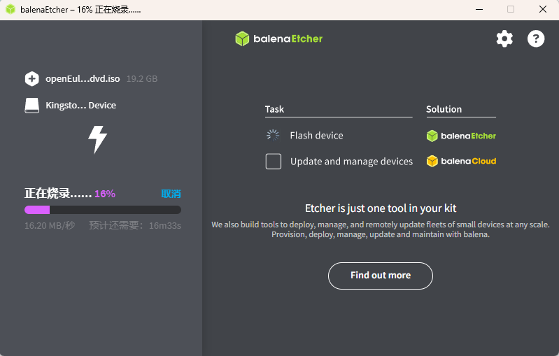

# 制作本地 yum 源离线安装软件包

受限于网络或者开发板初始化环境，我们不能使用网络上的发行版vendor提供的软件yum源仓库安装软件，来扩展操作系统的功能。

其实发行版本身的 everything iso 就包含了发行版的所有安装包。本文档讨论了如何配置本地 yum 源安装软件包的流程。

## 0. 镜像下载

选用工具链完善的 ARM64 架构的 openEuler 22.03 SP4 server edition.

操作系统镜像在[这里](https://www.openeuler.org/zh/download/archive/detail/?version=openEuler%2022.03%20LTS%20SP4)
，选择下载服务器版的Everything ISO 文件

> 以下方案任选，当没有USB口的时候，选择方案 2

## 1. 方案 1：制作启动盘作为 yum 源

### 1.1 制作启动 U 盘

> 官方的操作系统安装指导在
> [这里](https://docs.openeuler.org/zh/docs/24.03_LTS_SP2/server/installation_upgrade/installation/installation_preparations.html)
> ，可供参考。

如果已经装好系统的话，我们接下来只用制作启动 U 盘作为 yum 源。

#### a. 下载 USB 盘制作工具，这里使用了 Ubuntu 社区的开源烧录工具 [balenaEtcher](https://etcher.balena.io/)

#### b. 准备一个 32G 或更大的U盘，使用 balenaEtcher 和下载好的 ISO 文件制作一个启动 U 盘



### 1.2 配置本地 yum 源

#### 1.2.1 查看当前块设备

插入 U 盘后，执行：

```sh
lsblk
```

可以看到U 盘分区，假设 U 盘分区是 /dev/sda1，你可以挂载它到 /mnt/iso：

```sh
mkdir -p /mnt/iso
mount /dev/sda1 /mnt/iso
```

#### 1.2.2 创建本地仓库文件

首先需备份/etc/yum.repos.d/目录下的.repo源文件，再将其删除

```shell
cp /etc/yum.repos.d/xxx.repo /etc/yum.repos.d/xxx.repo.backup
rm -rf /etc/yum.repos.d/xxx.repo
vi /etc/yum.repos.d/local.repo
```

添加如下内容：

```text
[local]
name=OpenEuler Local Repo
baseurl=file:///mnt/iso
enabled=1
gpgcheck=0
```

保存并退出（:wq）

#### 1.2.3 刷新本地缓存

```sh
dnf clean all
dnf makecache
```

查看是否识别成功：

```sh
dnf repolist
```

应该能看到：

```text
repo id     repo name
local       OpenEuler Local Repo
```

#### 1.2.4 使用本地源安装软件

```sh
dnf install cmake -y
```

## 2. 方案 2 从 openEuler ISO 提取内容(以文件形式提供 yum 源)

适用示例环境：

* 宿主：Windows + WSL2 Ubuntu 24.04
* ISO：`openEuler-22.03-LTS-SP4-everything-aarch64-dvd.iso`
* 目标：得到 openEuler server 发行版的所有软件包

---

### 2.1 准备工具

在 WSL 中安装必需工具：

```bash
sudo apt update
sudo apt install -y rpm2cpio cpio libarchive-tools
```

说明：

* `rpm2cpio`：把 RPM 转换为 cpio 流。
* `cpio`：从 cpio 流中还原文件。
* `libarchive-tools`：提供 `bsdtar`，用于解包 ISO

---

### 2.2 使用 bsdtar 解包 ISO 内容

假设 ISO 位于 `~/openEuler-22.03-LTS-SP4-everything-aarch64-dvd.iso`。

```bash
cd ~
mkdir oeiso
bsdtar -C oeiso -xf openEuler-22.03-LTS-SP4-everything-aarch64-dvd.iso
```

解包完成后：

```bash
cd ~/oeiso
ls
# 可以看到：EFI  Packages  RPM-GPG-KEY-openEuler  TRANS.TBL  boot.catalog  docs  images  repodata
```

### 2.3 挑选本地文件作为 yum 源 (可选)

制作 yum 源的话，只需要 `~/oeiso/Packages` `~/oeiso/repodata` 两个目录和他们中的文件就行了。

可选，备份 `oeiso` 目录，并删除不必要的文件。

```text
cp -rf ~/oeiso ~/oeiso.bak;cd ~/oeiso
sudo rm -rf EFI RPM-GPG-KEY-openEuler  TRANS.TBL  boot.catalog  docs images;ls -l
```

### 2.4 在 WSL 打包压缩

在 `oeiso` 所在目录的上一级执行：

```bash
cd ~
tar -cf - oeiso | pigz -p "$(nproc)" -9 > oeiso.tar.gz
```

压完确认文件在当前目录：

```bash
ls -lh oeiso.tar.gz
```

### 2.5 把压缩包传到开发板

任选一种最简单的传输方式，怎么方便就怎么来：

#### 2.5.1 复制文件到 U 盘，然后再复制到开发板上

假设现在文件 `oeiso.tar.gz` 已经复制到了 U 盘中。
启动开发板之后，登录系统，插入 U 盘。

查看块设备：

```text
lsblk
```

可以看到U 盘分区，假设 U 盘分区是 /dev/sda1，你可以挂载它到 /mnt

```sh
mount /dev/sda1 /mnt/
```

复制文件到 `/opt`

```text
cd /mnt;
cp -v oeiso.tar.gz /opt
```

复制完之后确认 `oeiso.tar.gz` 已经到 `/opt` 目录了：

```text
ls -l /opt
```

如果文件没问题，卸载 U 盘

```text
umount /dev/sda1
```

拔掉 U 盘

#### 2.5.2 如果板子根本没有 USB 口插 U 盘

如果能 ssh/scp：

```bash
scp oeiso.tar.gz root@<board_ip>:/opt/
```

（也可以传到 `/root/`，但我建议 `/opt/`）

### 2.6 在开发板上解压到固定目录

在开发板上：

```bash
cd /opt
tar -xzf oeiso.tar.gz
```

解压后应该得到：

```bash
ls /opt/oeiso
# 期望看到：Packages  repodata 
```

### 2.7在开发板上创建本地 yum/dnf 源

写 repo 文件：

```bash
cat >/etc/yum.repos.d/oe-local.repo <<'EOF'
[oe-local]
name=openEuler local repo
baseurl=file:///opt/oeiso
enabled=1
gpgcheck=0
metadata_expire=-1
EOF
```

刷新缓存并检查：

```bash
dnf clean all
dnf makecache
```

> 注意，这个时候你会看到 `error`，这是正常的，因为没有网络，刷新的时候尝试联网会失败。

```
dnf repolist
```

查看仓库，如果多了一个 `oe-local` 就可以了。

### 2.8 只使用本地源安装软件（避免跑外网）

```bash
dnf --disablerepo="*" --enablerepo="oe-local" install -y <pkgname>
```

```text
dnf --disablerepo="*" --enablerepo="oe-local" install -y
```

```text
dnf --disablerepo="*" --enablerepo="oe-local" install -y \
  rpm-build rpmdevtools \
  dnf-plugins-core
```

```text
dnf --disablerepo="*" --enablerepo="oe-local" install -y \
  git make gcc gcc-c++ \
  bc bison flex \
  patch diffutils \
  perl python3 \
  rsync which file \
  tar gzip bzip2 xz cpio \
  findutils grep gawk sed \
  elfutils-libelf-devel \
  openssl-devel \
  ncurses-devel \
  dwarves
```

```text

```


你现在只要把 `<pkgname>` 换成实际值，就能安装发行版支持的所有包。
